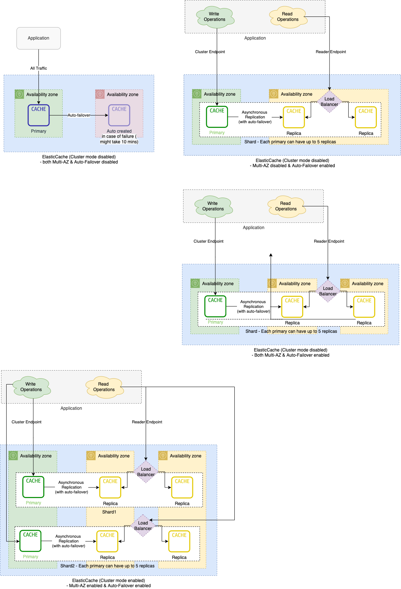

# DB Scalability Techniques
- A system design can implement one or more of following techniques.

| Technique                                                                            | Type   | Use Cases                                                                                                                                                                                                                                                                                                                               | Description                                                                                                                                                                                                                                                                                                                                                                                           |
|--------------------------------------------------------------------------------------|--------|-----------------------------------------------------------------------------------------------------------------------------------------------------------------------------------------------------------------------------------------------------------------------------------------------------------------------------------------|-------------------------------------------------------------------------------------------------------------------------------------------------------------------------------------------------------------------------------------------------------------------------------------------------------------------------------------------------------------------------------------------------------|
| :star: [Single-leader technique](Consistency&Replication/SingleLeaderReplication.md) | READS  | Almost all data-stores & message brokers for read scalability and reliability, like SQL-DBs etc.                                                                                                                                                                                                                                        | Being able to handle a higher volume of reads than a single machine could handle, by performing reads on replicas.                                                                                                                                                                                                                                                                                    |
| :star: [Partitioning/Sharding](PartioningSharding.md)                                | WRITES | [Kafka Cluster](../../4_MessageBrokers/Kafka/Readme.md) - [Redis Cluster](../In-Memory-Cache/Redis/RedisCluster.md) - [Amazon Elastic Cache Cluster](../../../2_AWSComponents/6_DatabaseServices/AmazonElasticCache/ClusterMode.md) - [ElasticSearch Cluster](../Search-Databases/ElasticSearch/ElasticSearchCluster.md) etc. | For very large datasets, or very high query throughput, that is not sufficient: we need to break the data up into partitions, also known as sharding - Instead of one shard for writes, we partition/shard the database based on a partition key which would increase query throughput. - In order to improve system reliability and read scalability, systems implement replication as well. |
| Vertical Scale-up (not-recommended)                                                  | WRITES | SQL-DBs etc.                                                                                                                                                                                                                                                                                                                            | Generally, it's NOT recommended to do vertical scalability (due to cost, other limitations)  - Horizontal scalability is more preferred.                                                                                                                                                                                                                                                          |

# Amazon RDS Cluster

# Kafka Cluster

# ElasticSearch Cluster

# Redis Cluster

# References
- [Scalability and High Availability](https://dzone.com/refcardz/scalability)