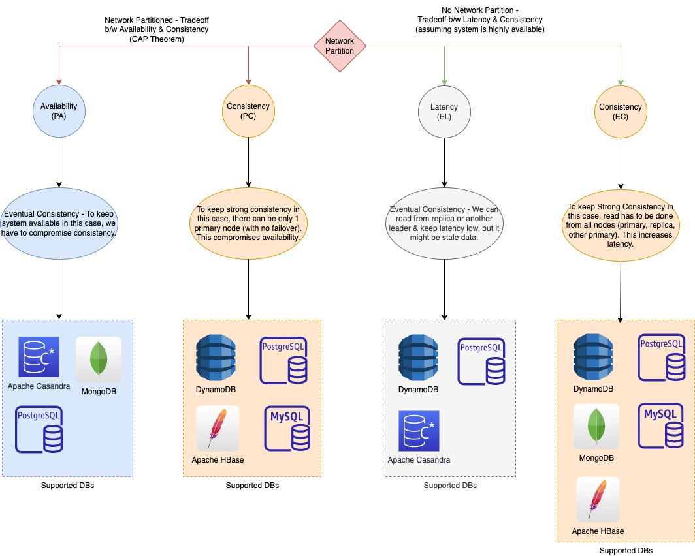

# :star: PACELC theorem

| Scenario                                                                          | Remarks                                                                   |
|-----------------------------------------------------------------------------------|---------------------------------------------------------------------------|
| If there is a `network partition (P)`                                             | System can trade off between `availability and consistency (i.e. A and C)` |
| else E - when the system is running normally in the absence of partition failures | System can trade off `between latency (L) and consistency (C)`            |

# Database PACELC ratings

| DB                                                                                  | P+A                | P+C                | E+L                | E+C                |
|-------------------------------------------------------------------------------------|--------------------|--------------------|--------------------|--------------------|
| [DynamoDB](../../../../2_AWSComponents/6_DatabaseServices/AmazonDynamoDB/Readme.md) |                    | :white_check_mark: | :white_check_mark: | :white_check_mark: |
| [PostgresSQL](../../SQL-DBs.md)                                                     | :white_check_mark: | :white_check_mark: | :white_check_mark: | :white_check_mark: |
| [MongoDB](../../NoSQL-Databases/MongoDB)                                            | :white_check_mark: |                    | :white_check_mark: |                    |
| [Cassandra](../../NoSQL-Databases/ApacheCasandra.md)                                | :white_check_mark: | :white_check_mark: |                    |                    |
| [HBase](../../NoSQL-Databases/ApacheHBase.md)                                       |                    | :white_check_mark: |                    | :white_check_mark: |

# CAP Theorem
- [Read more](CAPTheorem.md)

# Source(s) and further reading
- [PACELC](https://en.wikipedia.org/wiki/PACELC_theorem)
- [The CAP Theorem in DBMS](https://www.geeksforgeeks.org/the-cap-theorem-in-dbms/)