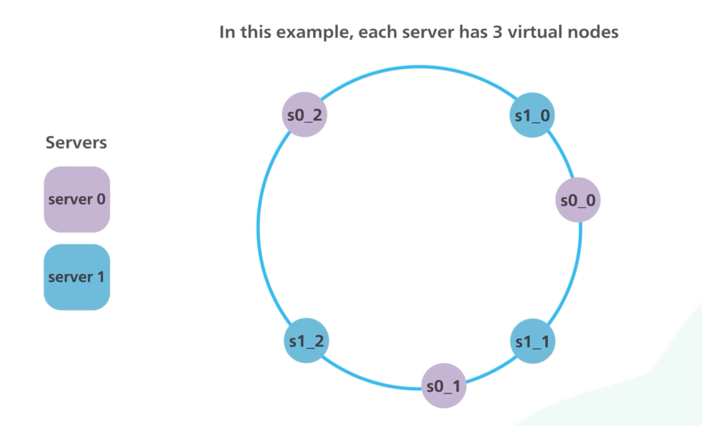

# Partitioning
- For very large datasets, or very high query throughput, replication is not sufficient - we need to break the data up into partitions, also known as sharding.
- Instead of one shard for writes, we partition/shard the database based on a partition key. 
- This would increase query throughput and overall system write throughput.

> Note - This partitioning is nothing related to network partition (in [CAP Theorem](CAPTheorem/Readme.md)).

# Key Terminologies

| Terminology        | Examples                                                                                                                                        | Description                                                                                                                                          |
|--------------------|-------------------------------------------------------------------------------------------------------------------------------------------------|------------------------------------------------------------------------------------------------------------------------------------------------------|
| Partition Key      | [Partition key in DynamoDB](../../../2_AWSComponents/6_DatabaseServices/AmazonDynamoDB/Partioning.md) - User ID, Location ID, Photo ID etc. | Partitioning would be done based on a partition key.  - Hence we need to carefully choose this key to distribute the data evenly b/w partitions. |
| Hash Function      | MD5 as a hash function used in [Casandra](../NoSQL-Databases/ApacheCasandra.md), [MongoDB](../NoSQL-Databases/MongoDB/Readme.md).               | Hash function helps to determine the partition for a given key.                                                                                      |
| Secondary Indexes  | [Global Secondary Indexes in DynamoDB](../../../2_AWSComponents/6_DatabaseServices/AmazonDynamoDB/Readme.md)                                    | [Read more](Indexing.md)                                                                                                                             |
| Consistent Hashing | -                                                                                                                                               | This handles data sharding with dynamic number of servers. - [Read more](https://www.youtube.com/watch?v=UF9Iqmg94tk)                            |

# Supported Clusters

## Kafka Cluster

## ElasticSearch Cluster

## Elastic Cache Cluster

## Others
- [Amazon DynamoDB Cluster](../../../2_AWSComponents/6_DatabaseServices/AmazonDynamoDB/Partioning.md)
- [Redis Cluster](../In-Memory-Cache/Redis/RedisCluster.md)
- [Apache Casandra](../NoSQL-Databases/ApacheCasandra.md) etc.

# Consistent Hashing

# References
- [A Guide to Consistent Hashing](https://www.toptal.com/big-data/consistent-hashing)
- [Interviewbit - Sharding a database](https://www.interviewbit.com/problems/sharding-a-database/)