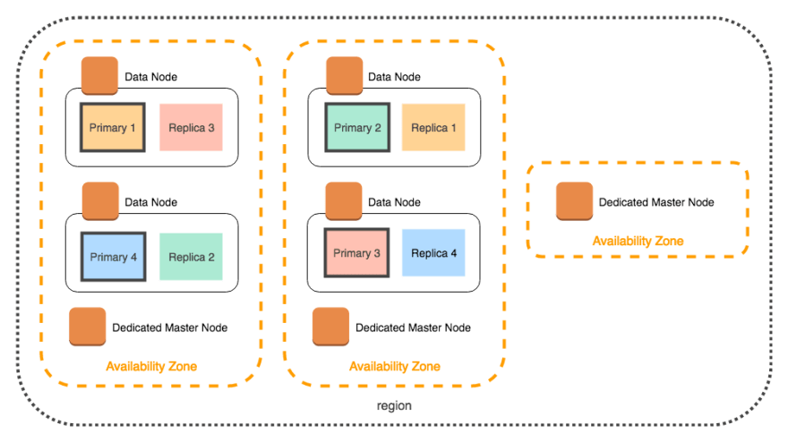

# ElasticSearch Cluster
- In [Elasticsearch](https://www.elastic.co/guide/en/elasticsearch/reference/current/add-elasticsearch-nodes.html), a [cluster](../../0_SystemGlossaries/ServersCluster.md) is a collection of nodes.
- Cluster and nodes work together and hold the data, where node is an instance of Elasticsearch.
- A cluster provides joined indexing as well as search capabilities to Elasticsearch users.

## Sharding in ES Cluster
- The data stored in an index can be divided into multiple partitions.
- Each of these partitions is called `Shard`, which is managed and controlled by a separate node.
- `An Elasticsearch index has five shards by default`.

