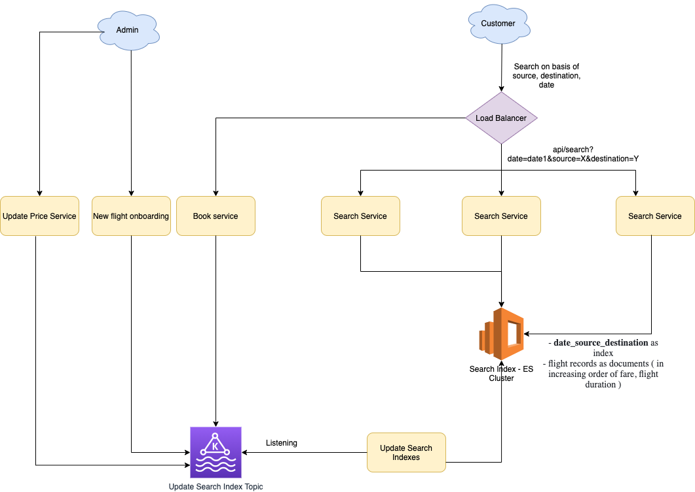

# Apache Casandra
- [Apache Cassandra](https://cassandra.apache.org/_/index.html) is a free and open-source, distributed & [wide column store](../ReadMe.md#nosql---intro-different-nosql-types).
- It is a NoSQL database management system designed to handle large amounts of data across many commodity servers, providing [high availability with no single point of failure](../../0_SystemGlossaries/Reliability/FaultTolerance&DisasterRecovery.md). 
- Since [Casandra]() is [append-only db storage](../../0_SystemGlossaries/AppendOnlyDataStructure.md), it can handle [large amount data with high throughput with fast writes](../../0_SystemGlossaries/Scalability/LatencyThroughput.md).
- Cassandra offers robust support for [clusters spanning multiple data centers](../../0_SystemGlossaries/Scalability/ServersCluster.md), with asynchronous masterless replication allowing low latency operations for all clients.
- Casandra is based modeled after [Amazon DynamoDB](../../../2_AWSComponents/6_DatabaseServices/AmazonDynamoDB/Readme.md) & [BigTable](https://cloud.google.com/bigtable).
- [Amazon KeySpaces](../../../2_AWSComponents/6_DatabaseServices/AmazonKeySpaces.md) can be used to deploy Casandra on AWS.
- :star: [Casandra vs MongoDB](CasandraVsMongoDB.md)

# :star: Ideal Use Cases

Large amount of data like,
- [Time Series Data](https://netflixtechblog.com/scaling-time-series-data-storage-part-i-ec2b6d44ba39)
- Historical records
- [High-Write, Low-Read](../../0_SystemGlossaries/Scalability/LatencyThroughput.md)
- Processing server logs
- [Social media posts](../../../3_HLDDesignProblems/InstagramDesign/Readme.md)
- PDF documents
- Emails etc.

# :star: Real world use cases of Casandra

## Personalization at Spotify using Cassandra

- [Read more](../../../3_HLDDesignProblems/PersonalizationSpotify)

## Instagram - User Entities like Posts, Comments etc.

- [Read more](../../../3_HLDDesignProblems/InstagramDesign/Readme.md)

## Search - Flight Booking

- [Read more](../../../3_HLDDesignProblems/FlightBookingSearch/README.md))

## How Uber Manages a Million Writes Per Second Using Mesos and Cassandra Across Multiple Datacenters?

- [Read more](../../../3_HLDDesignProblems/UberCasandraMesos)

## Inbox Search Feature & Instagram Unit at Facebook, using Casandra
- Facebook originally built Cassandra to power its [Inbox search feature](https://m.facebook.com/nt/screen/?params=%7B%22note_id%22%3A10158772759272200%7D&path=%2Fnotes%2Fnote%2F&paipv=0&eav=AfYuSXXQPZ5fvm0_ScPdSlfj5BEFhRVT3iy_6Rsz7NZDbQ2vfq9opnedmTLSjG1aZBA&_rdr), with over 200 nodes deployed.
- This was abandoned in late 2010 when they built Facebook Messaging platform on [HBase](ApacheHBase.md) as they [found Cassandra's eventual consistency model to be a difficult pattern](#supported-consistency-patterns).
- Facebook moved off its pre-Apache Cassandra deployment in late 2010 when they replaced Inbox Search with the Facebook Messaging platform.
- In 2012, [Facebook began using Apache Cassandra in its Instagram unit](https://www.quora.com/Does-Facebook-use-Apache-Cassandra).

## Other UCs
- [Twillo - Send Message API Design](../../../3_HLDDesignProblems/TwilloSendMessageAPI/README.md)
- [Twitter Hit Counter](../../../3_HLDDesignProblems/TwitterHitCounterDesign/Readme.md)
- [Exploring Data @ Netflix](https://netflixtechblog.com/exploring-data-netflix-9d87e20072e3)
- [Directi uses Casandra to save HeatMaps (UI activities)](https://engineering.zeta.tech/2021/09/15/zeta-tech-stack/)

# Features

## Rich data model
- [This is column-oriented](../ReadMe.md#nosql---intro-different-nosql-types).
- It means, Cassandra stores columns based on the column names, leading to very quick slicing.
- Unlike traditional databases, where column names only consist of metadata, in `Cassandra column names can also consist of the actual data`.

## Peer to Peer Architecture 
- There is no single point of failure in Cassandra, since it uses a P2P architecture, instead of master-slave architecture. 
- Any number of servers/nodes can be added to any Cassandra cluster in any of the data centers.

## Low-Latency, Faster Writes
- Since writes in Casandra result in storage in an [append-only structure](../../0_SystemGlossaries/AppendOnlyDataStructure.md), writes are generally very fast.
- Casandra provides [low latency](../../0_SystemGlossaries/Scalability/LatencyThroughput.md), at the cost of [consistency](../../0_SystemGlossaries/ReplicationLagAndDataConsistency.md). 
  - Refer [PACELC theorem](../../0_SystemGlossaries/CAPTheorem.md#pael-systems---dynamodb--cassandra) for more info.
- Hence Casandra should be used when transactions aren't performing (i.e. consistency can be compromised).

## High Availability, Fault-Tolerance
- Apache Casandra provides [high-availability](../../0_SystemGlossaries/Reliability/HighAvailability.md) & [fault-tolerance](../../0_SystemGlossaries/Reliability/FaultTolerance&DisasterRecovery.md) with tunable consistency levels.
- Any number of nodes can be added or deleted in the Cassandra cluster without much disturbance.
- As scaling happens, [read and write throughput](../../0_SystemGlossaries/Scalability/LatencyThroughput.md) both increase simultaneously with zero downtime or any pause to the applications.
- You don’t have to restart the cluster or change queries related to the Cassandra application while scaling up or down.

## Scales Horizontally & Linearly
- Apache Cassandra has a [high-scalability architecture](../../0_SystemGlossaries/Scalability/DBScalability.md).
- [Cassandra cluster](../../0_SystemGlossaries/Scalability/ServersCluster.md) can be easily scaled-up or scaled-down.
- Generally doubling the size of the cluster, would result in the half [latency](../../0_SystemGlossaries/Scalability/LatencyThroughput.md) (both at the median and 99th percentile).

## Support replication - Cross-site, Data-Centers
- `NetworkReplicationStrategy` can be used to [replicate](../../0_SystemGlossaries/ReplicationLagAndDataConsistency.md) the data between data centers.
- This allows users to access data in the data center nearest to them, and provides the redundancy capability.

## Good Integration with open source softwares (like Hadoop, Spark, Hive, HDFS etc.)
- Cassandra offers options for bulk importing data from other data sources (such as [HDFS](../../5_BigDataComponents/ApacheHadoop/ApacheHDFS.md)) into the Cassandra cluster by building entire `SSTables` and then streaming the tables into the cluster. 
- Streaming the tables into the cluster is much simpler, faster and more efficient than sending millions or more of individual INSERT statements for all the data you want to load into Cassandra.

## Supported Consistency Patterns
- [Eventual Consistency Model](../../0_SystemGlossaries/ReplicationLagAndDataConsistency.md#consistency-patterns)
- [Strong Consistency Model](../../0_SystemGlossaries/ReplicationLagAndDataConsistency.md#consistency-patterns)

## Casandra Query Language (CGL)
- By default, Cassandra provides a prompt [Cassandra query language shell (cqlsh)](https://cassandra.apache.org/doc/latest/cassandra/tools/cqlsh.html) that allows users to communicate with it. 
- Using this shell, you can execute [Cassandra Query Language (CQL)](https://cassandra.apache.org/doc/latest/cassandra/cql/). 
- Using cqlsh, you can define a schema, insert data, and execute a query.
- `Cassandra does not support joins or subqueries` and therefore requires a developer to denormalize the data or duplicate data for efficient access.

# Who created Casandra?
- Released in 2008 by Facebook and developed initially by Indians Avinash Lakshman and Prashant Malik, Cassandra was initially used in [Facebook’s inbox search feature](https://m.facebook.com/nt/screen/?params=%7B%22note_id%22%3A10158772759272200%7D&path=%2Fnotes%2Fnote%2F&paipv=0&eav=AfYuSXXQPZ5fvm0_ScPdSlfj5BEFhRVT3iy_6Rsz7NZDbQ2vfq9opnedmTLSjG1aZBA&_rdr).

# Sample Apps
- [Example: Deploying Cassandra with a StatefulSet](https://kubernetes.io/docs/tutorials/stateful-application/cassandra/)
- [Building a Performant API using Go and Cassandra](https://getstream.io/blog/building-a-performant-api-using-go-and-cassandra/)

# References
- [Golang Cassandra Example](https://golangdocs.com/golang-cassandra-example)
- [Does-Facebook-use-Apache-Cassandra](https://www.quora.com/Does-Facebook-use-Apache-Cassandra)