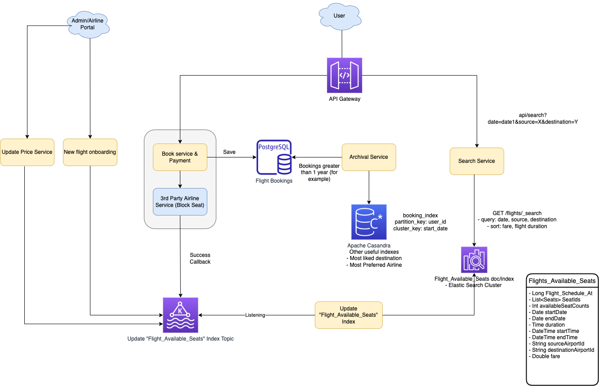

# Apache Casandra
- [Apache Cassandra](https://cassandra.apache.org/_/index.html) is a free and open-source, distributed & [wide column store](../NoSQL-Databases/Readme.md).
- It is a NoSQL database management system designed to handle large amounts of data across many commodity servers, providing [high availability with no single point of failure](../../0_SystemGlossaries/Reliability/FaultTolerance.md). 
- [Amazon KeySpaces](../../../2_AWSComponents/6_DatabaseServices/AmazonKeySpaces.md) can be used to deploy Casandra on AWS.
- :star: [Casandra vs MongoDB](DynamoDBVsMongoDBVsCasandra.md)

# Features

| Feature                                          | Description                                                                                                                                                                                                                                                                                                                                                                                                                                                                                                                                                                                                                                              |
|--------------------------------------------------|----------------------------------------------------------------------------------------------------------------------------------------------------------------------------------------------------------------------------------------------------------------------------------------------------------------------------------------------------------------------------------------------------------------------------------------------------------------------------------------------------------------------------------------------------------------------------------------------------------------------------------------------------------|
| :star: Low-Latency, Faster Writes                | Since writes in Casandra result in storage in an [append-only structure](../1_Glossaries/AppendOnlyProperty.md), writes are generally very fast. - Casandra provides [low latency](../../0_SystemGlossaries/Scalability/LatencyThroughput.md), at the cost of [consistency](../1_Glossaries/Consistency&Replication/Readme.md). - Refer [PACELC theorem](../1_Glossaries/PACELCTheorem/Readme.md) for more info.                                                                                                                                                                                                                      |
| Rich data model                                  | [This is column-oriented](../NoSQL-Databases/Readme.md). - It means, Cassandra stores columns based on the column names, leading to very quick slicing. - Unlike traditional databases, where column names only consist of metadata, in Cassandra, column names can also consist of the actual data.                                                                                                                                                                                                                                                                                                                                             |
| Peer to Peer Architecture                        | There is no single point of failure in Cassandra, since it uses a P2P architecture ([Leaderless replication](../1_Glossaries/Consistency&Replication/Replication.md)). - Any number of servers/nodes can be added to any Cassandra cluster in any of the data centers.                                                                                                                                                                                                                                                                                                                                                                               |
| High Availability, Fault-Tolerance               | Apache Casandra provides [high-availability](../../0_SystemGlossaries/Reliability/HighAvailability.md) & [fault-tolerance](../../0_SystemGlossaries/Reliability/FaultTolerance.md) with tunable consistency levels. - Any number of nodes can be added or deleted in the Cassandra cluster without much disturbance. - As scaling happens, [read and write throughput](../../0_SystemGlossaries/Scalability/LatencyThroughput.md) both increase simultaneously with zero downtime or any pause to the applications. - You don’t have to restart the cluster or change queries related to the Cassandra application while scaling up or down. |
| Scales Horizontally & Linearly                   | Apache Cassandra has a [high-scalability architecture](../1_Glossaries/DBScalability.md). - [Cassandra cluster](../../0_SystemGlossaries/Scalability/ServersCluster.md) can be easily scaled-up or scaled-down. - Generally doubling the size of the cluster, would result in the half [latency](../../0_SystemGlossaries/Scalability/LatencyThroughput.md) (both at the median and 99th percentile).                                                                                                                                                                                                                                            |
| Support replication - Cross-site, Data-Centers   | Cassandra offers robust support for [clusters spanning multiple data centers](../../0_SystemGlossaries/Scalability/ServersCluster.md), with [asynchronous leaderless replication]() allowing low latency operations for all clients.                                                                                                                                                                                                                                                                                                                                                                                                                     |
| Integration with systems (like Spark, HDFS etc.) | Cassandra offers options for bulk importing data from other data sources (such as [HDFS](../../5_BigDataComponents/ETLServices/BatchProcessing/ApacheHadoop/ApacheHDFS.md)) into the Cassandra cluster by building entire [SSTables](../2_DataStructuresDB/Readme.md) and then streaming the tables into the cluster. - Streaming the tables into the cluster is much simpler, faster and more efficient than sending millions or more of individual INSERT statements for all the data you want to load into Cassandra.                                                                                                                                         |
| Supported Consistency Patterns                   | [Eventual Consistency Model](../1_Glossaries/Consistency&Replication/Readme.md)                                                                                                                                                                                                                                                                                                                                                                                                                                                                                                                                                                          |
| Casandra Query Language (CGL)                    | By default, Cassandra provides a prompt [Cassandra query language shell (cqlsh)](https://cassandra.apache.org/doc/latest/cassandra/tools/cqlsh.html) that allows users to communicate with it. - Using this shell, you can execute [Cassandra Query Language (CQL)](https://cassandra.apache.org/doc/latest/cassandra/cql/). - Using cqlsh, you can define a schema, insert data, and execute a query. - `Cassandra does not support joins or subqueries` and therefore requires a developer to denormalize the data or duplicate data for efficient access.                                                                                 |

# :star: Ideal Use Cases

| Use Case                                                                                             |
|------------------------------------------------------------------------------------------------------|
| [Time Series Data](https://netflixtechblog.com/scaling-time-series-data-storage-part-i-ec2b6d44ba39) |
| Historical records                                                                                   |
| [High-Write, Low-Read](../../0_SystemGlossaries/Scalability/LatencyThroughput.md)                    |
| Processing server logs                                                                               |
| [Social media posts](../../../3_HLDDesignProblems/SocialNetworkFacebookInstagramDesign/Readme.md)    |
| PDF documents                                                                                        |
| Emails etc.                                                                                          |

# :star: Real world use cases of Casandra

## Personalization at Spotify using Cassandra

- [Read more](../../../3_HLDDesignProblems/PersonalizationSpotify)

## Social Network - User Entities like Posts, Comments etc.

- [Read more](../../../3_HLDDesignProblems/SocialNetworkFacebookInstagramDesign/Readme.md)

## Search - Flight Booking

- [Read more](../../../3_HLDDesignProblems/FlightBookingSearch/Readme.md))

## How Uber Manages a Million Writes Per Second Using Mesos and Cassandra Across Multiple Datacenters?

- [Read more](../../../3_HLDDesignProblems/UberCasandraMesos)

## Inbox Search Feature & Instagram Unit at Facebook, using Casandra
- Facebook originally built Cassandra to power its [Inbox search feature](https://m.facebook.com/nt/screen/?params=%7B%22note_id%22%3A10158772759272200%7D&path=%2Fnotes%2Fnote%2F&paipv=0&eav=AfYuSXXQPZ5fvm0_ScPdSlfj5BEFhRVT3iy_6Rsz7NZDbQ2vfq9opnedmTLSjG1aZBA&_rdr), with over 200 nodes deployed.
- This was abandoned in late 2010 when they built Facebook Messaging platform on [Apache HBase](ApacheHBase.md) as they [found Cassandra's eventual consistency model to be a difficult pattern](../1_Glossaries/Consistency&Replication/Readme.md).
- Facebook moved off its pre-Apache Cassandra deployment in late 2010 when they replaced Inbox Search with the Facebook Messaging platform.
- In 2012, [Facebook began using Apache Cassandra in its Instagram unit](https://www.quora.com/Does-Facebook-use-Apache-Cassandra).

## Other UCs
- [Twillo - Send Message API Design](../../../3_HLDDesignProblems/TwilloSendMessageAPI/Readme.md)
- [Twitter Hit Counter](../../../3_HLDDesignProblems/TwitterHitCounterDesign/Readme.md)
- [Exploring Data @ Netflix](https://netflixtechblog.com/exploring-data-netflix-9d87e20072e3)
- [Directi uses Casandra to save HeatMaps (UI activities)](https://engineering.zeta.tech/2021/09/15/zeta-tech-stack/)

# Sample Apps
- [Example: Deploying Cassandra with a StatefulSet](https://kubernetes.io/docs/tutorials/stateful-application/cassandra/)
- [Building a Performant API using Go and Cassandra](https://getstream.io/blog/building-a-performant-api-using-go-and-cassandra/)

# References
- [Golang Cassandra Example](https://golangdocs.com/golang-cassandra-example)
- [Does-Facebook-use-Apache-Cassandra](https://www.quora.com/Does-Facebook-use-Apache-Cassandra)
- [Casandra - Storage engine](https://docs.datastax.com/en/cassandra-oss/3.x/cassandra/dml/dmlManageOndisk.html)