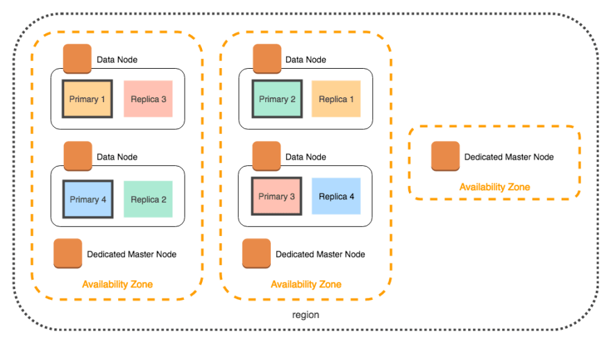

# ElasticSearch Cluster
- In [Elasticsearch](https://www.elastic.co/guide/en/elasticsearch/reference/current/add-elasticsearch-nodes.html), a [cluster](../../../0_SystemGlossaries/ServersCluster.md) is a collection of nodes.
- Cluster and nodes work together and hold the data, where node is an instance of Elasticsearch.
- A cluster provides joined indexing as well as search capabilities to Elasticsearch users.

## Sharding in ES Cluster
- The data stored in an index can be divided into multiple partitions.
- Each of these partitions is called `Shard`, which is managed and controlled by a separate node.
- `An Elasticsearch index has five shards by default`.

## How to increase ES throughput and concurrency capacity
- If you have an Elasticsearch cluster and you want to maximize the QPS and concurrency, its recommended to run the benchmark test that includes increasing and decreasing the number of shards per index / read replicas/indexes.
- [Reference - How to dramatically increase your Elasticsearch throughput and concurrency capacity](https://medium.com/explorium-ai/how-to-dramatically-increase-your-elasticsearch-throughput-and-concurrency-capacity-c32d7bb02ac2)
