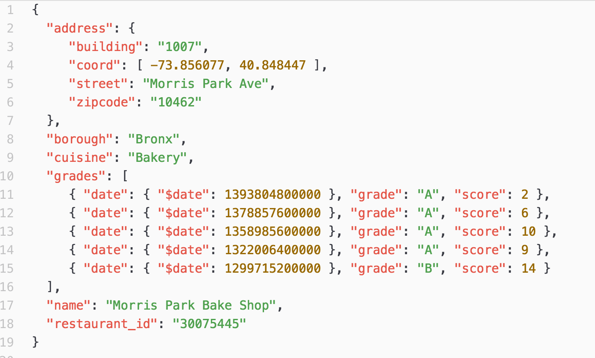

# MongoDB
- [MongoDB](https://www.mongodb.com/) is better suited for [high write and update throughput operations](../../../0_SystemGlossaries/Scalability/LatencyThroughput.md) without draining CPU resources and/or causing disk I/O issues. 
- It organizes data using a doubly linked data structure: documents contain linked lists to one another and to the `BSON-encoded` data behind the scenes.
- It offers [high scalability, reliability, and performance](../../1_Glossaries/DBScalability.md).
- [MongoDB]() is more suitable to manage NoSQL data requiring create, read, update and delete (CRUD) operations.



# :star: Real world use cases of MongoDB
- [Zomato - HLD Design](../../../../3_HLDDesignProblems/ZomatoSwiggyDesign/Readme.md)

# General Use Cases

| UC                         |
|----------------------------|
| E-commerce                 |
| Content Management         |
| IoT & time-series data     |
| Trading and Payments       |
| Gaming                     |
| Mobile Apps                |
| Real-time analytics and AI |

# :star: Casandra vs MongoDB
- [Read more](../DynamoDBVsMongoDBVsCasandra.md)

# MQL (Mongo Query Language)
- [MongoDB]() has a rich query language called [Mongo Query Language (MQL)](https://www.mongodb.com/developer/products/atlas/getting-started-atlas-mongodb-query-language-mql/). 
- It supports a wide variety of modern native drivers as well as a shell.
- MongoDB supports [fully ACID compliant transactions](../../1_Glossaries/ACIDTransactions/Readme.md).

# Book example - JSON-like document

````json
[
    {
        "year" : 2013,
        "title" : "Turn It Down, Or Else!",
        "info" : {
            "directors" : [ "Alice Smith", "Bob Jones"],
            "release_date" : "2013-01-18T00:00:00Z",
            "rating" : 6.2,
            "genres" : ["Comedy", "Drama"],
            "image_url" : "http://ia.media-imdb.com/images/N/O9ERWAU7FS797AJ7LU8HN09AMUP908RLlo5JF90EWR7LJKQ7@@._V1_SX400_.jpg",
            "plot" : "A rock band plays their music at high volumes, annoying the neighbors.",
            "actors" : ["David Matthewman", "Jonathan G. Neff"]
        }
    },
    {
        "year": 2015,
        "title": "The Big New Movie",
        "info": {
            "plot": "Nothing happens at all.",
            "rating": 0
        }
    }
]
````

# References
- [MongoDB Interview Questions](https://www.interviewbit.com/mongodb-interview-questions/)
- [Split Chunks in a Sharded Cluster](https://www.mongodb.com/docs/manual/tutorial/split-chunks-in-sharded-cluster/)