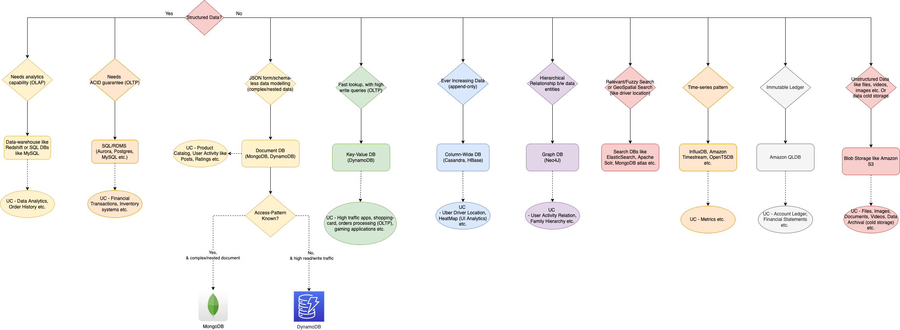
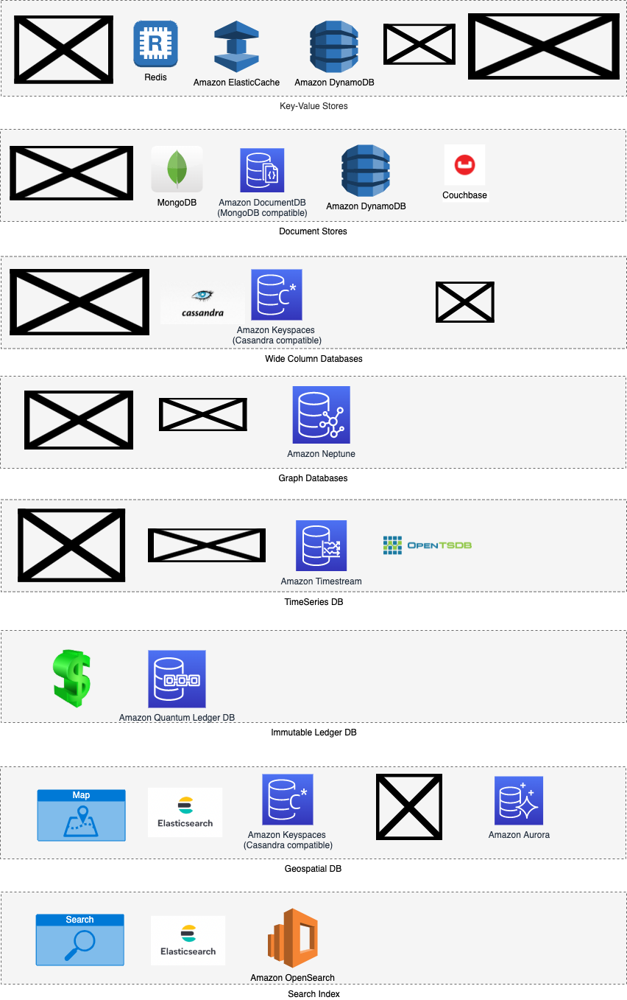

# How to choose database in the system design?

[Read more](../3_DecideDatabase/Readme.md)

# NoSQL-DB types

[Read more](../3_DecideDatabase/Readme.md)

# Cloud DB Cheat Sheet

# References
- :star: [AWS re:Invent 2021 - Which NoSQL database is right for you?](https://www.youtube.com/watch?v=ivBaro-8PhI)
- :star: [Database Design Tips | Choosing the Best Database in a System Design Interview](https://www.youtube.com/watch?v=cODCpXtPHbQ)