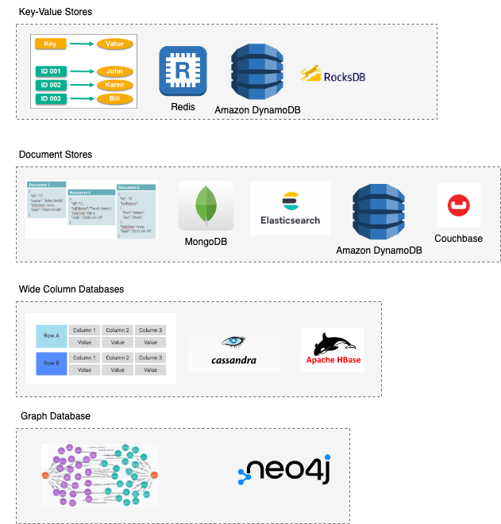

# NoSQL-DB Comparisons

| Database                                                                                       | Strength                                                                                                                                                                                                          | DB Type          | Pricing Model         |
|------------------------------------------------------------------------------------------------|-------------------------------------------------------------------------------------------------------------------------------------------------------------------------------------------------------------------|------------------|-----------------------|
| :star: [Amazon DynamoDB](../../../2_AWSComponents/6_DatabaseServices/AmazonDynamoDB/Readme.md) | Predictable performance and cost. <br/>- More than 20 million requests per second <br/>- Less than 10-20 ms latency                                                                                               | Document-DB      | `AWS Managed Service` |
| :star: [Elastic Search](../Search-Indexes/ElasticSearch)                                       | `Full-Text-Search`, `Logs-Analysis (ELK)`, `Metrics, Analysis`                                                                                                                                                    | Document-DB      | `Open Source`         |
| :star: [Apache Casandra](ApacheCasandra.md)                                                    | Handle large amount of data, at [low latency](../../0_SystemGlossaries/Scalability/LatencyThroughput.md) (with [eventual consistency](../../0_SystemGlossaries/Database/ReplicationAndDataConsistency.md))  | Wide-Column-DB   | `Open Source`         |
| [Apache HBase](ApacheHBase.md)                                                                 | Handle large amount of data, at [normal latency](../../0_SystemGlossaries/Scalability/LatencyThroughput.md) (with [strong consistency](../../0_SystemGlossaries/Database/ReplicationAndDataConsistency.md)) | Wide-Column-DB   | `Open Source`         |
| [MongoDB](MongoDB/Readme.md)                                                                   | -                                                                                                                                                                                                                 | Document-DB      | `Open Source`         |
| [Neo4j](Neo4j.md)                                                                              | -                                                                                                                                                                                                                 | Graph-DB         | `Open Source`         |
| [RocksDB](RocksDB.md)                                                                          | [low latency](../../0_SystemGlossaries/Scalability/LatencyThroughput.md), key-value data store for timeline use cases (like newsfeed).                                                                            | Document-DB      | `Open Source`         |

# NoSQL-DB types



## Key-Value Databases
- Data is stored in an array of key-value pairs.
- The `key` is an attribute name which is linked to a `value`.
- Examples - [Redis](../In-Memory-Cache/Redis), [Amazon DynamoDB](../../../2_AWSComponents/6_DatabaseServices/AmazonDynamoDB/Readme.md), [RocksDB](RocksDB.md) etc.

## Document Databases
- In these databases, data is stored in [JSON-like documents](https://aws.amazon.com/nosql/document/) (instead of rows and columns in a table) and these documents are grouped together in collections.
- Each document can have an entirely different structure.
- Since JSON document can contain all relevant information at one place (i.e. its self-contained), hence one query would be sufficient to get the data (instead of doing table joins in SQL).
- Examples - [Amazon DynamoDB](../../../2_AWSComponents/6_DatabaseServices/AmazonDynamoDB/Readme.md), [MongoDB](MongoDB), [Elastic Search](../Search-Indexes/ElasticSearch), [CouchDB](https://couchdb.apache.org) etc.

In the following example, a JSON-like document describes a book.
````json
[
    {
        "year" : 2013,
        "title" : "Turn It Down, Or Else!",
        "info" : {
            "directors" : [ "Alice Smith", "Bob Jones"],
            "release_date" : "2013-01-18T00:00:00Z",
            "rating" : 6.2,
            "genres" : ["Comedy", "Drama"],
            "image_url" : "http://ia.media-imdb.com/images/N/O9ERWAU7FS797AJ7LU8HN09AMUP908RLlo5JF90EWR7LJKQ7@@._V1_SX400_.jpg",
            "plot" : "A rock band plays their music at high volumes, annoying the neighbors.",
            "actors" : ["David Matthewman", "Jonathan G. Neff"]
        }
    },
    {
        "year": 2015,
        "title": "The Big New Movie",
        "info": {
            "plot": "Nothing happens at all.",
            "rating": 0
        }
    }
]
````

### General Use Cases - Document DBs
- Contact Management Systems
- Catalogs
- User Profiles
- Mobile Games
- IOT etc.

## Wide-Column Databases
- Instead of tables, we have column families in column databases, which are containers for rows.
- Each row contains a unique identifier (or set of identifiers) as its primary key and a following set of columns. 
- The primary key serves as a partition hash key as data is distributed across the cluster.
- Examples - [Apache Casandra](ApacheCasandra.md), [Apache HBase](ApacheHBase.md) etc.

### General Use Cases - Wide-Column DBs
- [Time Series Data](https://netflixtechblog.com/scaling-time-series-data-storage-part-i-ec2b6d44ba39)
- Historical records
- High-Write, Low-Read etc.

## Graph Databases
- These databases are used to store data (which is highly-connected, have many-to-many relationship) whose relations are best represented in a graph (like parent-child relationship of aadhaar etc.)
- Data is saved in graph structures with nodes (entities), properties (information about the entities), and lines (connections between the entities).
- Examples - [Neo4j](Neo4j.md), [Redis Graph](../In-Memory-Cache/Redis/RedisGraph.md)

Example Use Case - Social Network in Facebook
- vertices represent people, locations, events, checkins, and comments made by users
- edges indicate which people are friends with each other, which checkin hap‐ pened in which location, who commented on which post, who attended which event, and so on

### General Use Cases - Graph Database
- [Instagram - User Activity Relationship](../../../3_HLDDesignProblems/InstagramDesign/Readme.md)
- [LinkedIn - User Activity Relationship](https://engineering.linkedin.com/blog/2017/06/building-the-activity-graph--part-i)
- Social networks
- Logistics & spatial data
- Fraud detection & analytics
- Product-recommendation engine
- Identity and access management

# Comparisons
- :star: [Casandra vs MongoDB](CasandraVsMongoDB.md)