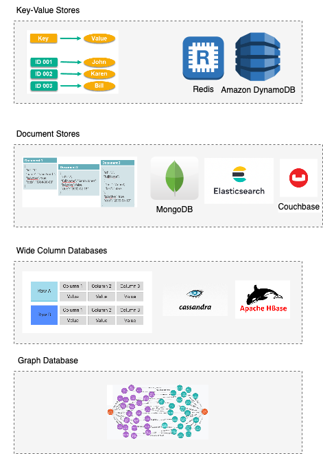

# NoSQL-DB Comparisons

| Database                                              | Strength                                                                                                            | DB Type        | Pricing Model         |
|-------------------------------------------------------|---------------------------------------------------------------------------------------------------------------------|----------------|-----------------------|
| [Amazon DynamoDB](../../../2_AWSComponents/6_DatabaseServices/AmazonDynamoDB.md) | Predictable performance and cost.  - More than 20 million requests per second  - Less than 10-20 ms latency | Key-Value      | `AWS Managed Service` |
| [ElasticSearch](ElasticSearch)     | `Full-Text-Search`, `Logs-Analysis (ELK)`, `Metrics, Analysis`                                                      | Document-DB    | `Open Source`         |
| [MongoDB](MongoDB)                 | -                                                                                                                   | Document-DB    | `Open Source`         |
| [Apache Casandra](ApacheCasandra.md) | Handle large amount of data, at low latency (with eventual consistency)                                             | Wide-Column-DB | `Open Source`         |
| [Apache HBase](ApacheHBase.md)    | Handle large amount of data, with strong consistency (& normal latency)                                             | Wide-Column-DB | `Open Source`         |

# NoSQL-DB types

## Key-Value Stores
- Data is stored in an array of key-value pairs.
- The `key` is an attribute name which is linked to a `value`.
- Well-known key-value stores include [Amazon DynamoDB](../../../2_AWSComponents/6_DatabaseServices/AmazonDynamoDB.md), [Redis](Redis) etc.

## Document Databases
- In these databases, data is stored in documents (instead of rows and columns in a table) and these documents are grouped together in collections.
- Each document can have an entirely different structure.
- Document databases include [MongoDB](MongoDB), [ElasticSearch](ElasticSearch), [CouchDB](https://couchdb.apache.org) etc.

## Wide-Column Databases
- Instead of `tables`, we have column families in column databases, which are containers for rows.
- Examples - [Apache Casandra](ApacheCasandra.md), [Apache HBase](ApacheHBase.md) etc.

## Graph Databases
- These databases are used to store data whose relations are best represented in a graph ( like parent-child relationship of aadhaar etc.)
- Data is saved in graph structures with nodes (entities), properties (information about the entities), and lines (connections between the entities).