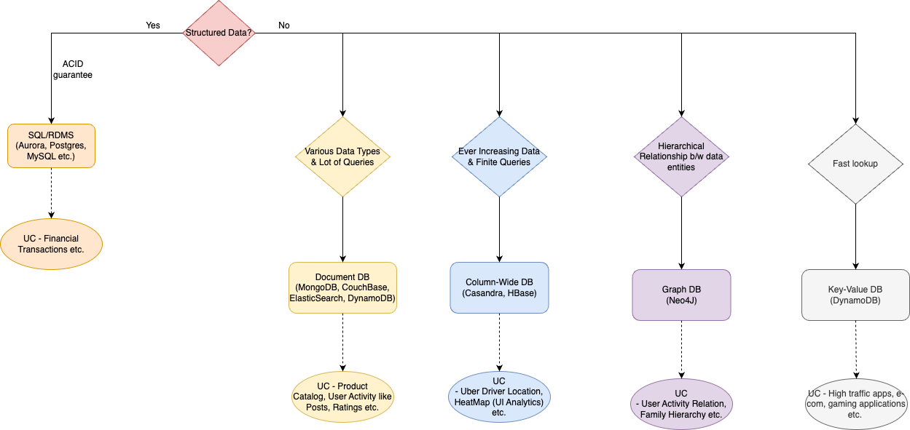
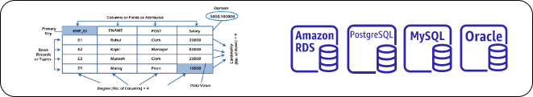

# SQL vs NoSQL

| Basis                           | SQL                                                                                                                                                                                                                                                                                                                                                | [NoSQL](NoSQL-Databases)                                                                                                                                                     |
|---------------------------------|----------------------------------------------------------------------------------------------------------------------------------------------------------------------------------------------------------------------------------------------------------------------------------------------------------------------------------------------------|------------------------------------------------------------------------------------------------------------------------------------------------------------------------------|
| Data Type                       | Normalized, Structured Data                                                                                                                                                                                                                                                                                                                        | Denormalized, Unstructured data                                                                                                                                              |
| Schema                          | :hammer: Fixed Schema                                                                                                                                                                                                                                                                                                                              | Dynamic Schema  (with hierarchical storage supported)                                                                                                                    |
| Write Performance               | Okay - Every write is not just an append to a table but also an update to multiple index which might require locking and hence might interfere with other reads and other writes.                                                                                                                                                              | :muscle: Very Good - Writes are cheaper due to [append-only nature](../0_SystemGlossaries/AppendOnlyDataStructure.md) - Hence [High-Throughput, Low-Latency](../0_SystemGlossaries/LatencyThroughput.md)               |
| Querying                        | :muscle: Very Powerful                                                                                                                                                                                                                                                                                                                             | Okay                                                                                                                                                                         |
| Ideal Use Cases                 | SQL is best suitable for complex queries, multi-row transactions, joins etc.  - Data is structured ( like e-commerce, :moneybag: financial applications etc.) and also when data reporting is needed.                                                                                                                                          | NoSQL is best suited for unstructured data or documents (or large volume of data).  - Not ideal for complex queries. - UCS like Gaming, Analytics, Online Tests etc. |
| Scalability                     | - [Vertically Scalable](../0_SystemGlossaries/Scalability/DBScalability.md#vertical-scalability--scale-up-) (increase memory, CPU of machine) or  - [Single-Master-Multi-Read-Replicas technique](../0_SystemGlossaries/Scalability/DBScalability.md#db---horizontal-scaling-techniques) (1 write DB, multiple read DBs) or  - Sharding based on a business parameter. | [Horizontally Scalable](../0_SystemGlossaries/Scalability/DBScalability.md#db---horizontal-scaling-techniques) (through in-built data sharding technique)                                  |
| Properties                      | [SQL enables ACID (atomicity, consistency, isolation, and durability)](../0_SystemGlossaries/ACIDPropertyTransaction.md) transaction properties.                                                                                                                                                                                                   | [NoSQL follows CAP (consistency, availability, partition tolerance)](../0_SystemGlossaries/CAPTheorem.md) properties of the distributed systems.                             |
| Best Features                   | Secure, Cross Platform Support, Free                                                                                                                                                                                                                                                                                                               | High Performance, Flexible, Easy to use                                                                                                                                      |
| Built-in Single Machine Failure | :x: Not-Supported                                                                                                                                                                                                                                                                                                                                  | :white_check_mark: Supported                                                                                                                                                 |

# How to choose database in the system design?

[Read more](DecideDatabase.md)

# SQL - Intro

Relational databases store data in rows and columns.
- Each row contains all the information about one entity and each column contains all the separate data points.
- Some of the most popular relational databases are [AWS Aurora](../../2_AWSComponents/6_DatabaseServices/AmazonRDSAurora/Readme.md), `Postgres`, `MySQL`, `Oracle`, `MS SQL Server`, `SQLite` and `MariaDB`.
- [Read more about sharding in MySQL Cluster](https://www.mysql.com/products/cluster/scalability.html)

# NoSQL - Intro, Different NoSQL types

[Read more](NoSQL-Databases/Readme.md)

# SQL - Different Databases

## MySQL vs PostgreSQL

[PostgreSQL is twice as fast as MySQL](https://itnext.io/benchmark-databases-in-docker-mysql-postgresql-sql-server-7b129368eed7).

| Component                                                               | Strength                                | Component Type                | Very Rough Throughput (QPS)                 | Latency | Pricing Model                                              |
|-------------------------------------------------------------------------|-----------------------------------------|-------------------------------|---------------------------------------------|----------------|------------------------------------------------------------|
| [MySQL](src/1_HLDDesignComponents/3_DatabaseComponents)                                | -                                       | SQL DB                        | 1000 concurrent requests ( 100 as default ) | [< 10ms ( to get a row from 1 million records )](https://www.quora.com/How-can-we-calculate-the-throughput-of-MySQL?share=1)| `Open Source` ( [RDS](src/2_AWSComponents/RDS.md) on AWS ) |

# References
- [Groking the System Design](https://www.educative.io/courses/grokking-the-system-design-interview/YQlK1mDPgpK)
- [SQL vs NoSQL](https://www.interviewbit.com/blog/sql-vs-nosql/)
- [Scaling Your Amazon RDS Instance Vertically and Horizontally](https://aws.amazon.com/blogs/database/scaling-your-amazon-rds-instance-vertically-and-horizontally/)
- [10 use cases where NoSQL will outperform SQL](https://www.networkworld.com/article/2999856/10-use-cases-where-nosql-will-outperform-sql.html)
- [Why is NoSQL faster than SQL?](https://softwareengineering.stackexchange.com/questions/175542/why-is-nosql-faster-than-sql)
- [Why and How to Migrate from Apache Cassandra to Amazon DynamoDB - AWS Online Tech Talks?](https://www.youtube.com/watch?v=WuDGvG_4kC8)
- [7 Database Paradigms](https://www.youtube.com/watch?v=G1rOthIU-uo)