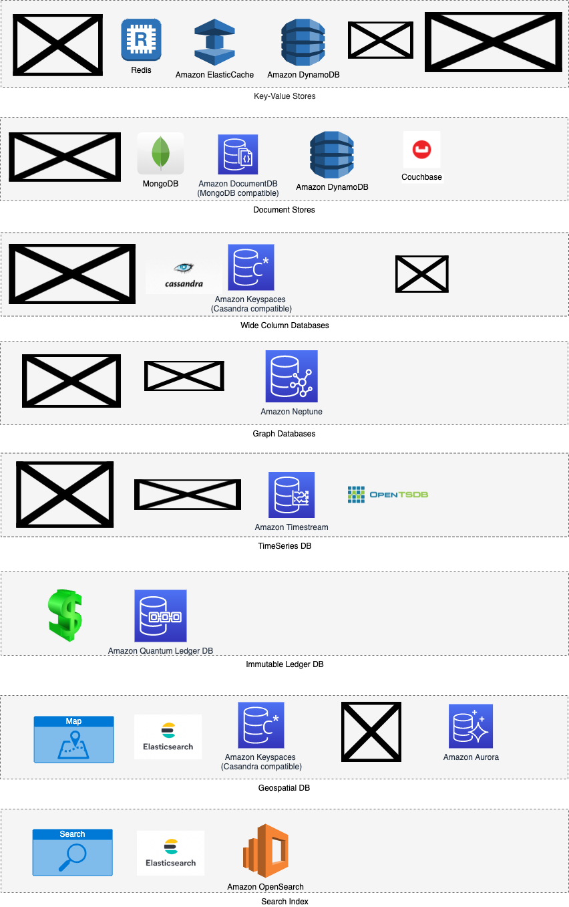

# How to choose database in the system design?

[Read more](3_DecideDatabase/Readme.md)

# NoSQL - Intro, Different NoSQL types

[Read more](NoSQL-Databases/Readme.md)

# References
- [Groking the System Design](https://www.educative.io/courses/grokking-the-system-design-interview/YQlK1mDPgpK)
- [SQL vs NoSQL](https://www.interviewbit.com/blog/sql-vs-nosql/)
- [Scaling Your Amazon RDS Instance Vertically and Horizontally](https://aws.amazon.com/blogs/database/scaling-your-amazon-rds-instance-vertically-and-horizontally/)
- [10 use cases where NoSQL will outperform SQL](https://www.networkworld.com/article/2999856/10-use-cases-where-nosql-will-outperform-sql.html)
- [Why is NoSQL faster than SQL?](https://softwareengineering.stackexchange.com/questions/175542/why-is-nosql-faster-than-sql)
- [Why and How to Migrate from Apache Cassandra to Amazon DynamoDB - AWS Online Tech Talks?](https://www.youtube.com/watch?v=WuDGvG_4kC8)
- [7 Database Paradigms](https://www.youtube.com/watch?v=G1rOthIU-uo)
- [DBs on various clouds](https://media.licdn.com/dms/image/D4E22AQGZI2OlimmTuQ/feedshare-shrink_800/0/1696693136128?e=1699488000&v=beta&t=0LhhYelBizt1fhUW897sSuOfMNcAieVkbA67H9q7B6w)