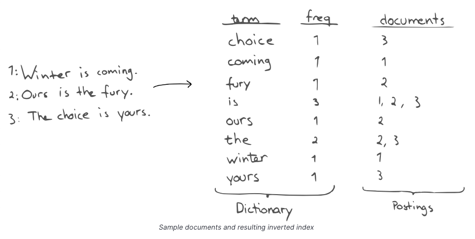

# Apache Lucene
- [Apache Lucene](https://lucene.apache.org/core/) is a text search engine. 
- It stores text in a custom binary format optimized for retrieval purposes. 
- The format is highly optimized and complicated.
- Lucene uses the concept of `indices containing documents`.
    - Internally every index consists of several segments.
    - Segments are saved in several files in the file system.
    - Documents are split up in several lookup structures, residing in the files.
- When you browse the data folder of [ElasticSearch](ElasticSearch/Readme.md), you see this lucene index and segment structure.
    - There is no storage of json formatted data on the file system level.
    - The files contain `optimized binary data` and `you need to pass through the elastic API to get a JSON representation of a document`.

# :star: Real world usages of Apache Lucene
- Search - Full-text, Partial etc.
- Logs-analysis
  - Since data is indexed in Lucene, hence logs analysis is fast in Lucene.
- Dashboard, Visualize data, Metrics etc.
  - Since data aggregation is fast in Lucene, hence data visualization is quick in Lucene.

# Components based on Apache Lucene

| Component                                        | Remarks |
|--------------------------------------------------|---------|
| [ElasticSearch](ElasticSearch/Readme.md)         | -       |
| [Apache Solr](ApacheSolr.md)                     | -       |
| [New Relic](../../7_MonitoringTools/NewRelic.md) | -       |

# What is tokenizer?
- Tokenizers are used to generate the `tokens from a text string`.
- It breaks down the text string into tokens where it finds whitespace or other punctuation symbols.

# Inverted indexes and Index Terms
- Internally, Lucene stores data in inverted indexes ( term and documents mapped to it ).
- The inverted index maps `terms` to `documents` (and possibly positions in the documents) containing the term.
- Using inverted indexes, lucene internally & efficiently finds documents with given term prefixes.
- For example - find all documents, starting with `c`.

# Reference
- [How does elasticsearch store data?](https://stackoverflow.com/questions/57328151/how-does-elasticsearch-store-data)