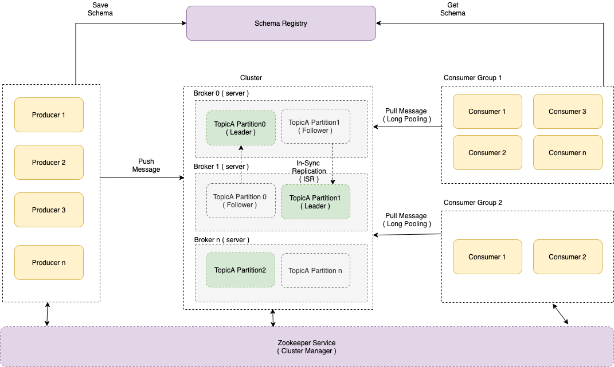

# :star: Apache Kafka 
- Apache Kafka is an [open-source distributed event streaming platform](../../0_SystemGlossaries/EventDrivenArchitecture.md) used by thousands of companies for high-performance data pipelines, streaming analytics, data integration, and mission-critical applications.
- Kafka can process a large amount of data in a short amount of time (`1 million messages/sec`).
- It also has [low latency](../../0_SystemGlossaries/Scalability/LatencyThroughput.md), making it possible to process data in real-time.
- Kafka is based on [Publish-Subscriber Model](..#publisher-subscriber-model-pubsub). And can be used for [Event-Driven Architecture](../../0_SystemGlossaries/EventDrivenArchitecture.md).
- [Amazon Managed Streaming for Apache Kafka (MSK)](../../../2_AWSComponents/5_MessageBrokerServices/AmazonMSK.md) can be used to deploy Kafka on [AWS](../../../2_AWSComponents).

# :star: Real world use cases of Kafka
- [Personalization at Spotify using Cassandra](../../../3_HLDDesignProblems/PersonalizationSpotify)
- [Zomato - HLD Design](../../../3_HLDDesignProblems/ZomatoDesign)
- [Uber Driver Allocation](../../../3_HLDDesignProblems/UberDriverAllocationDesign)
- [Twillo - Send Message API Design](../../../3_HLDDesignProblems/TwilloSendMessageAPI)
- [Logging Solution in Distributed Systems](../../../3_HLDDesignProblems/LoggingSolution)
- [Flight Booking Search](../../../3_HLDDesignProblems/FlightBookingSearch/README.md)
- [Linked In - Kafka](../../../3_HLDDesignProblems/LinkedInDesign/Readme.md)

# Why Kafka is so fast?
- Kafka achieves [low latency](../../0_SystemGlossaries/Scalability/LatencyThroughput.md) message delivery through [Sequential I/O and Zero Copy Principle](https://twitter.com/alexxubyte/status/1506663791961919488/photo/1).
- Messages (events) in the [Kafka]() are immutable and can't be changed once it's pushed (due to [log based queue nature](../../0_SystemGlossaries/Database/AppendOnlyDataStructure.md)).
- The same techniques are commonly used in much other messaging/streaming platforms.

Kafka is based on [Log Based Queue](../../0_SystemGlossaries/Database/AppendOnlyDataStructure.md)
- :star: Messages are persisted to [append-only log files](../../0_SystemGlossaries/Database/AppendOnlyDataStructure.md) by the broker.
- Producers are [appending these log files (sequential write)](../../0_SystemGlossaries/Database/AppendOnlyDataStructure.md) & consumers are reading a range of these files ( `sequential reads` ).

# :star: Is Kafka a Database?
- Yes & No.
- In some way, Kafka supports [ACID properties](../../0_SystemGlossaries/Database/ACIDPropertyTransaction.md).
- [Martin Kleppmann | Kafka Summit London 2019 Keynote | Is Kafka a Database?](https://www.youtube.com/watch?v=BuE6JvQE_CY)
- [Read More](https://queue.acm.org/detail.cfm?id=3321612)

# Basic Architecture of Kafka Cluster

# General use cases of Kafka

## As an events/message broker in Event-Driven Architecture
- Use Kafka when your application has a High Throughput ( around `1 million messages/sec`), i.e. application has to process a large volume of messages, [event driven services](../../0_SystemGlossaries/EventDrivenArchitecture.md) etc.

## To monitor metrics, logs of the IT infrastructure
- Various systems in the IT infrastructure can push events/messages/logs in the Kafka. And logstash ( in ELK ) can act as a consumer to the Kafka.

## For Analytics
- If we want to build our own Google Analytics ( to track app activities, events etc.), we can use Kafka as a broker.

## Stream Processing
- Use Kafka when the event stream needs to process data in multi-stage pipelines, the pipelines can generate graphs of the real-time data flows, thus providing real-time monitoring of traffic in the pipelines. 
- Example - Video streaming in YouTube etc.

# Top Features of Kafka

## Scalability
- Kafka can be [horizontally scaled](../../0_SystemGlossaries/Scalability/DBScalability.md) easily across the cluster.
- A cluster of brokers is used to partition and streamline the data thereby, scaling up the storage capacity.

## Performance - High Throughput
- Each Kafka broker can serve more than [1 million messages per second](../../0_SystemGlossaries/Scalability/LatencyThroughput.md#Throughput) and can hold TBs of data.
- Default configured message size in Kafka is `1MB`.

## High Volume
- Large amount of data can be stored in the Kafka pool.

## Durability
- The data is kept [persistent (as per retention policy)](../../0_SystemGlossaries/Database/Durability.md) and tolerant to any hardware failures by copying the data in the clusters.

## High Availability, Fault Tolerance
- The [distributed, partitioned, replicated](../../0_SystemGlossaries/Database/ReplicationAndDataConsistency.md), and [fault-tolerant](../../0_SystemGlossaries/Reliability/FaultTolerance&DisasterRecovery.md) nature of Kafka makes it very reliable.
- Kafka connector can handle failures with three strategies summarised as `fast-fail`, `ignore` and `re-queue` (sends to another topic).
- [Read more about replication in Kafka](#replication)

## Extensibility
- Allows multiple ways for applications to plugin and make use of Kafka.
- Also, it has provisions for new connectors that you can write as needed.

## Data Transformation
- Kafka allows for deriving new data streams using the existing data streams from producers.

# Major Components of Kafka

## Topic (i.e. Category or Queue)
- Topic is a category or feed where messages ( or events ) would be saved and published.
- Topics are logically collections of partitions (the physical files).
- A broker contains some partitions for a topic.

## Producer
- Producer writes data into the topics ( 1 or more ) in the Kafka.
- [Read about ACK levels in Kafka](#ack-levels)

## Consumer
- A consumer can subscribe ( listen ) to the topics ( 1 or more ) and read data from those in the Kafka.
- Each consumer in a consumer group will be responsible for reading a subset of the partitions of each subject to which they have subscribed.
- Reading data out of Kafka is very fast thanks to `java.nio.channels.FileChannel#transferTo`.
    - This method uses `sendFile` system call which allows for very efficient transfer of data from a file to another file ( including sockets ).

## Broker ( i.e. Server )
- A Kafka broker is a server that works as part of a Kafka cluster (in other words, a Kafka cluster is made up of a number of brokers)
- Multiple brokers in the Kafka cluster, provides load balancing, reliable redundancy & fail-over.
- Without sacrificing performance, each broker instance can handle read and write volumes of hundreds of thousands per second (and gigabytes of messages).
- Brokers keep very little state, mostly just open file pointers & connections.
- To scale writes, number of leader partitions per broker can be reduced to spread the writes across more brokers.

## ZooKeeper
- [Zookeeper](../../7_ClusterCoordinationService/ApacheZookeeper.md) manages Kafka Cluster ( new broker, new partition etc. ) and brokers coordination.
- Kafka stores basic metadata in Zookeeper ( in-memory ), like info about brokers, topics, partitions, partition lead/followers, consumer offset etc.
- Zookeeper is also used in the [Controller election](#controller-election) in the `Kafka Cluster`.
- Zookeeper notifies consumers and producers of the arrival of new broker or failure of existing broker, as well as routing all requests to partition's leaders.
- [Read more about replication in Kafka](#replication)

## Sharding/Partitioning
- Partitioning allows Kafka producers to serialize, compress, and load balance data among brokers.
- Topics can be parallelized via partitions, which split data into a single topic among numerous brokers.
- [More partitions](https://www.confluent.io/blog/how-choose-number-topics-partitions-kafka-cluster/) lead to higher throughput.

## Consumer Group
- The name of an application is essentially represented by a consumer group
- A consumer in Kafka can be part of one or more consumer groups.
- A consumer group in Kafka is a collection of consumers who work together to ingest data from the same topic or range of topics.
- The `-group` command must be used to consume messages from a consumer group.

## Replication
- Each partition would be replicated across the brokers/servers in the cluster (as per configured replication factor).

### Leader
- Only one partition (of the topic) would be active at the time, called `Leader`.
- Write requests on the partition, would be handled by Leader

### Follower
- Other partitions (of the topic) would only replicate message, called `Followers`.
- Based on configured replication factor ([replication.factor](https://kafka.apache.org/documentation/#replication)), the number of followers would be decided.
- Example - 3 replication factor means there would be 1 leader and 2 followers.

### In-Sync Replicas (ISR)
- An [in-sync replica (ISR)](https://www.conduktor.io/blog/how-replication-and-isr-work-in-kafka) is a broker that has the latest data for a given partition. 
  - A leader is always an in-sync replica. 
  - A follower is an in-sync replica only if it has fully caught up to the partition it’s following. 
  - In other words, it can't be behind on the latest records for a given partition.
- Read requests on the partition, would be handled by in-sync replicas.
- The message is considered committed to the log only when all in-sync replicas have the message. 
  - Accordingly, ack is sent to the producer.
- The number of [brokers](#broker--ie-server-) should be greater than the `minimum in-sync replica size` (i.e. at least 3).

### ACK levels 
The `acks` setting is a client (producer) configuration. 
- It denotes the number of brokers that must receive the record before we consider the write as successful. 
- It supports three values – 0, 1, and all.

The `acks` setting is a good way to configure your preferred trade-off between durability guarantees and performance.
- If you’d like to be sure your records are nice and safe – configure your acks to all.
- If you value latency and throughput over sleeping well at night, set a low threshold of 0. You may have a greater chance of losing messages, but you inherently have better latency and throughput.

#### acks=0
- With a value of 0, the producer won’t even wait for a response from the broker. 
- It immediately considers the write successful the moment the record is sent out.

#### acks=1
- With a setting of 1, the producer will consider the write successful when the leader receives the record. 
- The leader broker will know to immediately respond the moment it receives the record and not wait any longer.

#### acks=all
- When set to all, the producer will consider the write successful when all of the in-sync replicas receive the record. 
- This is achieved by the leader broker being smart as to when it responds to the request – it’ll send back a response once all the in-sync replicas receive the record themselves.

  
## Schema Registry
- Schema Registry holds Avro schemas & ensures that schema used by producer and consumer, are identical.
- Producer sends schema id while pushing the data and consumer look for schema id to get schema.

## Kafka Controller
- In a Kafka cluster, one of the brokers serves as the controller, which is responsible for managing the states of partitions and replicas and for performing administrative tasks like reassigning partitions. 
- At any given time there is only one controller broker in your cluster.
- The Kafka controller in a Kafka cluster is in charge of managing partition leaders and replication.
- [Kafka Controller does leader election for the topic](https://stackoverflow.com/questions/49525141/how-many-kafka-controllers-are-there-in-a-cluster-and-what-is-the-purpose-of-a-c) ( if existing leader goes down ).
- [The Kafka controller is brain of the Kafka cluster](https://stackoverflow.com/questions/49525141/how-many-kafka-controllers-are-there-in-a-cluster-and-what-is-the-purpose-of-a-c). It monitors the liveliness of the brokers and acts on broker failures.

### Controller Election
- The first broker that starts in the cluster will become the Kafka Controller by creating an `ephemeral node called "/controller"` in [Zookeeper](#zookeeper)
- When other brokers starts they also try to create this node in Zookeeper, but will receive an "node already exists" exception, by which they understand that there is already a Controller elected in the cluster.
- When the Zookeeper doesn't receive heartbeat messages from the Controller, the ephemeral node in Zookeeper will get deleted.`
- It then notifies all the other brokers in the cluster that the Controller is gone via Zookeeper watcher, which starts a new election for new Controller again. 
- All the other brokers will again try to create a ephemeral node "/controller" and the first one to succeed will be elected as the new Controller.

## What is Partition Key in Kafka?

- Partitioning is done using `key` in the record
- If we want to sequence records execution in Kafka, as per the records input time, we should push those in the same partition (hence same key should be used for the records).
- If we push those in different partitions, then we can't guarantee of their execution sequence.
- Producers can be configured with a custom routing function (implementing the `Partitioner interface`).
- Default message routing is `hash-mod`.

Example
- This is important because we may have to deliver records to customers in the same order that they were made.
- You want these events to come in the order they were created when a consumer purchases an eBook from your webshop and subsequently cancels the transaction.
- If you receive a cancellation event before a buy event, the cancellation will be rejected as invalid (since the purchase has not yet been registered in the system), and the system will then record the purchase and send the product to the client (and lose you money).
- You might use a customer id as the key of these Kafka records to solve this problem and assure ordering.
- This will ensure that all of a customer's purchase events are grouped together in the same partition.

## Security
- All components ( brokers, zookeeper, producers, consumers etc. ) should authenticate each other and setup an encrypted channel for communication. 
  - Kafka supports SSL based authentication and encryption.
- `Authorization` - ACLs should be defined and enforced to control which users can perform what action? 

### Multiple Tenants Isolation
- Each tenant will have a separate topic prefix. Eg. User A can only create and access topics with prefix “A.”, user B can only create and access topics with prefix “B.”
- Define and enforce ACLs for topic creation and access (produce and consume) restricting each user to their own topic prefixes.

# Estimation - How to decide number of partitions in Kafka?

Rough formula for picking the number of partitions = `MAX(t/p, t/c)`

| Parameter    | Title                             | More Description                                                                                |
|--------------|-----------------------------------|-------------------------------------------------------------------------------------------------|
| `t`          | Target Throughput                 | Let’s say your target throughput is t. |
| `p`          | Thoughput on a single partition   | You measure the throughout that you can achieve on a single partition for production (call it p). |
| `c`          | Consumption Rate                  | And consumption (call it c). |

Read more
- [How to Choose the Number of Topics/Partitions in a Kafka Cluster?](https://www.confluent.io/blog/how-choose-number-topics-partitions-kafka-cluster/)
- [Kafka cluster size calculator](https://docs.google.com/spreadsheets/d/1a3uIa8TTRLlN6HTtMzPPqf8p5j5OxflJuAyff-uHLgk/edit?usp=sharing)

## Other Points
- More partitions lead to `higher throughput`.
- More partitions requires `more open file handles`
    - This is mostly just a configuration issue.
    - We have seen production Kafka clusters running with more than 30 thousand open file handles per broker.
- More partitions may `increase unavailability`.
    - It’s probably better to limit the number of partitions per broker to two to four thousand and the total number of partitions in the cluster to low tens of thousand.
- More partitions may increase end-to-end latency.
    - As a rule of thumb, if you care about latency, it’s probably a good idea to limit the number of partitions per broker to *100 x b x r*, where b is the number of brokers in a Kafka cluster and r is the replication factor.
- More partitions may require more memory in the client.

## Kafka Cluster (with min. nodes) for high availability

So, if you wish to design a Kafka cluster that can tolerate one planned and one unplanned failure, you should consider the following requirements:
- A minimum in-sync replicas of 2.
- A replication factor of 3 for topics.
- At least 3 Kafka brokers, each running on different nodes. 
- Nodes spread across three availability zones.

# Other Links
- [Core APIs in Kafka](KafkaAPIs.md)
- [Kafka vs Others](../KafkaVsRabbitMQVsSQSVsSNS.md)
- [Designing and testing a highly available Kafka cluster on Kubernetes (without zookeeper)](https://learnk8s.io/kafka-ha-kubernetes)

# References
- [Kafka official documentation](https://kafka.apache.org/documentation/#theproducer)
- [Kafka Interview Question](https://www.interviewbit.com/kafka-interview-questions/)
- [How to minimize the latency involved in kafka messaging framework?](https://stackoverflow.com/questions/20520492/how-to-minimize-the-latency-involved-in-kafka-messaging-framework)
- [Apache Kafka on AWS using Amazon MSK](https://aws.amazon.com/msk/what-is-kafka/)
- [Kafka Talk by Tri Hug](https://www.slideshare.net/mumrah/kafka-talk-tri-hug)
- [Role of ZooKeeper in Kafka](https://www.youtube.com/watch?v=bnHWrSwPvig)
- [Replication in Kafka](https://medium.com/@_amanarora/replication-in-kafka-58b39e91b64e)
- [Kafka Acks Explained](https://accu.org/journals/overload/28/159/kozlovski/)