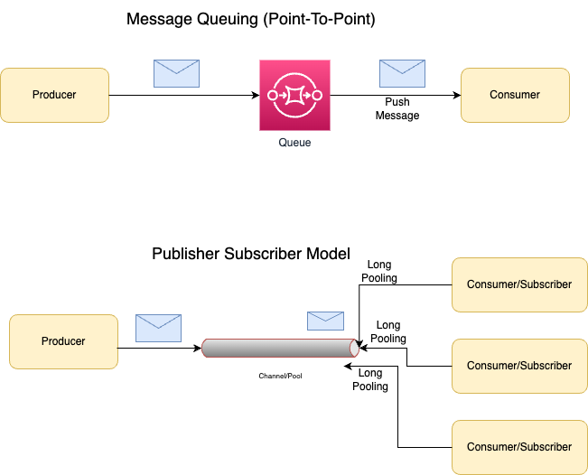

# Publisher-Subscriber Model (Pub/Sub)
- Unlike point-to-point model, a message is only removed once it has been consumed by `all category subscribers` or according to `retention policy`.
- This may be synchronous or asynchronous.

# Supported Services

| Service                                                                                                     |
|-------------------------------------------------------------------------------------------------------------|
| [Kafka](../Kafka/Readme.md)                                                             |
| [Amazon Kinesis Data Streams](../../../2_AWSComponents/5_MessageBrokerServices/AmazonKinesisDataStreams.md) |
| [Amazon EventBridge](../../../2_AWSComponents/5_MessageBrokerServices/AmazonEventBridge.md)                 |
| [Amazon SNS](../../../2_AWSComponents/5_MessageBrokerServices/AmazonSNS.md)                                 |
| [Active MQ](../ActiveMQ.md)                                                             |

# References
- [Pub/sub pattern](https://docs.aws.amazon.com/prescriptive-guidance/latest/modernization-integrating-microservices/pub-sub.html)
