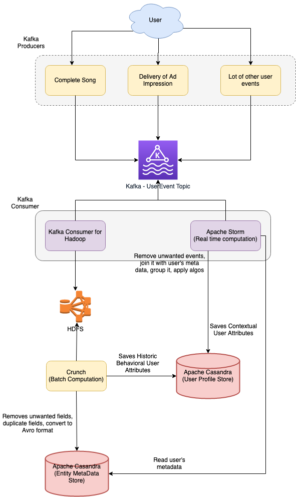

# Introduction
- [Apache HDFS (Hadoop Distributed File System)](https://hadoop.apache.org/docs/r1.2.1/hdfs_design.html) is a distributed file system that runs on standard or low-end hardware. (handles large data sets)
- HDFS provides better [data throughput](../../0_SystemGlossaries/LatencyThroughput.md) than traditional file systems, in addition to [high fault tolerance](../../0_SystemGlossaries/FaultTolerance&DisasterRecovery.md) and native support of large datasets.
- It is used to scale a single Apache Hadoop cluster to hundreds (and even thousands) of nodes.
- HDFS accommodates applications that have data sets typically gigabytes to terabytes in size.

# :star: Real world use cases of HDFS

## Personalization at Spotify using Cassandra & HDFS

- [Read more](../../../3_HLDDesignProblems/PersonalizationSpotify)

# HDFS vs S3
- With better [scalability](../../0_SystemGlossaries/Scalability.md), built-in persistence, and lower prices, [S3](../../../2_AWSComponents/7_StorageServices/AmazonS3.md) is the winner!
- For better [performance](../../0_SystemGlossaries/LatencyThroughput.md) and no limitations on file size or storage format, [HDFS is the way to go](https://www.integrate.io/blog/storing-apache-hadoop-data-cloud-hdfs-vs-s3/).

# References
- [What is Hadoop?](https://aws.amazon.com/emr/details/hadoop/what-is-hadoop/)
- [Storing Apache Hadoop Data on the Cloud - HDFS vs. S3](https://www.integrate.io/blog/storing-apache-hadoop-data-cloud-hdfs-vs-s3/)
- [Scale an Apache Hadoop cluster to hundreds of nodes with the Hadoop Distributed File System (HDFS)](https://www.ibm.com/in-en/topics/hdfs)