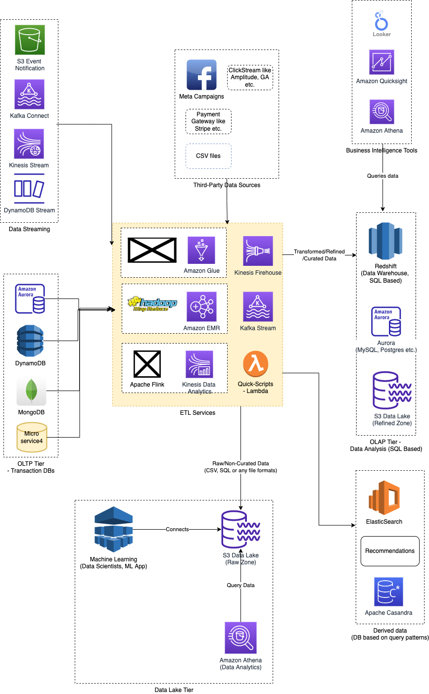

# Apache Flink
- [Apache Flink](https://flink.apache.org/what-is-flink/flink-architecture/) is a framework and distributed processing engine for stateful computations over unbounded and bounded data streams. 
- Flink has been designed to run in all common cluster environments, perform computations at in-memory speed and at any scale.

# Bounded vs Unbounded Stream

