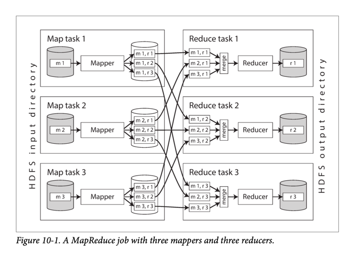

# Map Reduce
- [MapReduce](https://en.wikipedia.org/wiki/MapReduce) is a programming model for processing large amounts parallel of data in bulk across many machines.

| Step                                | Description                                                                                                                                                                                                                                                                                                             |
|-------------------------------------|-------------------------------------------------------------------------------------------------------------------------------------------------------------------------------------------------------------------------------------------------------------------------------------------------------------------------|
| Read input files                    | Read a set of input files, and break it up into records.  - In the web server log example, each record is one line in the log (that is, \n is the record separator).                                                                                                                                                |
| Mapper (also known as collect)      | The mapper is called once for every input record, and its job is to extract the key and value from the input record.  - For each input, it may generate any number of key-value pairs (including none).  - It does not keep any state from one input record to the next, so each record is handled independently. |
| Reducer (also known as fold/inject) | The MapReduce framework takes the key-value pairs produced by the mappers, collects all the values belonging to the same key, and calls the reducer with an iterator over that collection of values.  - The reducer can produce output records (such as the number of occurrences of the same URL).                 |

# MapReduce vs Unix Tools
- The main difference from pipelines of Unix commands is that MapReduce can parallelize a computation across many machines, without you having to write code to explicitly handle the parallelism.
- While [Unix tools](https://dasher.wustl.edu/chem478/software/unix-tools/) use stdin and stdout as input and output, MapReduce jobs read and write files on a distributed filesystem like [HDFS](ApacheHadoop/ApacheHDFS.md), [S3](../../../../2_AWSComponents/7_StorageServices/3_ObjectStorageS3/Readme.md) etc.

# MapReduce workflows
- It is very common for MapReduce jobs to be chained together into workflows, such that the output of one job becomes the input to the next job.
- To handle these dependencies between job executions, various workflow schedulers for Hadoop have been developed like [Airflow](https://airflow.apache.org/) etc.

# Beyond MapReduce
- In response to the difficulty of using MapReduce directly, various higher-level programming models (Pig, Hive, Cascading, Crunch etc.) were created as abstractions on top of MapReduce.

# References
- [What is Hadoop?](https://aws.amazon.com/emr/details/hadoop/what-is-hadoop/)
