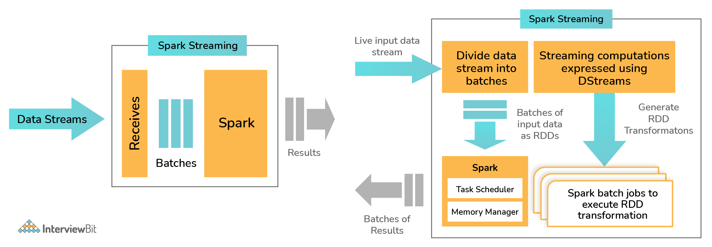

# Introduction
- [Apache Spark](https://spark.apache.org) is an open-source framework & compute engine that is known for its speed, easy-to-use nature in the field of `big data processing` and `analysis`.
- It also has built-in modules for graph processing, machine learning, streaming, SQL etc.
- The spark execution engine supports in-memory computation and cyclic data flow.
- It can run either on [cluster mode](../../../0_SystemGlossaries/Scalability/ServersCluster.md) or standalone mode.

> Example 
> - For running map-reduce jobs to select driver for efficient delivery and generate recommendations based on continuous streams of user activity, order activity, pricing and promo changes, etc.
> - It will select the distributed data, create a map and then reduce the values to give proper data.

# Tech Stack

# Data Sources
- [Kafka](../../../4_MessageBrokers/Kafka/Readme.md)
- [HBase](../../../3_DatabaseComponents/NoSQL-Databases/ApacheHBase.md)
- [HDFS](../BatchProcessing/ApacheHadoop/ApacheHDFS.md) 
- [Cassandra](../../../3_DatabaseComponents/NoSQL-Databases/ApacheCasandra.md) etc.

# :star: Real world use cases of Apache Spark
- [Zomato - HLD Design](../../../../3_HLDDesignProblems/ZomatoSwiggyDesign/Readme.md)
- [Uber Driver Allocation](../../../../3_HLDDesignProblems/UberDriverAllocationDesign/README.md)

# What is Spark Streaming and how is it implemented in Spark?
- Data from sources like [Kafka](../../../4_MessageBrokers/Kafka/Readme.md), [Kinesis](../../../../2_AWSComponents/10_BigDataComponents/ETLServices/StreamProcessing/AmazonKinesis/Readme.md) etc. are processed and pushed to various destinations like databases, dashboards, machine learning APIs or as simple as file systems.
- The data is divided into various streams (similar to batches) and is processed accordingly.
- Spark Streaming supports [highly scalable](../../../3_DatabaseComponents/1_Glossaries/DBScalability.md), [fault-tolerant](../../../0_SystemGlossaries/Reliability/FaultTolerance.md) continuous stream processing which is mostly used in cases like fraud detection, website monitoring, website click baits, IoT (Internet of Things) sensors, etc.
- Spark Streaming first divides the data from the data stream into `batches of X seconds which are called Dstreams or Discretized Streams`.
    - They are internally nothing but a sequence of multiple RDDs.
    - The Spark application does the task of processing these RDDs using various Spark APIs and the results of this processing are again returned as batches.

# Apache Spark vs Others
- [Apache Spark vs Hadoop MapReduce](../ApacheSparkVsMapReduce.md) 
- [Apach Spark vs Storm](ApacheStorm.md#apachestorm-vs-spark)

# References
- [Top Spark Interview Questions](https://www.interviewbit.com/spark-interview-questions/)
- [Spark vs Hadoop MapReduce](https://www.integrate.io/blog/apache-spark-vs-hadoop-mapreduce/)