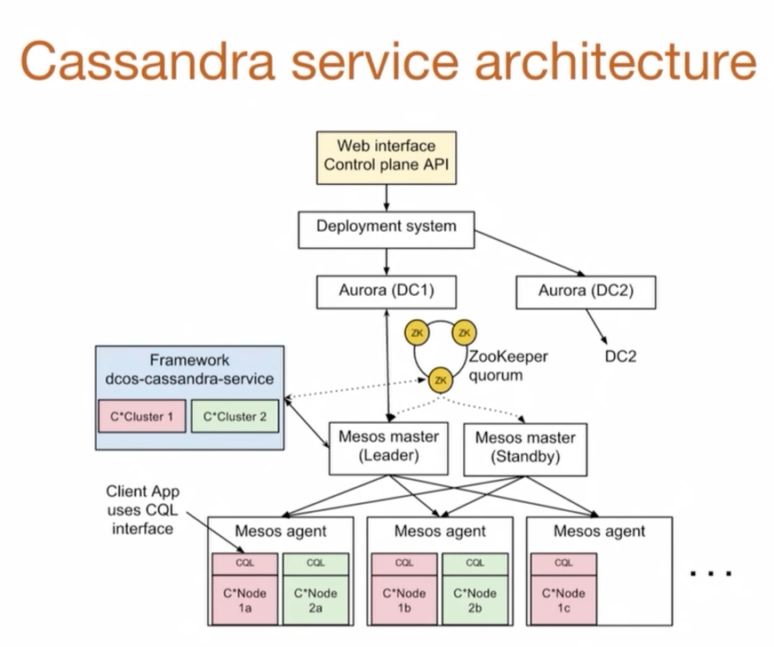

# Apache Marathon (A container orchestration platform for Mesos and DC/OS)
- [Marathon](https://mesosphere.github.io/marathon/) is a [production-grade container orchestration platform](Readme.md) for Mesosphere’s Datacenter Operating System (DC/OS) and [Apache Mesos](https://mesos.apache.org/).

# What is Apache Mesos? 
- [Apache Mesos](https://mesos.apache.org/) is built using the same principles as the Linux kernel, only at a different level of abstraction. 
- The Mesos kernel runs on every machine and provides applications (e.g., [Hadoop](../5_BigDataComponents/ETLServices/BatchProcessing/ApacheHadoop), [Spark](../5_BigDataComponents/ETLServices/StreamProcessing/ApacheSpark.md), [Kafka](../4_MessageBrokers/Kafka/Readme.md), [Elasticsearch](../3_DatabaseComponents/Search-DBs/ElasticSearch)) with API’s for resource management and scheduling across entire datacenter and cloud environments.

## Features

### Resource Management using Mesos
- [Apache Mesos](https://mesos.apache.org/) abstracts CPU, memory, storage away from machines
- Program like it's a single of resources.

### Linear Scalability
- [Linear Scalability](../3_DatabaseComponents/1_Glossaries/DBScalability.md) - Industry proven to easily scale to 10,000s of nodes.

### High availability
- [Fault-tolerant](../0_SystemGlossaries/Reliability/HighAvailability.md) replicated master and agents using [Zookeeper](../7_ClusterCoordinationService/ApacheZookeeper.md).
- It uses [Zookeeper](../7_ClusterCoordinationService/ApacheZookeeper.md) for the leader election.
- If the Mesos master is unavailable, existing tasks can continue to execute, but new resources cannot be allocated and new tasks cannot be launched. 
- To reduce the chance of this situation occurring, Mesos has a [high-availability](../0_SystemGlossaries/Reliability/HighAvailability.md) mode that uses multiple Mesos masters
  - One active master (called the leader or leading master) and several backups in case it fails. 
- The masters elect the leader, with [Zookeeper](../7_ClusterCoordinationService/ApacheZookeeper.md) both coordinating the election and handling leader detection by masters, agents, and scheduler drivers

### Native Support for launching containers 
- Support different containers like [Docker](Docker/Readme.md), [Mesos Container](#mesos-containerization).

### Pluggable resource isolation
- First class isolation support for CPU, memory, disk, ports, GPU, and modules for custom resource isolation.

### Two level scheduling
- Support for running cloud native and legacy applications in the same cluster with pluggable scheduling policies.

### Cross Platform
- Runs on Linux, OSX and Windows. Cloud provider-agnostic.

# Mesos Containerization

# Real World Use Cases

## How Uber Manages a Million Writes Per Second Using Mesos and Cassandra Across Multiple Datacenters?
- [Read more](../../3_HLDDesignProblems/UberCasandraMesos/Readme.md)

