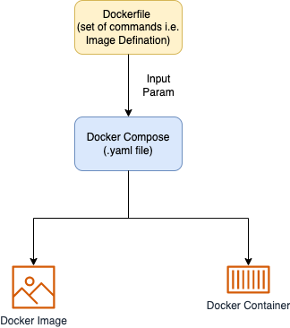

# Docker
- [Docker](https://docs.docker.com/get-started/overview/) is an open platform for developing, shipping, and running applications. 
- Docker enables you to separate your applications from your infrastructure so you can deliver software quickly. 
- With Docker, you can manage your infrastructure in the same ways you manage your applications.
- [Amazon ECR](../../../2_AWSComponents/4_ComputeServices/AmazonECS/AmazonECR.md) can be used to store, manage & deploy docker container images. (An alternative to [Docker Hub](https://hub.docker.com/))


# Various Components

| Component                                                                       | Description                                                                                                                                                                                                                                                                                                                                                                                                                                                                                                  | Sample file                                                              |
|---------------------------------------------------------------------------------|--------------------------------------------------------------------------------------------------------------------------------------------------------------------------------------------------------------------------------------------------------------------------------------------------------------------------------------------------------------------------------------------------------------------------------------------------------------------------------------------------------------|--------------------------------------------------------------------------|
| [Docker Images](https://docs.docker.com/get-started/overview/#images)           | An image is a read-only template with instructions for creating a Docker container.                                                                                                                                                                                                                                                                                                                                                                                                                          |                                                                          |
| [Docker Containers](https://docs.docker.com/get-started/overview/#containers)   | A container packages up code and its dependencies so the application runs quickly and reliably from one computing environment to another.                                                                                                                                                                                                                                                                                                                                                                    |                                                                          |
| [Docker Volumes](https://docs.docker.com/storage/volumes/)                      | Volumes are the preferred mechanism for persisting data generated by and used by Docker containers.                                                                                                                                                                                                                                                                                                                                                                                                          |                                                                          |
| [Dockerfile](https://docs.docker.com/language/golang/build-images/)             | A Dockerfile is a simple text file that contains the commands a user could call to assemble an image whereas Docker Compose is a tool for defining and running multi-container Docker applications.                                                                                                                                                                                                                                                                                                          | [SampleDockerFile](SampleDockerFile)                                     |
| [Docker Compose](#docker-compose)                                               | Docker Compose define the services that make up your app in docker-compose.yml so they can be run together in an isolated environment. <br/>- It gets an app running in one command by just running docker-compose up. <br/>- Docker compose uses the Dockerfile if you add the build command to your project’s docker-compose.yml. <br/>- Your Docker workflow should be to build a suitable Dockerfile for each image you wish to create, then use compose to assemble the images using the build command. | [docker-compose.sample-service.yaml](docker-compose.sample-service.yaml) |
| [Docker Image Layers](#docker-image-layers)                                     | [Each layer is an image itself](https://vsupalov.com/docker-image-layers/), just one without a human-assigned tag.<br/>- [Each instruction in a Dockerfile results in a layer]().                                                                                                                                                                                                                                                                                                                            |                                                                          |

# Docker Compose
- In [docker compose](https://docs.docker.com/get-started/08_using_compose/), you can specify image, environment variables etc.
- It should create the corresponding micro containers for those different microservices.



## Up
- Start up the application stack using the `docker-compose up` command. 
- We’ll add the -d flag to run everything in the background.

````shell
docker-compose -f docker-compose.sample-service.yaml -f service/docker-compose.service.yaml up -d
````

## Down
- When you’re ready to tear it all down, simply run `docker-compose down` or hit the trash can on the Docker Dashboard for the entire app. 
- The containers will stop and the network will be removed.

````shell
docker-compose -f docker-compose.sample-service.yaml -f service/docker-compose.service.yaml down
````

## Logs
- Let’s look at the logs using the `docker-compose logs -f` command. 
- You’ll see the logs from each of the services interleaved into a single stream. 
- This is incredibly useful when you want to watch for timing-related issues. 
- The -f flag “follows” the log, so will give you live output as it’s generated.

````shell
docker-compose -f docker-compose.sample-service.yaml -f service/docker-compose.service.yaml` logs -f
````

## Specify Runtime options with Memory, CPUs, and GPUs

````shell
docker run -it \
--cpu-rt-runtime=950000 \
--ulimit rtprio=99 \
--cap-add=sys_nice \
debian:jessie
````

# Docker Image Layers
- [Each layer is an image itself](https://vsupalov.com/docker-image-layers/), just one without a human-assigned tag.
- [Each instruction in a Dockerfile results in a layer](). (Except for multi-stage builds, where usually only the layers in the final image are pushed, or when an image is squashed to a single layer).
- They have auto-generated IDs though.
- Each layer stores the changes compared to the image it’s based on.
- An image can consist of a single layer (that’s often the case when the squash command was used).
- Layers are used to avoid transferring redundant information and skip build steps which have not changed (according to the Docker cache).

# The underlying technology
- Docker is written in the [Go programming language](../../../5_ProgrammingLanguages/1_GoLang) and takes advantage of several features of the Linux kernel to deliver its functionality. 
- Docker uses a technology called namespaces to provide the isolated workspace called the container. 
- When you run a container, Docker creates a set of namespaces for that container.

# References
- [Big Misconceptions about Bare Metal, Virtual Machines, and Containers](https://www.youtube.com/watch?v=Jz8Gs4UHTO8)