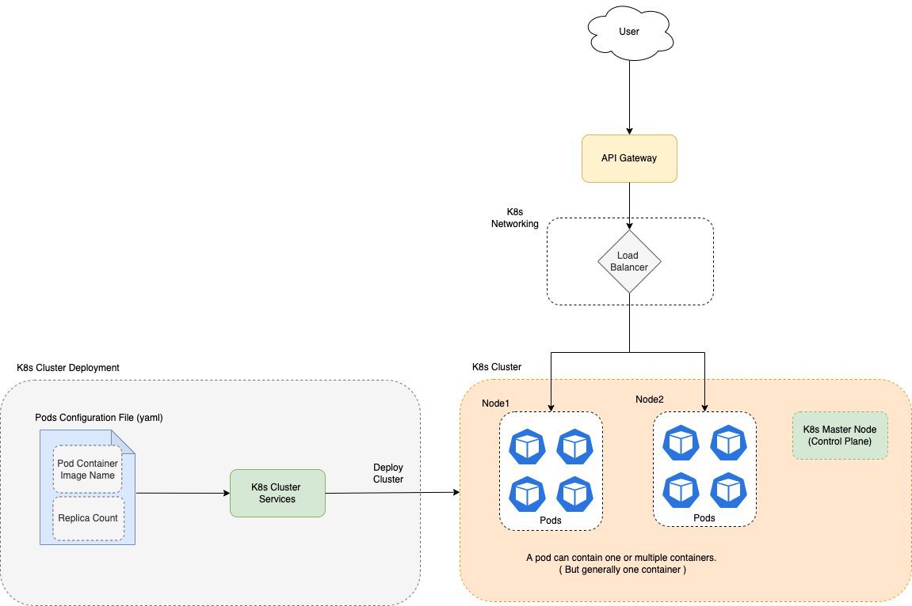

# Kubernates
- [Kubernetes](https://kubernetes.io), also known as K8s, is an OPEN-SOURCE system for automating deployment, scaling, and management of containerized applications. 
- Kubernates is a [container orchestration service](../0_SystemGlossaries/ContainerOrchestrationService.md).
- Kubernetes is a Greek word meaning `captain` in English. 
  - Like the captain is responsible for the safe journey of the ship in the seas, Kubernetes is responsible for carrying and delivering those boxes safely to locations where they can be used.
- We can use kubernates to manage, create containers ( through pods, worker nodes ).



# Components

## Cluster
- When you deploy Kubernetes, you get [a cluster](../0_SystemGlossaries/ServersCluster.md).
- A [Kubernetes cluster](https://kubernetes.io/docs/concepts/overview/components/) consists of a set of worker machines, called [nodes](), that run containerized applications. 
- Every cluster has at least one worker node.


## Control Plane (Master node)
- [The control plane](https://kubernetes.io/docs/concepts/overview/components/) manages the worker nodes and the Pods in the cluster.
- In production environments, the control plane usually runs across multiple computers and a cluster usually runs multiple nodes, providing fault-tolerance and high availability.
- Nodes with [controlplane]((https://kubernetes.io/docs/concepts/overview/components/)) role run the K8s master components (excluding `etcd`, as its separate role). 
- [Read more](https://kubernetes.io/docs/concepts/overview/components/)

| Component                                                                                                             | Remarks                                                                                                                                                                                                                                                                                           |
|-----------------------------------------------------------------------------------------------------------------------|---------------------------------------------------------------------------------------------------------------------------------------------------------------------------------------------------------------------------------------------------------------------------------------------------|
| etcd                                                                                                                  | Consistent and [highly-available key value store](../0_SystemGlossaries/HighAvailability.md) used as Kubernetes backing store for all cluster data.                                                                                                                                               |
| [API server](https://kubernetes.io/docs/reference/command-line-tools-reference/kube-apiserver/)                       | The Kubernetes API server validates and configures data for the api objects which include pods, services, replicationcontrollers, and others. <br/>- The API Server services REST operations and provides the frontend to the cluster's shared state through which all other components interact. |
| [kube-controller-manager](https://kubernetes.io/docs/reference/command-line-tools-reference/kube-controller-manager/) | The Kubernetes controller manager is a daemon that embeds the core control loops shipped with Kubernetes.                                                                                                                                                                                                                                                                                                  |
| [Scheduler](https://kubernetes.io/docs/concepts/scheduling-eviction/kube-scheduler/)                                  | A scheduler watches for newly created Pods that have no Node assigned. For every Pod that the scheduler discovers, the scheduler becomes responsible for finding the best Node for that Pod to run on.                                                                                                                                                                                                                                                                                                  |

## Worker Nodes
- Each docker/Pod container would run the micro-service (golang, java, python service etc.)
- And a [worker node can have one or multiple pods](https://kubernetes.io/docs/concepts/architecture/nodes/).
- Kubernates would manage the [worker nodes](https://kubernetes.io/docs/concepts/architecture/nodes/) i.e. Create, Update, Delete, Auto-Scale based on the configuration and params.

## Pods
- [Pods](https://kubernetes.io/docs/concepts/workloads/pods/) are the smallest deployable units of computing that you can create and manage in Kubernetes.
- A Pod (as in a pod of whales or pea pod) is a group of one or more containers, with shared storage and network resources, and a specification for how to run the containers.

```
kubectl scale --replicas=5 rc/foo rc/bar rc/baz                   # Scale multiple replication controllers i.e. 5 pods for each of the services
```

## Labels
- [Labels](https://kubernetes.io/docs/concepts/overview/working-with-objects/labels/) are key/value pairs that are attached to objects, such as pods. 
- Labels are intended to be used to specify identifying attributes of objects that are meaningful and relevant to users, but do not directly imply semantics to the core system.

## K8s Networking
- K8s manages its own load balance, service discovery etc.
- [Read more](https://kubernetes.io/docs/concepts/services-networking/_print/)

## Workload Resources

### Deployments
- [A Deployment](https://kubernetes.io/docs/concepts/workloads/controllers/deployment/) provides declarative updates for Pods and ReplicaSets.
- You describe a desired state in a Deployment, and the Deployment Controller changes the actual state to the desired state at a controlled rate. 
- You can define Deployments to create new ReplicaSets, or to remove existing Deployments and adopt all their resources with new Deployments.
- Every microservice, app component can be a deployment in K8s.

### Replica Set
- [ReplicasSet](https://kubernetes.io/docs/concepts/workloads/controllers/replicaset/) will ensure that the number of pods (defined in our config file) is always running in our cluster. 
- Does not matter in which worker node they are running. 
- The scheduler will schedule the pods on any node depending upon the free resources. 
- If one of our nodes goes down then all pods running on the node will be randomly scheduled on different nodes as per the resource availability. 
- In this way, ReplicaSet ensures that the number of pods of an application is running on the correct scale as specified in the conf file.
- Example - MicroServices, App Pods etc.


### Daemon Set
- Whereas in the case of [DaemonSet](https://kubernetes.io/docs/concepts/workloads/controllers/daemonset/), it will ensure that one copy of pod defined in our configuration will always be available on every worker node.
- Example - [newrelic-infra, newrelic-logging](https://docs.newrelic.com/docs/kubernetes-pixie/kubernetes-integration/get-started/introduction-kubernetes-integration) etc.


### StatefulSets
- [StatefulSets]((https://kubernetes.io/docs/concepts/workloads/controllers/statefulset/)) are used when state has to be persisted. 
- Therefore it uses volumeClaimTemplates / claims on persistent volumes to ensure they can keep the state across component restarts.
- Example - [kube-state-metrics](https://github.com/kubernetes/kube-state-metrics) etc.

# Horizontal Pod Autoscaling
- In Kubernetes, [a Horizontal Pod Autoscaler](https://kubernetes.io/docs/tasks/run-application/horizontal-pod-autoscale/) automatically updates a workload resource (such as a Deployment or StatefulSet), with the aim of automatically scaling the workload to match demand.

## AutoScaling on Container resource metrics

````yaml
type: ContainerResource
containerResource:
  name: cpu
  container: application
  target:
    type: Utilization
    averageUtilization: 60
````

## Stabilization window

````yaml
behavior:
  scaleDown:
    stabilizationWindowSeconds: 300
    policies:
    - type: Percent
      value: 100
      periodSeconds: 15
  scaleUp:
    stabilizationWindowSeconds: 0
    policies:
    - type: Percent
      value: 100
      periodSeconds: 15
    - type: Pods
      value: 4
      periodSeconds: 15
    selectPolicy: Max
````

# Configure a Pod to Use a ConfigMap
- [ConfigMaps](https://kubernetes.io/docs/tasks/configure-pod-container/configure-pod-configmap/) are the Kubernetes way to inject application pods with configuration data. 
- ConfigMaps allow you to decouple configuration artifacts from image content to keep containerized applications portable

````yaml
apiVersion: v1
kind: Pod
metadata:
  name: dapi-test-pod
spec:
  containers:
    - name: test-container
      image: registry.k8s.io/busybox
      command: [ "/bin/sh", "-c", "env" ]
      env:
        - name: SPECIAL_LEVEL_KEY
          valueFrom:
            configMapKeyRef:
              name: special-config
              key: special.how
  
        - name: LOG_LEVEL
          valueFrom:
            configMapKeyRef:
              name: env-config
              key: log_level
  restartPolicy: Never
````

# Kubernates Commands


| Title                             | Command                                       | Remarks                                                                                                                                                                                                          |
|-----------------------------------|-----------------------------------------------|------------------------------------------------------------------------------------------------------------------------------------------------------------------------------------------------------------------|
| View config                       | kubectl config view                           | -                                                                                                                                                                                                                |
| Set context in config             | kubectl config use-context <clusterName>      | -                                                                                                                                                                                                                |
| Get all contexts                  | kubectl config get-contexts                   | -                                                                                                                                                                                                                |
| Get all the events of the cluster | kubectl get events                            | [List Events](https://www.containiq.com/post/kubernetes-events) sorted by timestamp                                                                                                                              |
| Get all the deployments list      | kubectl get deployments                       | -                                                                                                                                                                                                                |
| Scale the deployment              | kubectl scale --replicas=10 <deployment_name> | Replicate the deployment (microservice) across the worker-nodes                                                                                                                                                  |
| Get all pods                      | kubectl get pods --all-namespaces             | List all pods in the namespace, in the default context                                                                                                                                                           |
| Get pod information               | kubectl get pod my-pod -o yaml                | Get a pod's YAML                                                                                                                                                                                                 |
| Create resource                   | kubectl apply -f ./my-manifest.yaml           | Create resource (pod etc.) from yaml file <br/>- `apply` manages applications through files defining Kubernetes resources. <br/>- It creates and updates resources in a cluster through running `kubectl apply`. |
| Update resource                   | kubectl patch                                 | Use kubectl patch to update an API object in place.                                                                                                                                                              |

## Others

```
kubectl autoscale deployment foo --min=2 --max=10                # Auto scale a deployment "foo"

kubectl logs my-pod                                 # dump pod logs (stdout)
kubectl logs -l name=myLabel                        # dump pod logs, with label name=myLabel (stdout)

kubectl cp /tmp/foo_dir my-pod:/tmp/bar_dir            # Copy /tmp/foo_dir local directory to /tmp/bar_dir in a remote pod in the current namespace
```

- [kubectl - Cheat Sheet](https://kubernetes.io/docs/reference/kubectl/cheatsheet/)

# Installation Guide
- [Install and Set Up kubectl on macOS](https://kubernetes.io/docs/tasks/tools/install-kubectl-macos/)
- [MiniKube Start](https://minikube.sigs.k8s.io/docs/start/)

# References
- [How to Manage Kubernetes With Kubectl?](https://www.suse.com/c/rancher_blog/how-to-manage-kubernetes-with-kubectl/)
- [Mesos vs. Kubernetes](https://www.baeldung.com/ops/mesos-kubernetes-comparison)
