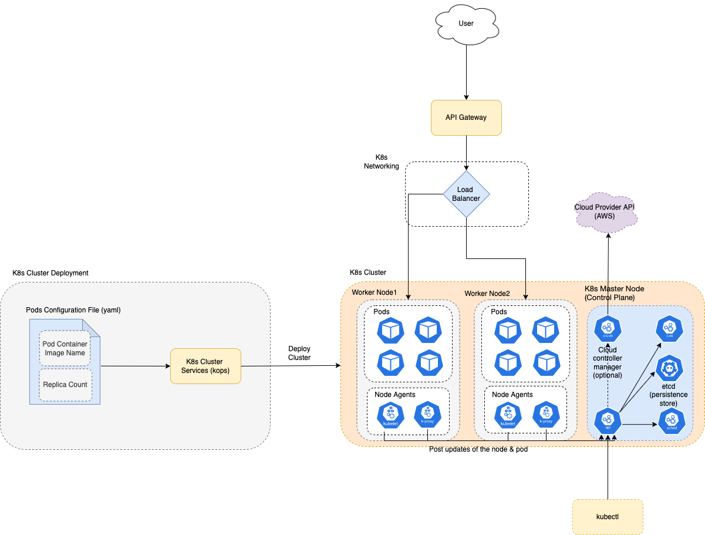

# Kubernates
- [Kubernetes](https://kubernetes.io), also known as K8s, is an `OPEN-SOURCE system for automating deployment, scaling, and management of containerized applications`.
- Kubernetes is a Greek word meaning `captain` in English. 
  - Like the captain is responsible for the safe journey of the ship in the seas, Kubernetes is responsible for carrying and delivering those boxes safely to locations where they can be used.
- We can use kubernates to manage, create containers ( through pods, worker nodes )
- Each docker container would run the micro-service ( golang, java, python service etc. )
- A pod can contain one or multiple containers
- And a `worker node` can have one or multiple pods.
- Kubernates would manage the `worker nodes` i.e. Create, Update, Delete, Auto-Scale based on the configuration and params.



# What are Pods?
- [Pods](https://kubernetes.io/docs/concepts/workloads/pods/) are the smallest deployable units of computing that you can create and manage in Kubernetes.
- A Pod (as in a pod of whales or pea pod) is a group of one or more containers, with shared storage and network resources, and a specification for how to run the containers.

```
kubectl scale --replicas=5 rc/foo rc/bar rc/baz                   # Scale multiple replication controllers i.e. 5 pods for each of the services
```

# What are Labels?
- [Labels](https://kubernetes.io/docs/concepts/overview/working-with-objects/labels/) are key/value pairs that are attached to objects, such as pods. 
- Labels are intended to be used to specify identifying attributes of objects that are meaningful and relevant to users, but do not directly imply semantics to the core system.

# kubectl - Cheat Sheet
- `apply` manages applications through files defining Kubernetes resources. It creates and updates resources in a cluster through running `kubectl apply`.
- [Read more](https://kubernetes.io/docs/reference/kubectl/cheatsheet/)

```
kubectl get pods                              # List all pods in the namespace
kubectl get pod my-pod -o yaml                # Get a pod's YAML

kubectl apply -f ./my-manifest.yaml            # create resource(s)
kubectl apply -f ./my1.yaml -f ./my2.yaml      # create from multiple files
kubectl apply -f ./dir                         # create resource(s) in all manifest files in dir
kubectl apply -f https://git.io/vPieo          # create resource(s) from url

kubectl autoscale deployment foo --min=2 --max=10                # Auto scale a deployment "foo"

kubectl logs my-pod                                 # dump pod logs (stdout)
kubectl logs -l name=myLabel                        # dump pod logs, with label name=myLabel (stdout)

kubectl cp /tmp/foo_dir my-pod:/tmp/bar_dir            # Copy /tmp/foo_dir local directory to /tmp/bar_dir in a remote pod in the current namespace
```

# Installation Guide
- [Install and Set Up kubectl on macOS](https://kubernetes.io/docs/tasks/tools/install-kubectl-macos/)
- [MiniKube Start](https://minikube.sigs.k8s.io/docs/start/)

# StatefulSets
- [TBD](https://kubernetes.io/docs/concepts/workloads/controllers/statefulset/)

# Who uses K8s?
- Google

# References
- [Mesos vs. Kubernetes](https://www.baeldung.com/ops/mesos-kubernetes-comparison)
