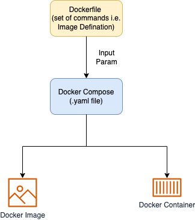

# Docker
- [Docker](https://docs.docker.com/get-started/overview/) is an open platform for developing, shipping, and running applications. (Package it once and leverage it across environments)
- Docker enables you to separate your applications from your infrastructure so you can deliver software quickly. 
- With Docker, you can manage your infrastructure in the same ways you manage your applications.
- [Amazon Elastic Container Registry (Amazon ECR)](../../../2_AWSComponents/4a_ContainerOrchestrationServices/AmazonECR.md) can be used to store, manage & deploy docker container images. (An alternative to [Docker Hub](https://hub.docker.com/))

# Various Components

| Component                                                                              | Tag       | Description                                                                                                                                                                                                                                                                                                                                                                                                                                                                                                    | Sample file                                                                |
|----------------------------------------------------------------------------------------|-----------|----------------------------------------------------------------------------------------------------------------------------------------------------------------------------------------------------------------------------------------------------------------------------------------------------------------------------------------------------------------------------------------------------------------------------------------------------------------------------------------------------------------|----------------------------------------------------------------------------|
| [Docker Daemon](https://docs.docker.com/get-started/overview/)                         | General   | [Docker daemon (dockerd)](https://docs.docker.com/get-started/overview/) listens for Docker API requests and manages Docker Objects such as images, containers, networks & volumes.                                                                                  |
| [Docker Client (Optional)](https://docs.docker.com/get-started/overview/)              | General   | When you use commands such as docker run, [the client](https://docs.docker.com/get-started/overview/) sends these commands to dockerd, which carries them out. The docker command uses the Docker API. The Docker client can communicate with more than one daemon. |
| :star: [Docker Images](https://docs.docker.com/get-started/overview/#images)           | Image     | An image is a read-only template with instructions for creating a Docker container.                                                                                                                                                                                                                                                                                                                                                                                                                            |                                                                            |
| [Docker Image Layers](#docker-image-layers)                                            | Image     | [Each layer is an image itself](https://vsupalov.com/docker-image-layers/), just one without a human-assigned tag. - [Each instruction in a Dockerfile results in a layer]().                                                                                                                                                                                                                                                                                                                              |                                                                            |
| [Dockerfile](https://docs.docker.com/language/golang/build-images/)                    | Image     | A Dockerfile is a simple text file that contains the commands a user could call to assemble an image whereas Docker Compose is a tool for defining and running multi-container Docker applications.                                                                                                                                                                                                                                                                                                            | [SampleDockerFile](SampleDockerFile)                                       |
| [Docker Registry](https://docs.docker.com/registry/)                                   | Image     | The Registry is a stateless, highly scalable server side application that stores and lets you distribute Docker images.                                                                                                                                                                                                                                                                                                                                                                                        |                                                                            |
| :star: [Docker Containers](https://docs.docker.com/get-started/overview/#containers)   | Container | A container packages up code and its dependencies so the application runs quickly and reliably from one computing environment to another.                                                                                                                                                                                                                                                                                                                                                                      |                                                                            |
| :star: [Docker Compose](https://docs.docker.com/get-started/08_using_compose/)         | Container | Docker Compose define the services that make up your app in [docker-compose.yml](https://docs.docker.com/compose/compose-file/) so they can be run together in an isolated environment.  - It gets an app running in one command by just running `docker-compose up`.  - Docker compose uses the Dockerfile if you add the build command to your project’s [docker-compose.yml](https://docs.docker.com/compose/compose-file/).  - Your Docker workflow should be to build a suitable Dockerfile for each image you wish to create, then use compose to assemble the images using the build command.   | [docker-compose.sample-service.yaml](docker-compose.sample-service.yaml)   |
| [Docker Volumes](https://docs.docker.com/storage/volumes/)                             | Volume    | Volumes are the preferred mechanism for persisting data generated by and used by Docker containers.                                                                                                                                                                                                                                                                                                                                                                                                            |                                                                            |

# Docker Commands

| Title                                       | Tag                                  | Command                                                                                               | Description                                          |
|---------------------------------------------|--------------------------------------|-------------------------------------------------------------------------------------------------------|------------------------------------------------------|
| :star: Build Docker Image from Dockerfile   | Image                                | `docker build -t <name:tag> <DockerFile_path>`                                                        | -                                                    |
| List Docker Images                          | Image                                | `docker images`                                                                                       | -                                                    |
| :star: Run a docker container from image    | Container                            | `docker run -it --cpu-rt-runtime=950000 --ulimit rtprio=99 --cap-add=sys_nice <name:tag>`             | Specify Runtime options with Memory, CPUs, and GPUs. |
| List Docker Running Containers              | Container                            | `docker ps`                                                                                           | -                                                    |
| Connect to Docker Container                 | Container                            | `docker exec -it <container_name> /bin/sh`                                                            | -                                                    |
| :star: Start up the application stack       | Application Stack / Docker Compose   | `docker-compose -f docker-compose.sample-service.yaml -f service/docker-compose.service.yaml up -d`   | -                                                    |
| Stop the application stack                  | Application Stack / Docker Compose   | `docker-compose -f docker-compose.sample-service.yaml -f service/docker-compose.service.yaml down`    | -                                                    |
| Check logs of the application stack         | Application Stack / Docker Compose   | `docker-compose -f docker-compose.sample-service.yaml -f service/docker-compose.service.yaml logs -f` | -                                                    |

# Docker Run vs Docker Compose
- docker run is entirely command line based, while [docker-compose](https://www.theserverside.com/blog/Coffee-Talk-Java-News-Stories-and-Opinions/Docker-run-vs-docker-compose-Whats-the-difference) reads configuration data from a YAML file.
- docker run can only start one container at a time, while [docker-compose](https://www.theserverside.com/blog/Coffee-Talk-Java-News-Stories-and-Opinions/Docker-run-vs-docker-compose-Whats-the-difference) will configure and run multiple.

  

# Docker Image Layers
- [Each layer is an image itself](https://vsupalov.com/docker-image-layers/), just one without a human-assigned tag.
- [Each instruction in a Dockerfile results in a layer](). (Except for multi-stage builds, where usually only the layers in the final image are pushed, or when an image is squashed to a single layer).
- They have auto-generated IDs though.
- Each layer stores the changes compared to the image it’s based on.
- An image can consist of a single layer (that’s often the case when the squash command was used).
- Layers are used to avoid transferring redundant information and skip build steps which have not changed (according to the Docker cache).

# The underlying technology
- Docker is written in the [Go programming language](../../../5_ProgrammingLanguages/1_GoLang) and takes advantage of several features of the Linux kernel to deliver its functionality. 
- Docker uses a technology called namespaces to provide the isolated workspace called the container. 
- When you run a container, Docker creates a set of namespaces for that container.

# References
- [Big Misconceptions about Bare Metal, Virtual Machines, and Containers](https://www.youtube.com/watch?v=Jz8Gs4UHTO8)