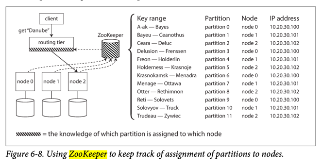

# Apache Zookeeper
- [Apache Zookeeper](https://zookeeper.apache.org/) can manage a [Cluster (new broker, new partition etc.) and servers coordination](Readme.md).
- ZooKeeper is modeled after [Google’s Chubby lock service](https://people.cs.rutgers.edu/~pxk/417/notes/chubby.html).

# :star: Real world use cases
- [Apache Kafka](../4_MessageBrokers/Kafka/Readme.md#zookeeper)
- [Apache Marathon & Mesos](../6a_ContainerOrchestrationServices/ApacheMarathon&Mesos.md)
- [Apache HBase](../3_DatabaseComponents/NoSQL-Databases/ApacheHBase.md)
- [Apache SolrCloud](../3_DatabaseComponents/Search-Indexes/ApacheSolr.md)
- [Twitter Hit Counter](../../3_HLDDesignProblems/TwitterHitCounterDesign/Readme.md)