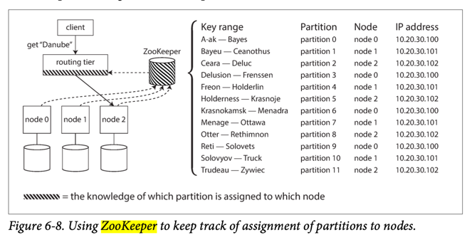

# Clusters Coordination & Configuration Service (also known as Distributed key-value store)

| Purpose                                                                                           | Description                                                                                                                                                                                                                                                                                                                                                                                                                                                |
|---------------------------------------------------------------------------------------------------|------------------------------------------------------------------------------------------------------------------------------------------------------------------------------------------------------------------------------------------------------------------------------------------------------------------------------------------------------------------------------------------------------------------------------------------------------------|
| Store basic metadata of the cluster                                                               | Metadata like info about brokers, topics, partitions, mapping of partitions to nodes, partition leader/followers, consumer offset etc. - [ZooKeeper](ApacheZookeeper.md) and [etcd](etcd.md) are designed to hold small amounts of data that can fit entirely in memory (although they still write to disk for durability). - That small amount of data is replicated across all the nodes using a fault-tolerant total order broadcast algorithm. |
| [Leader Election](../0_SystemGlossaries/Database/ReplicationAndDataConsistency.md) in the cluster | Electing leader in the leader-follower replication, through [consensus algorithm](https://www.techtarget.com/whatis/definition/consensus-algorithm).                                                                                                                                                                                                                                                                                                       |
| [Controller election](../0_SystemGlossaries/ControllerNode.md) in the Cluster                     | Through [consensus algorithm](https://www.techtarget.com/whatis/definition/consensus-algorithm)                                                                                                                                                                                                                                                                                                                                                            |
| Handle new broker/node addition or failure in the cluster                                         | Notifies consumers, producers, routing tier of the arrival of new broker or failure of existing broker.                                                                                                                                                                                                                                                                                                                                                    |
| Route requests to partition leader                                                                | Route all requests to partition's leaders.                                                                                                                                                                                                                                                                                                                                                                                                                 |

# Why separate distributed key-value store?
- As an application developer, you will rarely need to use [ZooKeeper](ApacheZookeeper.md) or [etcd](etcd.md) directly, because it is actually not well suited as a general-purpose database.
- It is more likely that you will end up relying on it indirectly via some other project - [Kafka (uses Zookeeper)](../4_MessageBrokers/Kafka/Readme.md#zookeeper), [Kubernates (uses etcd)](../6a_ContainerOrchestrationServices/Kubernates.md) etc.