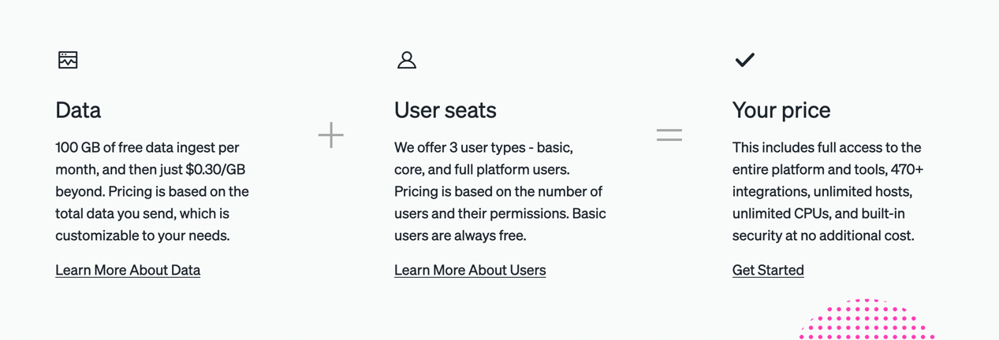

# Introduction
- [NewRelic](https://newrelic.com/) helps to monitor, debug, and improve your entire stack.
- New Relic is where dev, ops, security and business teams solve software–performance problems with data.
- New Relic uses [Apache Lucene](../3_DatabaseComponents/Search-DBs/Readme.md).

## Application Monitoring

## Infrastructure Monitoring

## Kubernates Monitoring

## Log Management

## Errors Inbox

## Browser Monitoring

## Mobile Monitoring

## Networking Monitoring

## Code Stream

## Preintegrations

# Pricing

[Read more](https://newrelic.com/pricing)
