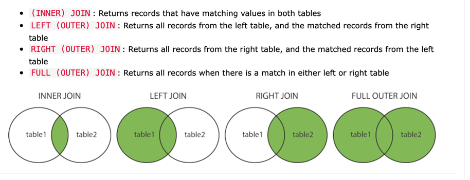

# [Different Types of joins](https://www.w3schools.com/sql/sql_join.asp)



# [Having Clause](https://www.w3schools.com/sql/sql_having.asp)

```sql
SELECT COUNT(CustomerID), Country
FROM Customers
GROUP BY Country
HAVING COUNT(CustomerID) > 5;
```
# [Postgres Aggregate](https://www.postgresqltutorial.com/postgresql-aggregate-functions/postgresql-array_agg/)
- The PostgreSQL ARRAY_AGG() function is an aggregate function that accepts a set of values and returns an array in which each value in the set is assigned to an element of the array.
- `@>` is the [contains operator](https://stackoverflow.com/questions/36985926/what-does-the-operator-in-postgres-do) in the SQL query in postgres.