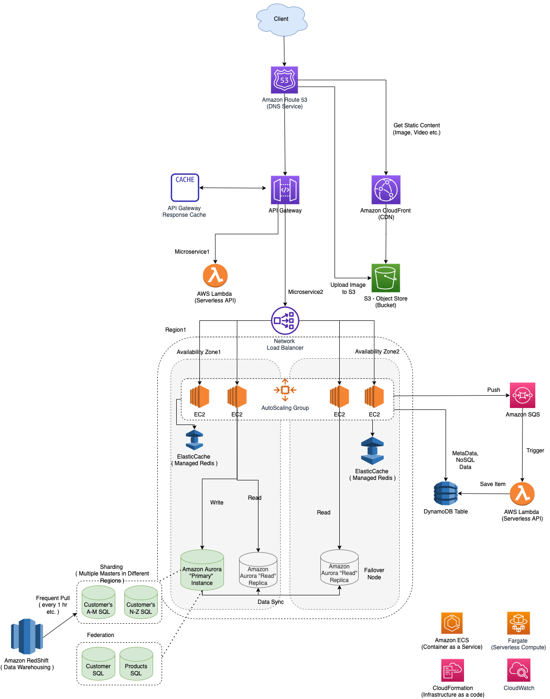

# Implementing Microservices on AWS

[Read more](DesignScalableSystemWithRDMS/README.md)

# Key Components

## Compute Services
- [AWS PrivateLink](../1_NetworkingAndContentDelivery/AWSPrivateLink.md)
- [Amazon ECS](../4_ComputeServices/AmazonECS/Readme.md)
- [Amazon EKS](../4_ComputeServices/AmazonEKS.md)
- [AWS Lambda](../4_ComputeServices/AWSLambda/Readme.md)
- [AWS Fargate](../4_ComputeServices/AWSFargate.md)

## Data Store
- [Amazon Elastic Cache](../6_DatabaseServices/AmazonElasticCache.md)
- [Amazon Aurora](../6_DatabaseServices/AmazonRDSAurora)
- [Amazon DynamoDB](../6_DatabaseServices/AmazonDynamoDB/Readme.md)

## Message Brokers

Message brokers can be used for [asynchronous messaging and event passing in microservices](../../1_HLDDesignComponents/1_MicroServicesSOA).

- [Amazon SQS](../5_MessageBrokerServices/AmazonSQS.md)
- [AWS Event Bridge](../5_MessageBrokerServices/AmazonEventBridge.md)
- [Amazon SNS](../5_MessageBrokerServices/AmazonSNS.md)

## Auditing/Logging
- [CloudWatch](../8_MonitoringServices/AmazonCloudWatch.md)
- [CloudTrail](../8_MonitoringServices/AWSCloudTrail.md)
- [NewRelic](../../1_HLDDesignComponents/7_MonitoringTools/NewRelic.md)
- [PagerDuty](../../1_HLDDesignComponents/7_MonitoringTools/IncidentResponse/PagerDuty.md)
- [ELK](../../1_HLDDesignComponents/7_MonitoringTools/ELK.md)

## Others
- [DNS-based service discovery using Amazon ECS](../4_ComputeServices/AmazonECS/Readme.md)

# References
- [Implementing Microservices on AWS](https://docs.aws.amazon.com/whitepapers/latest/microservices-on-aws/microservices-on-aws.html)