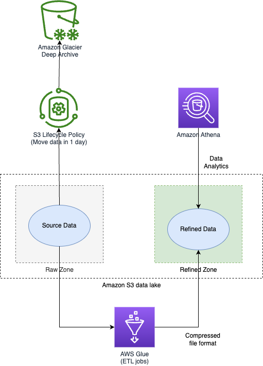

# AWS Glue
- [AWS Glue](https://aws.amazon.com/glue/) is a serverless data integration service that makes it easier to discover, prepare, move, and integrate data from multiple sources for analytics, machine learning (ML), and application development.
- [AWS Glue](https://aws.amazon.com/glue/) is a fully managed ETL (extract, transform, and load) service that makes it simple and cost-effective to categorize your data.

