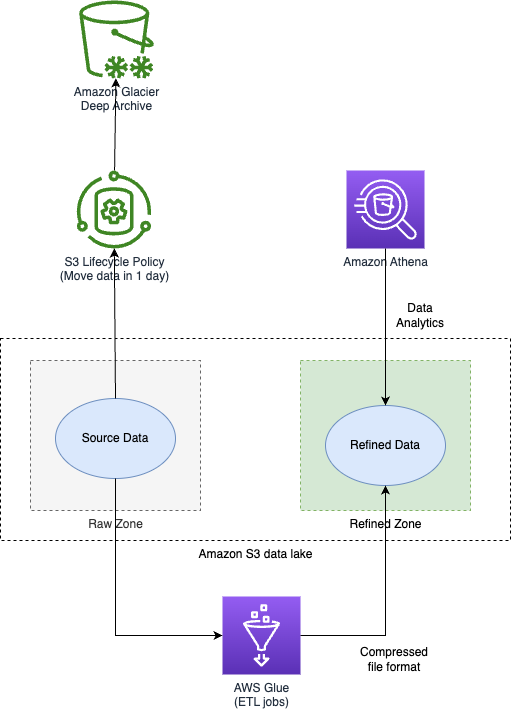

# AWS Glue
- [AWS Glue](https://aws.amazon.com/glue/) is a serverless data integration service that makes it easier to discover, prepare, move, and integrate data from multiple sources for analytics, machine learning (ML), and application development.
- [AWS Glue](https://aws.amazon.com/glue/) is a fully managed [ETL (extract, transform, and load)](../../../../1_HLDDesignComponents/5_BigDataComponents/BigData/ETL.md) service that makes it simple and cost-effective to categorize your data.

# How to access and analyze on-premises data stores using AWS Glue?

[Read more](https://aws.amazon.com/blogs/big-data/how-to-access-and-analyze-on-premises-data-stores-using-aws-glue/)