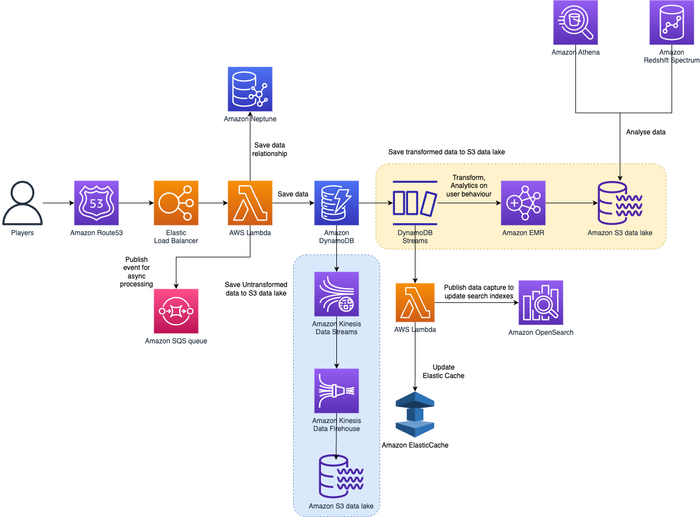

# Amazon Athena
- [Amazon Athena](https://aws.amazon.com/athena/) is an interactive query service that makes it easy for you to analyze data directly in [Amazon S3](../../7_StorageServices/3_ObjectStorageS3/Readme.md), using standard SQL.
- [Athena](https://aws.amazon.com/athena/) provides a simplified, flexible way to analyze petabytes of data where it lives.
- Analyze data or build applications from an [Amazon Simple Storage Service (S3) data lake](../../../1_HLDDesignComponents/0_SystemGlossaries/Database/BigData/DataLake.md) and 25-plus data sources, including on-premises data sources or other cloud systems using SQL or Python.

# IoT sensor data capture architecture

