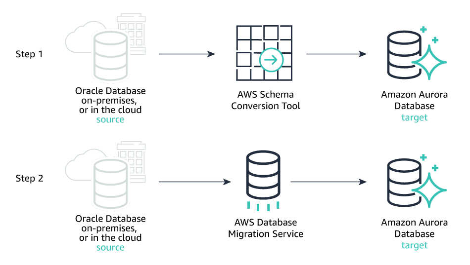

# AWS Database Migration Service
- [AWS Database Migration Service](https://aws.amazon.com/dms/) helps to migrate (one-time or continuously) from one source to another target.
- [AWS DMS]() enables you to seamlessly migrate data from supported sources to relational databases, data warehouses, streaming platforms, and other data stores in AWS cloud.

| Features                                                                                               | Remarks                                                                                                                                                                                                                                                                                                                                                                                                                                                                                                                                             |
|--------------------------------------------------------------------------------------------------------|-----------------------------------------------------------------------------------------------------------------------------------------------------------------------------------------------------------------------------------------------------------------------------------------------------------------------------------------------------------------------------------------------------------------------------------------------------------------------------------------------------------------------------------------------------|
| [Sources for AWS DMS](https://docs.aws.amazon.com/dms/latest/userguide/CHAP_Introduction.Sources.html) | On-premises databases (like MySQL, Postgres, [Casandra](../../../1_HLDDesignComponents/3_DatabaseComponents/NoSQL-Databases/ApacheCasandra.md), [MongoDB](../../../1_HLDDesignComponents/3_DatabaseComponents/NoSQL-Databases/MongoDB/Readme.md) etc.) - AWS services like [Amazon RDS](../../6_DatabaseServices/AmazonRDS/Readme.md), [Amazon S3](../../7_StorageServices/3_ObjectStorageS3/Readme.md).                                                                                                                                        |
| [Targets for AWS DMS](https://docs.aws.amazon.com/dms/latest/userguide/CHAP_Introduction.Targets.html) | Databases like [Amazon RDS](../../6_DatabaseServices/AmazonRDS/Readme.md), [Amazon DynamoDB](../../6_DatabaseServices/AmazonDynamoDB/Readme.md), [Document DB](../../6_DatabaseServices/AmazonDocumentDB.md), [Redshift](../../10_BigDataComponents/StorageDBs/DataWarehouse/AmazonRedshift.md) etc.  Storages like [Amazon S3](../../7_StorageServices/3_ObjectStorageS3/Readme.md) - Message Brokers like [Amazon Kinesis](../../5_MessageBrokerServices/AmazonKinesisDataStreams.md), [Amazon MSK](../../5_MessageBrokerServices/AmazonMSK.md) etc. |

# Example Source/Targets

| Source                                                                                             | Target                                                                                   | Remarks                                                                                                                                                                                                                                                                                                                                                              |
|----------------------------------------------------------------------------------------------------|------------------------------------------------------------------------------------------|----------------------------------------------------------------------------------------------------------------------------------------------------------------------------------------------------------------------------------------------------------------------------------------------------------------------------------------------------------------------|
| [Amazon RDS](../../6_DatabaseServices/AmazonRDS/Readme.md)                                         | [Amazon Redshift](../../10_BigDataComponents/StorageDBs/DataWarehouse/AmazonRedshift.md)            | During a database migration to [Amazon Redshift](../../10_BigDataComponents/StorageDBs/DataWarehouse/AmazonRedshift.md), AWS DMS first moves data to an [Amazon S3 bucket](../../7_StorageServices/3_ObjectStorageS3/Readme.md) & then transfers them to the proper tables in the [Amazon Redshift data warehouse](../../10_BigDataComponents/StorageDBs/DataWarehouse/AmazonRedshift.md). |
| [Amazon S3](../../7_StorageServices/3_ObjectStorageS3/Readme.md)                                   | [Amazon Kinesis Data Streams](../../5_MessageBrokerServices/AmazonKinesisDataStreams.md) | -                                                                                                                                                                                                                                                                                                                                                                    |
| [MongoDB](../../../1_HLDDesignComponents/3_DatabaseComponents/NoSQL-Databases/MongoDB/Readme.md)   | [Amazon DocumentDB](../../6_DatabaseServices/AmazonDocumentDB.md)                        | -                                                                                                                                                                                                                                                                                                                                                                    |
| Oracle and SQL Server                                                                              | [Amazon RDS](../../6_DatabaseServices/AmazonRDS/Readme.md)                               | -                                                                                                                                                                                                                                                                                                                                                                    |
| [Cassandra](../../../1_HLDDesignComponents/3_DatabaseComponents/NoSQL-Databases/ApacheCasandra.md) | [Amazon DynamoDB](../../6_DatabaseServices/AmazonDynamoDB/Readme.md)                     | -                                                                                                                                                                                                                                                                                                                                                                    |
| On-Perm Data warehouse                                                                             | [Amazon Redshift](../../10_BigDataComponents/StorageDBs/DataWarehouse/AmazonRedshift.md)            | For large-scale migrations, use [AWS Schema Conversion Tool](AWSSCT.md) and [AWS Snowball Edge devices](../Hybrid/AWSSnowFamily.md). [Read more](https://docs.aws.amazon.com/SchemaConversionTool/latest/userguide/agents.dw.html).                                                                                                                                                                                                                      |

# Stream data from Amazon S3 to Amazon Kinesis Data Streams

[Read more](https://aws.amazon.com/blogs/big-data/streaming-data-from-amazon-s3-to-amazon-kinesis-data-streams-using-aws-dms/)

# Migration Techniques/Tools

| Migration Techniques/Tools                                                                                    | Remarks                                                                                                                                                                                                                                      |
|---------------------------------------------------------------------------------------------------------------|----------------------------------------------------------------------------------------------------------------------------------------------------------------------------------------------------------------------------------------------|
| Migrate Only Primary Keys Using Basic Schema Only tool                                                        | To quickly migrate a database schema to your target instance you can rely on the Basic Schema Copy feature of AWS Database Migration Service. - Basic Schema Copy will not migrate secondary indexes, foreign keys or stored procedures. |
| Migrate Complex Schema (Primary keys, foreign keys, stored procedures, secondary indexes etc.) using SCT tool | First use the [AWS Schema Conversion Tool](AWSSCT.md) to convert the source schema and code to match that of the target database.                                                                                                            |
| Data Migration                                                                                                | Use the [AWS Database Migration Service]() to migrate data from the source database to the target database.                                                                                                                                  |

