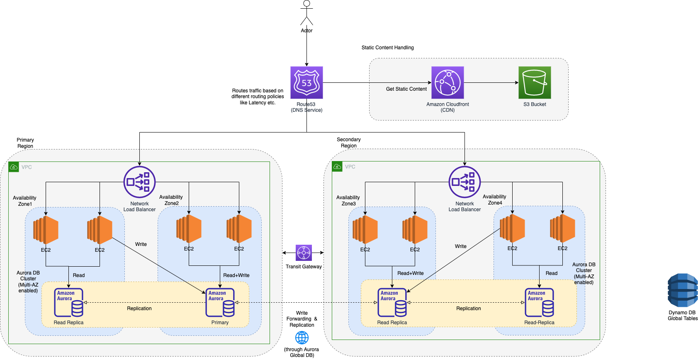
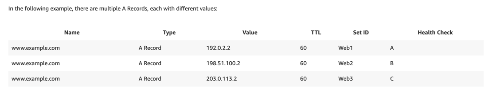

# Amazon Route 53
- [Amazon Route 53](https://docs.aws.amazon.com/Route53/latest/DeveloperGuide/Welcome.html) is a [highly available](../../../../1_HLDDesignComponents/0_SystemGlossaries/Reliability/HighAvailability.md) and [scalable Domain Name System (DNS)](https://www.cloudflare.com/learning/dns/what-is-dns/) web service. 
- [Amazon Route 53]() can transfer or manage only [second-level domains](https://developer.mozilla.org/en-US/docs/Glossary/Second-level_Domain).

# Features

| Feature                                                                            | Description                                                                                                                                                                                                                                                                                                                  |
|------------------------------------------------------------------------------------|------------------------------------------------------------------------------------------------------------------------------------------------------------------------------------------------------------------------------------------------------------------------------------------------------------------------------|
| Globally Distributed Servers                                                       | Amazon is a global service and consequently has DNS services globally.  - Any customer creating a query from any part of the world gets to reach a `DNS server local` to them that provides low latency.                                                                                                                 |
| Domain registration                                                                | -                                                                                                                                                                                                                                                                                                                            |
| Domain hosting                                                                     | -                                                                                                                                                                                                                                                                                                                            |
| DNS routing                                                                        | -                                                                                                                                                                                                                                                                                                                            |
| [Resolver](Route53Resolver.md)                                                     | -                                                                                                                                                                                                                                                                                                                            |
| [Health checks](Route53HealthChecks.md)                                            | Amazon Route 53 health checks monitor the health and performance of your web applications, web servers, and other resources.                                                                                                                                                                                                 |
| Optimal Locations                                                                  | [Route 53](https://docs.aws.amazon.com/Route53/latest/DeveloperGuide/Welcome.html) uses a [global anycast network](https://www.cloudflare.com/learning/cdn/glossary/anycast-network/) to answer queries from the optimal position automatically.                                                                             |
| Dependency                                                                         | [Route 53](https://docs.aws.amazon.com/Route53/latest/DeveloperGuide/Welcome.html) provides a high level of dependability required by critical applications.                                                                                                                                                                 |
| [Alias Records](https://repost.aws/knowledge-center/route-53-create-alias-records) | [Alias records](https://repost.aws/knowledge-center/route-53-create-alias-records) provide a Route 53–specific extension to DNS functionality.  - An alias record can only redirect queries to selected AWS resources such as S3 buckets, CloudFront distributions, and another record in the same Route 53 hosted zone. |

# Routing Policies

| Policy                                                                                                                                 | Description                                                                                                                                                                                                                                                                                                                       |
|----------------------------------------------------------------------------------------------------------------------------------------|-----------------------------------------------------------------------------------------------------------------------------------------------------------------------------------------------------------------------------------------------------------------------------------------------------------------------------------|
| :star: [Simple policy](https://aws.amazon.com/premiumsupport/knowledge-center/multivalue-versus-simple-policies/)                      | Use for traffic that requires only standard DNS records and that doesn't require special options such as weighted routing or latency routing.                                                                                                                                                                                     |
| :star: [Latency Based Routing](https://docs.aws.amazon.com/Route53/latest/DeveloperGuide/routing-policy.html)                          | Use when you want to give your customers the lowest latency possible.                                                                                                                                                                                                                                                             |
| [Geolocation routing](https://docs.aws.amazon.com/Route53/latest/DeveloperGuide/routing-policy-geo.html)                               | Use when you want to direct the customer to different websites based on the country or region they are browsing from. - You can also use geolocation routing to restrict the distribution of content to only the locations in which you have distribution rights. - You cannot use geolocation routing to reduce latency, |
| [Geoproximity routing (traffic flow only)](https://docs.aws.amazon.com/Route53/latest/DeveloperGuide/routing-policy-geoproximity.html) | Geoproximity routing lets Amazon Route 53 route traffic to your resources based on the geographic location of your users and your resources. - You can also optionally choose to route more traffic or less to a given resource by specifying a value, known as a bias.                                                       |
| [Multivalue answer routing](https://aws.amazon.com/premiumsupport/knowledge-center/multivalue-versus-simple-policies/)                 | Use to help distribute DNS responses across multiple resources.  - [Amazon ECS](../../../4_ContainerOrchestrationServices/AmazonECS/Readme.md) uses multivalue answer routing in the [service-discovery](../../../../1_HLDDesignComponents/1_MicroServicesSOA/2_ServiceRegistry&Discovery/Readme.md), for load balancing.     |
| [Weighted routing policy](https://docs.aws.amazon.com/Route53/latest/DeveloperGuide/resource-record-sets-values-weighted.html)         | Use when you want to configure [weighted routing i.e. send X% to one target, Y% to another target](https://docs.aws.amazon.com/Route53/latest/DeveloperGuide/resource-record-sets-values-weighted.html), for example [Canary Deployments](../../../../1_HLDDesignComponents/0_SystemGlossaries/DevOps/DeploymentTechniques.md).   |
| [Fail-over routing policy](https://docs.aws.amazon.com/Route53/latest/DeveloperGuide/routing-policy.html)                              | Use when you want to configure [active-passive fail over for disaster recovery](../../../../1_HLDDesignComponents/0_SystemGlossaries/Reliability/HighAvailability.md#active-passive-policy) based on [Route53 health checks](Route53HealthChecks.md).                                                                             |

# :star: Multivalue answer routing

# Hosted Zones

|                 | [Public hosted zone](https://docs.aws.amazon.com/Route53/latest/DeveloperGuide/AboutHZWorkingWith.html)                                                                                                                                                                                                    | [Private hosted zone](https://docs.aws.amazon.com/Route53/latest/DeveloperGuide/hosted-zones-private.html)                                                                                                                                                                                                                                                                                               |
|-----------------|------------------------------------------------------------------------------------------------------------------------------------------------------------------------------------------------------------------------------------------------------------------------------------------------------------|----------------------------------------------------------------------------------------------------------------------------------------------------------------------------------------------------------------------------------------------------------------------------------------------------------------------------------------------------------------------------------------------------------|
| Description     | A [public hosted zone](https://docs.aws.amazon.com/Route53/latest/DeveloperGuide/AboutHZWorkingWith.html) is a container that holds information about how you want to route traffic on the internet for a specific domain, such as example.com, and its subdomains (acme.example.com, zenith.example.com). | A [private hosted zone](https://docs.aws.amazon.com/Route53/latest/DeveloperGuide/hosted-zones-private.html) is a container that holds information about how you want [Amazon Route 53]() to respond to DNS queries for a domain and its subdomains within [one or more VPCs](../../3_NetworkFoundationsVPC/Readme.md) that you create with the [Amazon VPC service](../../3_NetworkFoundationsVPC/Readme.md). |
| Traffic Sources | Globally/Publicly accessed                                                                                                                                                                                                                                                                                 | [Only Amazon VPC services](../../3_NetworkFoundationsVPC/Readme.md)                                                                                                                                                                                                                                                                                                                                         |
| Main-UseCase    | Hosting a website/apis                                                                                                                                                                                                                                                                                     | [Split-view DNS](https://www.bogotobogo.com/DevOps/AWS/aws-Route53-DNS-Private-Hosted-Zone.php) - Maintain internal and external versions of the same website or application.  - We can configure public and private hosted zones to return different internal and external IP addresses for the same domain name.                                                                                   |
| Pre-requisite   | None                                                                                                                                                                                                                                                                                                       | [Enable DNS hostnames and DNS resolution in VPC](https://docs.aws.amazon.com/vpc/latest/userguide/vpc-dns.html)                                                                                                                                                                                                                                                                                          |

# CName vs Alias Records

|                                                            | CNAME Record                 | Alias Record                                                                                                                                            | Remarks                                                   |
|------------------------------------------------------------|------------------------------|---------------------------------------------------------------------------------------------------------------------------------------------------------|-----------------------------------------------------------|
| [Zone Apex](https://cloudsoft.io/blog/aws-dns-domain-apex) | :x: Not-Supported            | :white_check_mark: Supported                                                                                                                            | Zone apex of the hosted zone, is the name of hosted zone. |
| Change Detection                                           | :x: Not-Supported            | :white_check_mark: Supported                                                                                                                            | -                                                         |
| TTL                                                        | :white_check_mark: Supported | :x: Not-Supported - TTL depends on resource it points to.                                                                                           | -                                                         |
| Pricing                                                    | :-1: Billed                  | :+1: Not-Billed                                                                                                                                         | -                                                         |
| Setup for top-level domain (i.e. example.com)              | :x: Not-Supported            | :white_check_mark: Supported                                                                                                                            |                                                           |
| Supported targets                                          | :+1: To any DNS record       | Only redirect queries to selected AWS resources such as S3 buckets, CloudFront distributions, and another record in the same Route 53 hosted zone. |                                                           |

Read more
- [Choosing between alias and non-alias records](https://docs.aws.amazon.com/Route53/latest/DeveloperGuide/resource-record-sets-choosing-alias-non-alias.html)
- [AWS Route 53 Alias vs CNAME](https://jayendrapatil.com/aws-route-53-alias-vs-cname/)

# References
- [How to implement the perfect failover strategy using Amazon Route53](https://medium.com/dazn-tech/how-to-implement-the-perfect-failover-strategy-using-amazon-route53-1cc4b19fa9c7)
- [A Case Study in Global Fault Isolation](https://aws.amazon.com/blogs/architecture/a-case-study-in-global-fault-isolation/) 
- [Amazon Route 53 : Private Hosted Zone](https://www.bogotobogo.com/DevOps/AWS/aws-Route53-DNS-Private-Hosted-Zone.php)