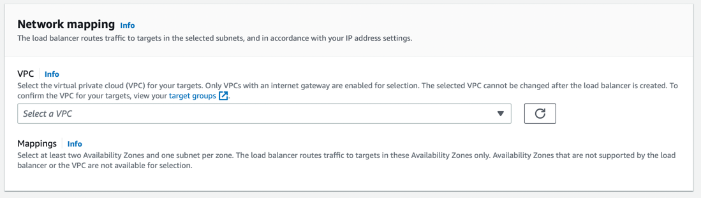
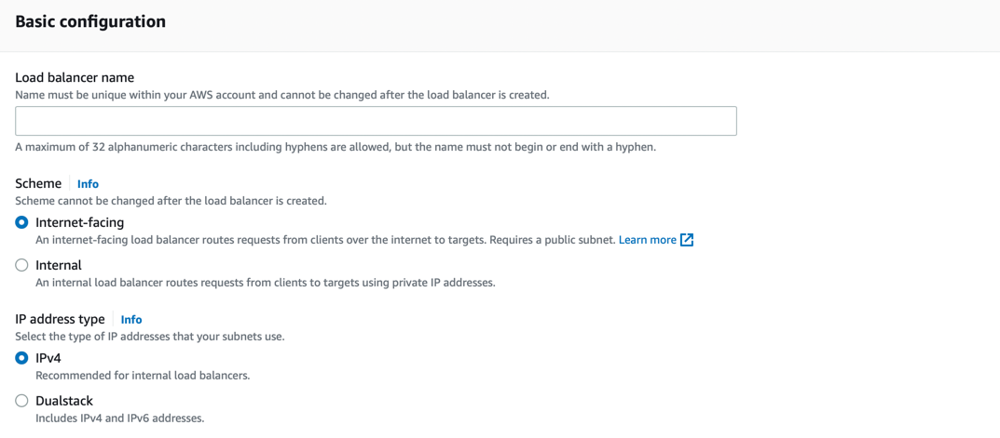

# Amazon ELB - Elastic Load Balancer
- [Amazon ELB - Elastic Load Balancer](https://docs.aws.amazon.com/elasticloadbalancing) automatically distributes your incoming traffic across multiple targets, such as [EC2 instances](../../../3_ComputeServices/AmazonEC2), [containers](../../../4_ContainerOrchestrationServices/AmazonECS), and IP addresses, in [one or more Availability Zones](../../../AWS-Global-Architecture-Region-AZ.md) in the same region.
- Note - Elastic Load Balancer cannot throttle requests.

# Key Features of ELB

| Feature                                                                                                                    | Remarks                                                                                                                                                                                                                                                                                                                                                                                                                                                            |
|----------------------------------------------------------------------------------------------------------------------------|--------------------------------------------------------------------------------------------------------------------------------------------------------------------------------------------------------------------------------------------------------------------------------------------------------------------------------------------------------------------------------------------------------------------------------------------------------------------|
| [Types of ELBs](ALBvsNLB.md)                                                                                            | -                                                                                                                                                                                                                                                                                                                                                                                                                                                                  |
| [Highly available](../../../../1_HLDDesignComponents/0_SystemGlossaries/Reliability/HighAvailability.md)                   | Load balancers balances loads across instances in multiple Availability Zones.                                                                                                                                                                                                                                                                                                                                                                                     |
| [Automatically Scalable](../../../../1_HLDDesignComponents/0_SystemGlossaries/Reliability/HighAvailability.md)             | ELB automatically scales as traffic increases.                                                                                                                                                                                                                                                                                                                                                                                                                     |
| [Health checks](../../../3_ComputeServices/AmazonEC2/AutoScalingGroup/ELBAndHealthChecks.md)                               | Automatically checks health of instances and takes them in or out of service.                                                                                                                                                                                                                                                                                                                                                                                      |
| [Session stickiness](https://docs.aws.amazon.com/elasticloadbalancing/latest/application/sticky-sessions.html)             | Routes requests to the same instance.                                                                                                                                                                                                                                                                                                                                                                                                                              |
| [SSL Termination/Offloading](https://aws.amazon.com/blogs/aws/new-tls-termination-for-network-load-balancers/)             | Supports [SSL termination/offload](https://aws.amazon.com/blogs/aws/new-tls-termination-for-network-load-balancers/) from web and application servers with flexible cipher support                                                                                                                                                                                                                                                                                 |
| [Connection Draining](https://aws.amazon.com/blogs/aws/elb-connection-draining-remove-instances-from-service-with-care/)   | When [Connection Draining is enabled and configured](https://aws.amazon.com/blogs/aws/elb-connection-draining-remove-instances-from-service-with-care/), the process of deregistering an instance from an [Elastic Load Balancer]() gains an additional step.  - For the duration of the configured timeout, the load balancer will allow existing, in-flight requests made to an instance to complete, but it will not send any new requests to the instance. |
| [Cross-zone load balancing](CrossZoneLoadBalancing.md)                                                                     | -                                                                                                                                                                                                                                                                                                                                                                                                                                                                  |
| [Authenticate users](https://docs.aws.amazon.com/elasticloadbalancing/latest/application/listener-authenticate-users.html) | You can configure an Application Load Balancer to securely authenticate users (through Amazon Cognito User Pool, Third-Party IDP etc.) as they access your applications.                                                                                                                                                                                                                                                                                           |
| [Monitoring/logging](https://docs.aws.amazon.com/elasticloadbalancing/latest/application/load-balancer-monitoring.html)    | Publishes metrics to CloudWatch and can get logs of requests processed.                                                                                                                                                                                                                                                                                                                                                                                            |
| [Access logs](https://docs.aws.amazon.com/elasticloadbalancing/latest/application/load-balancer-access-logs.html)          | Elastic Load Balancing provides access logs that capture detailed information about requests sent to your load balancer.  - Each log contains information such as the time the request was received, the client's IP address, latencies, request paths, and server responses.                                                                                                                                                                                  |

# Key Components of ELB

| Component                                                                                                        | Description                                                                                                                                                                                                                                                                                                                                                                                                                                                                                                                                                                                                                                                                                                                    |
|------------------------------------------------------------------------------------------------------------------|--------------------------------------------------------------------------------------------------------------------------------------------------------------------------------------------------------------------------------------------------------------------------------------------------------------------------------------------------------------------------------------------------------------------------------------------------------------------------------------------------------------------------------------------------------------------------------------------------------------------------------------------------------------------------------------------------------------------------------|
| [Listener](https://docs.aws.amazon.com/elasticloadbalancing/latest/network/load-balancer-listeners.html)         | [A listener](https://docs.aws.amazon.com/elasticloadbalancing/latest/network/load-balancer-listeners.html) checks for connection requests from clients, using the protocol and port that you configure, and forwards requests to a target group.                                                                                                                                                                                                                                                                                                                                                                                                                                                                               |
| [Target Group](https://docs.aws.amazon.com/elasticloadbalancing/latest/network/load-balancer-target-groups.html) | [Each target group](https://docs.aws.amazon.com/elasticloadbalancing/latest/network/load-balancer-target-groups.html) routes requests to one or more registered targets, such as [EC2 instances](../../../3_ComputeServices/AmazonEC2), using the TCP protocol ( in case of [Network Load Balancer]()) and the port number that you specify. - You can register a target with multiple target groups. - You can [configure health checks on a per target group basis](https://docs.aws.amazon.com/elasticloadbalancing/latest/application/target-group-health-checks.html). - Health checks are performed on all targets registered to a target group that is specified in a listener rule for your load balancer. |
| Network Mapping - VPC                                                                                            | The load balancer routes traffic to the targets in the selected subnets, and in accordance with your IP address settings.                                                                                                                                                                                                                                                                                                                                                                                                                                                                                                                                                                                                      |
| Scheme - Internet-Facing or Internal                                                                             | When you create a load balancer, you must choose whether to make it an internal load balancer or an internet-facing load balancer. - The nodes of an internet-facing load balancer have public IP addresses. - The nodes of an internal load balancer have only private IP addresses. - Both internet-facing and internal load balancers route requests to your targets using private IP addresses. - Therefore, your targets do not need public IP addresses to receive requests from an internal or an internet-facing load balancer.                                                                                                                                                                        |

## Request Routing and IP Addresses - NLB

| Routing                            | Remarks                                                                                                                                                                       |
|------------------------------------|-------------------------------------------------------------------------------------------------------------------------------------------------------------------------------|
| Targets specified using Instance ID | If you specify targets using an instance ID, traffic is routed to instances using the primary private IP address specified in the primary network interface for the instance. |
| Targets specified using IP address | If you specify targets using IP addresses, you can route traffic to an instance using any private IP address from one or more network interfaces. This enables multiple applications on an instance to use the same port.                                                                                                                                                                               |

[Read more](https://docs.aws.amazon.com/elasticloadbalancing/latest/network/load-balancer-target-groups.html)

## Listener Setup

## Network Mapping

## Scheme - Internet-Facing, Internal

# ELB Load Balancer setup in Multi-Regions & Multi-AZs

# How ELB works with AutoScaling?

[Read here](../../../3_ComputeServices/AmazonEC2/AutoScalingGroup/Readme.md)

# References
- [Application Load Balancer vs Network Load Balancer vs Classic Load Balancer | AWS CSAA | Whizlabs](https://www.youtube.com/watch?v=WqJDac1H81I)
- [AWS ELB - Elastic Load Balancer | Why and What is ELB? | What are listeners and target groups?](https://www.youtube.com/watch?v=fMgA3rE0aPY)