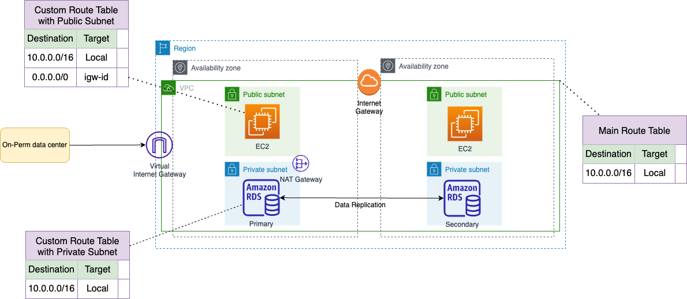

# Route tables
- [A route table](https://docs.aws.amazon.com/vpc/latest/userguide/VPC_Route_Tables.html) contains a set of rules, called routes, that determine where network traffic from your subnet or gateway is directed. 
- When the [CIDR blocks for route table](https://docs.aws.amazon.com/vpc/latest/userguide/VPC_Route_Tables.html) entries overlap, the more specific (smaller range) CIDR block takes priority.

# IP Ranges

| IP Range  | Description                                                                                                                        |
|-----------|------------------------------------------------------------------------------------------------------------------------------------|
| 0.0.0.0/0 | Standard default address range used to route all outbound traffic to an Amazon Virtual Private Cloud (Amazon VPC) internet gateway |
