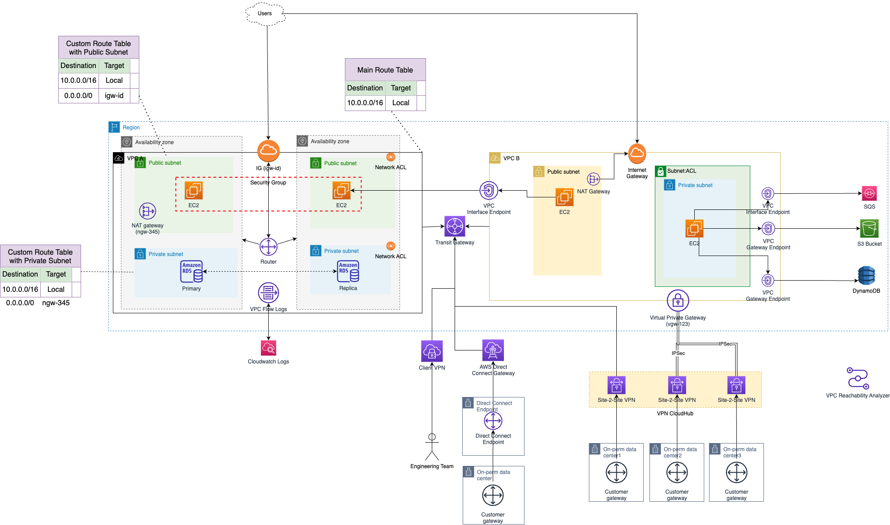

# AWS Direct Connect
- [AWS Direct Connect](https://aws.amazon.com/directconnect/) provides a dedicated, private connection between an on-premises data center and an [AWS region](../../AWS-Global-Architecture-Region-AZ.md) over a high-speed, low-latency connection, which is facilitated by a direct physical link between the two locations.

# AWS Direct Connect Delivery Partners
- [AWS Direct Connect Delivery Partners](https://aws.amazon.com/directconnect/partners/?partner-solutions-cards.sort-by=item.additionalFields.partnerNameLower&partner-solutions-cards.sort-order=asc&awsf.partner-solutions-filter-location=*all) help you establish network connectivity between AWS Direct Connect locations and their data center, office, or colocation environment.

## Models

| Model                     |
|---------------------------|
| Dedicated Connections     |
| Hosted Connections        |
| Hosted Virtual Interfaces |

# Facts
- Direct connect takes significant time (several months) to be provisioned.
- All connections must be dedicated connections and have a port speed of 1 Gbps, 10 Gbps, or 100 Gbps.
- All connections in the LAG must use the same bandwidth.
- You can have a maximum of two 100-Gbps connections in a LAG, or four connections with a port speed less than 100 Gbps. 
- Each connection in the LAG counts toward your overall connection limit for the Region.
- All connections in the LAG must terminate at the same Direct Connect endpoint.
- When you create a LAG, you can download the Letter of Authorization and Connecting Facility Assignment (LOA-CFA) for each new physical connection individually from the Direct Connect console.

# Network requirements 
- Your network is co-located with an existing Direct Connect location.
- You are working with a Direct Connect Partner.
- You are working with an independent service provider to connect to [Direct Connect]().

# Direct Connect gateways
- Use AWS Direct Connect gateway to connect your VPCs. 
- You associate an AWS Direct Connect gateway with either of the following gateways:

| Gateway                                                                                                                             |
|-------------------------------------------------------------------------------------------------------------------------------------|
| A [transit gateway](../3_NetworkFoundationsVPC/ConnectBetweenVPCs/TransitGateway.md) when you have multiple VPCs in the same Region |
| A [virtual private gateway](../3_NetworkFoundationsVPC/VirtualPrivateGateway.md)                                                    |

# Pricing

| Pricing Component                                                        | Definition                                                                                                                               | Pricing Params                     |
|--------------------------------------------------------------------------|------------------------------------------------------------------------------------------------------------------------------------------|------------------------------------|
| [Data transfer out (DTO)](https://aws.amazon.com/directconnect/pricing/) | Data transfer out (DTO) refers to the cumulative network traffic that is sent through AWS Direct Connect to destinations outside of AWS. | This is charged per gigabyte (GB). |

Note
- Data transfer pricing over Direct Connect is lower than data transfer pricing over the internet.

