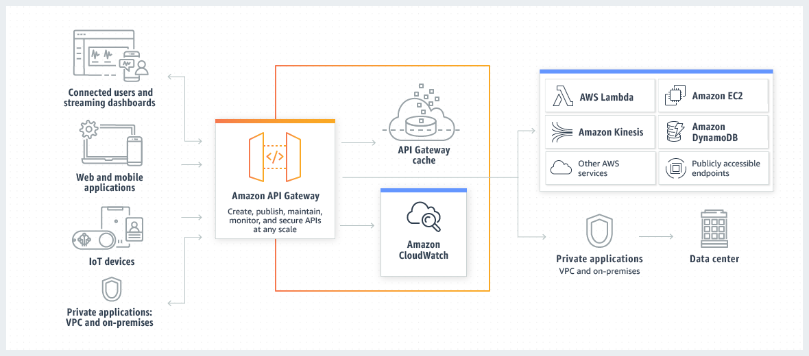

# Amazon API Gateway
- [Amazon API Gateway](https://docs.aws.amazon.com/apigateway/latest/developerguide/welcome.html) is an AWS service for creating, publishing, maintaining, monitoring, and securing [REST, HTTP, and WebSocket APIs](../../1_HLDDesignComponents/2_APITechOptions/REST.md) at any scale.
- API Gateway allows you to [create your APIs programmatically by importing Swagger definitions](https://swagger.io/), using either the AWS API or the AWS Management Console. 
- [API Gateway serves as a front door to any web application](https://aws.amazon.com/api-gateway/features/) running on [Amazon EC2](../4_ComputeServices/EC2), [Amazon ECS](../3_InfraAutomation/AmazonECS), [AWS Lambda](../4_ComputeServices/AWSLambda.md), or in any on-premises environment. 
- Basically, API Gateway allows you to run APIs without having to manage servers.

# References
- [AWS re:Invent - I didn’t know Amazon API Gateway did that](https://www.youtube.com/watch?v=yfJZc3sJZ8E)