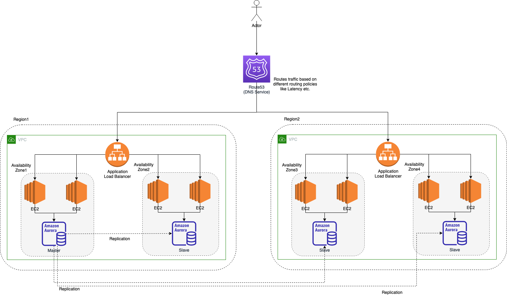

# Amazon Route 53

[Amazon Route 53](https://docs.aws.amazon.com/Route53/latest/DeveloperGuide/Welcome.html) is a [highly available](../../1_HLDDesignComponents/0_SystemGlossaries/HighAvailability.md) and [scalable](../../1_HLDDesignComponents/0_SystemGlossaries/Scalability.md) [Domain Name System (DNS)](https://www.cloudflare.com/learning/dns/what-is-dns/) web service. 

You can use Route 53 to perform three main functions in any combination,
- Domain registration
- DNS routing
- Health checking



# How does Amazon Route 53 provide high availability and low latency?

## Globally Distributed Servers
- Amazon is a global service and consequently has DNS services globally.
- Any customer creating a query from any part of the world gets to reach a `DNS server local` to them that provides low latency.

## Optimal Locations
- [Route 53](https://docs.aws.amazon.com/Route53/latest/DeveloperGuide/Welcome.html) uses a [global anycast network](https://www.cloudflare.com/learning/cdn/glossary/anycast-network/) to answer queries from the optimal position automatically.

## Dependency
- [Route 53](https://docs.aws.amazon.com/Route53/latest/DeveloperGuide/Welcome.html) provides a high level of dependability required by critical applications.

# Routing Policy

## Simple policy
- Point a domain to a single, simple resource.

## :star: Latency Based Routing
- Latency Based Routing utilizes [latency measurements between networks and AWS data centers](../../1_HLDDesignComponents/0_SystemGlossaries/LatencyThroughput.md).
- Latency Based Routing is used when you want to give your customers the lowest latency possible.
- [This is mostly used multi-region (active-active) routing policy](../AWS-Global-Architecture-Region-AZ.md) (if application has no geographic requirements).

````

// Basic Routing Policy using Terraform

resource "aws_route53_record" "latency-use1" {
  zone_id         = "${data.aws_route53_zone.my_zone.zone_id}"
  name            = "my-application"
  type            = "A"
  set_identifier  = "service-us-east-1"

  alias {
    zone_id                = "${aws_lb.main_us_east_1.zone_id}"
    name                   = "${aws_lb.main_us_east_1.dns_name}"
    evaluate_target_health = true
  }

  latency_routing_policy {
    region = "us-east-1"
  }
}

resource "aws_route53_record" "latency-euc1" {
  zone_id         = "${data.aws_route53_zone.my_zone.zone_id}"
  name            = "my-application"
  type            = "A"
  set_identifier  = "service-eu-central-1"

  alias {
    zone_id                = "${aws_lb.main_eu_central_1.zone_id}"
    name                   = "${aws_lb.main_eu_central_1.dns_name}"
    evaluate_target_health = true
  }

  latency_routing_policy {
    region = "eu-central-1"
  }
}
````

## Geo Based DNS routing
- The Geo Based DNS routing takes decisions based on the geographic location of the request.
- Geo Based routing is used when you want to direct the customer to different websites based on the country or region they are browsing from.

## Fail-over routing policy
- Use when you want to configure [active-passive fail over for disaster recovery](../../1_HLDDesignComponents/0_SystemGlossaries/HighAvailability.md#active-passive-policy).

# References
- [How to implement the perfect failover strategy using Amazon Route53](https://medium.com/dazn-tech/how-to-implement-the-perfect-failover-strategy-using-amazon-route53-1cc4b19fa9c7)
