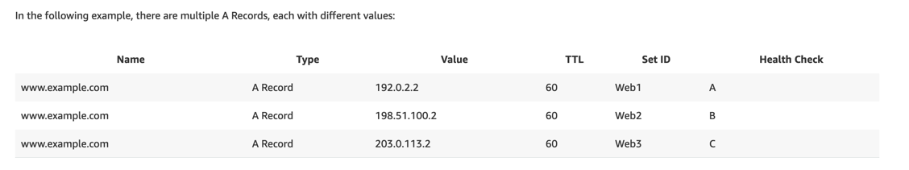

# Amazon Route 53
[Amazon Route 53](https://docs.aws.amazon.com/Route53/latest/DeveloperGuide/Welcome.html) is a [highly available](../../1_HLDDesignComponents/0_SystemGlossaries/HighAvailability.md) and [scalable](../../1_HLDDesignComponents/0_SystemGlossaries/Scalability/DBScalability.md) [Domain Name System (DNS)](https://www.cloudflare.com/learning/dns/what-is-dns/) web service. 

You can use Route 53 to perform three main functions in any combination,
- Domain registration
- DNS routing
- Health checking


# How does Amazon Route 53 provide high availability and low latency?

## Globally Distributed Servers
- Amazon is a global service and consequently has DNS services globally.
- Any customer creating a query from any part of the world gets to reach a `DNS server local` to them that provides low latency.

## Optimal Locations
- [Route 53](https://docs.aws.amazon.com/Route53/latest/DeveloperGuide/Welcome.html) uses a [global anycast network](https://www.cloudflare.com/learning/cdn/glossary/anycast-network/) to answer queries from the optimal position automatically.

## Dependency
- [Route 53](https://docs.aws.amazon.com/Route53/latest/DeveloperGuide/Welcome.html) provides a high level of dependability required by critical applications.

# Routing Policy

## Simple policy
- Point a domain to a single, simple resource.
- Use a [simple routing policy](https://aws.amazon.com/premiumsupport/knowledge-center/multivalue-versus-simple-policies/) for traffic that requires only standard DNS records and that doesn't require special options such as weighted routing or latency routing. 
- For example, use simple routing when you need to route traffic to a single resource. 
- You can't use multiple records of the same name and type with simple routing. 
- However, a single record can contain multiple values (such as IP addresses).

## :star: Latency Based Routing
- Latency Based Routing utilizes [latency measurements between networks and AWS data centers](../../1_HLDDesignComponents/0_SystemGlossaries/LatencyThroughput.md).
- Latency Based Routing is used when you want to give your customers the lowest latency possible.
- [This is mostly used multi-region (active-active) routing policy](../AWS-Global-Architecture-Region-AZ.md) (if application has no geographic requirements).

````
// Basic Routing Policy using Terraform
resource "aws_route53_record" "latency-use1" {
  zone_id         = "${data.aws_route53_zone.my_zone.zone_id}"
  name            = "my-application"
  type            = "A"
  set_identifier  = "service-us-east-1"

  alias {
    zone_id                = "${aws_lb.main_us_east_1.zone_id}"
    name                   = "${aws_lb.main_us_east_1.dns_name}"
    evaluate_target_health = true
  }

  latency_routing_policy {
    region = "us-east-1"
  }
}

resource "aws_route53_record" "latency-euc1" {
  zone_id         = "${data.aws_route53_zone.my_zone.zone_id}"
  name            = "my-application"
  type            = "A"
  set_identifier  = "service-eu-central-1"

  alias {
    zone_id                = "${aws_lb.main_eu_central_1.zone_id}"
    name                   = "${aws_lb.main_eu_central_1.dns_name}"
    evaluate_target_health = true
  }

  latency_routing_policy {
    region = "eu-central-1"
  }
}
````

## :star: Multivalue answer routing
- [Use a multivalue answer routing policy](https://aws.amazon.com/premiumsupport/knowledge-center/multivalue-versus-simple-policies/) to help distribute DNS responses across multiple resources. 
- For example, use multivalue answer routing when you want to associate your routing records with a Route 53 health check. 
- For example, use multivalue answer routing when you need to return multiple values for a DNS query and route traffic to multiple IP addresses.
- [Amazon ECS](../4a_ContainerOrchestrationServices/AmazonECS/Readme.md) uses multivalue answer routing in the [service-discovery](../../1_HLDDesignComponents/1_MicroServicesSOA/2_ServiceRegistry&Discovery/Readme.md), for load balancing.

Note: 
- Multivalue answer routing is not a substitute for [Elastic Load Balancing (ELB)](ElasticLoadBalancer/Readme.md). 
- Route 53 randomly selects any eight records. 
- When you perform dig (on Linux) or nslookup (on Windows) on your domain name multiple times, you might notice that the IP addresses rotate. 
- This rotation improves availability and provides some load balancing functionality. 
- Your operating system performs this round-robin DNS for cached responses, not Route 53.



## Geo Based DNS routing
- The Geo Based DNS routing takes decisions based on the geographic location of the request.
- Geo Based routing is used when you want to direct the customer to different websites based on the country or region they are browsing from.

## Fail-over routing policy
- Use when you want to configure [active-passive fail over for disaster recovery](../../1_HLDDesignComponents/0_SystemGlossaries/HighAvailability.md#active-passive-policy).

## Weighted routing policy
- Use when you want to configure [weighted routing i.e. send X% to one target, Y% to another target](https://docs.aws.amazon.com/Route53/latest/DeveloperGuide/resource-record-sets-values-weighted.html), for example [Canary Deployments](../../1_HLDDesignComponents/6_DevOps/CanaryDeployments.md).
- [Read more - Performing Weighted Routing in AWS Route 53](https://virtualizationreview.com/articles/2020/07/30/weighted-routing.aspx)

# References
- [How to implement the perfect failover strategy using Amazon Route53](https://medium.com/dazn-tech/how-to-implement-the-perfect-failover-strategy-using-amazon-route53-1cc4b19fa9c7)
