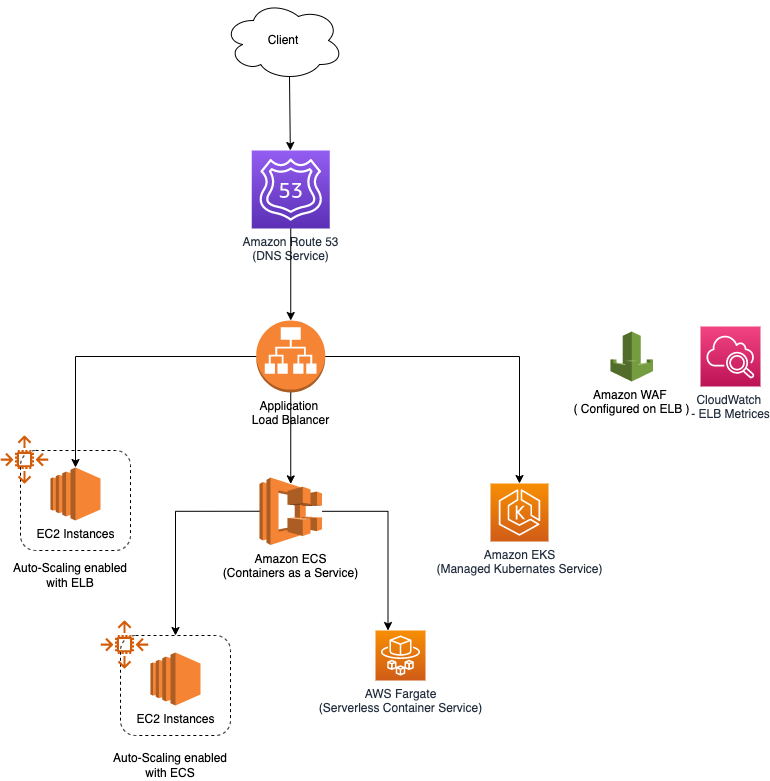

# Amazon ELB - Elastic Load Balancer
- [Amazon ELB - Elastic Load Balancer](https://docs.aws.amazon.com/elasticloadbalancing) automatically distributes your incoming traffic across multiple targets, such as [EC2 instances](../4_ComputeServices/AmazonEC2), [containers](../4_ComputeServices/AmazonECS), and IP addresses, in [one or more Availability Zones](../AWS-Global-Architecture-Region-AZ.md). 
- It monitors the `health of its registered targets` and [routes traffic only to the healthy targets](../../1_HLDDesignComponents/0_SystemGlossaries/LoadBalancer.md).

# ELB Load Balancer setup in Multi-Regions & Multi-AZs

# What is Listener?
- A [listener](https://docs.aws.amazon.com/elasticloadbalancing/latest/network/load-balancer-listeners.html) checks for connection requests from clients, using the protocol and port that you configure, and forwards requests to a target group.

# What is Target Group?
- [Each target group](https://docs.aws.amazon.com/elasticloadbalancing/latest/network/load-balancer-target-groups.html) routes requests to one or more registered targets, such as [EC2 instances](../4_ComputeServices/AmazonEC2), using the TCP protocol ( in case of [Network Load Balancer](#network-load-balancer)) and the port number that you specify.
- You can register a target with multiple target groups.
- You can configure health checks on a per target group basis.
- Health checks are performed on all targets registered to a target group that is specified in a listener rule for your load balancer.

# How ELB works with AutoScaling?
- [Read here](../4_ComputeServices/AmazonEC2/AutoScalingGroup/README.md)

# Types of ELB Load Balancers

You can select the type of [load balancer](../../1_HLDDesignComponents/0_SystemGlossaries/LoadBalancer.md) that best suits your needs.
- [Network Load Balancer](#network-load-balancer)
- [Application Load Balancer](#application-load-balancer)
- [Gateway Load Balancer](#gateway-load-balancer)

## Network Load Balancer
- Choose a [Network Load Balancer](https://docs.aws.amazon.com/elasticloadbalancing/latest/network/introduction.html) when you need ultra-high performance, TLS offloading at scale, centralized certificate deployment, support for UDP, and static IP addresses for your applications.
- Operating at the [connection level (TCD, UDP)](https://www.diffen.com/difference/TCP_vs_UDP), Network Load Balancers are capable of handling [millions of requests per second securely](../../1_HLDDesignComponents/0_SystemGlossaries/LatencyThroughput.md)  while maintaining [ultra-low latencies](../../1_HLDDesignComponents/0_SystemGlossaries/LatencyThroughput.md).

## Application Load Balancer
- Choose an [Application Load Balancer](https://aws.amazon.com/elasticloadbalancing/application-load-balancer/) when you need a flexible feature set for your applications with [HTTP and HTTPS traffic](https://www.izooto.com/blog/understanding-http-https-protocols). 
- Operating at the request level (HTTP, HTTPs), Application Load Balancers provide advanced routing and visibility features targeted at application architectures, including [microservices](../../1_HLDDesignComponents/1_MicroServicesSOA) and [containers](../../1_HLDDesignComponents/0_SystemGlossaries/ContainerOrchestrationService.md).
- Application Load Balancer allows for multiple applications (using [Content-based routing - /FOO, /BAR](https://aws.amazon.com/blogs/aws/new-advanced-request-routing-for-aws-application-load-balancers/) etc.) to be hosted behind a single load balancer.

### Key Features of ALB
- [Highly available](../../1_HLDDesignComponents/0_SystemGlossaries/HighAvailability.md)
- [Health checks](https://aws.amazon.com/builders-library/implementing-health-checks/)
- [Session stickiness](https://docs.aws.amazon.com/elasticloadbalancing/latest/application/sticky-sessions.html)
- [Content-based routing](https://aws.amazon.com/blogs/aws/new-advanced-request-routing-for-aws-application-load-balancers/)
- Monitoring/logging
- Container based apps
- [WebSockets](https://aws.amazon.com/blogs/compute/using-websockets-and-load-balancers-part-two/)
- HTTP/2

## Gateway Load Balancer
- Choose a [Gateway Load Balancer](https://docs.aws.amazon.com/elasticloadbalancing/latest/gateway/introduction.html) when you need to deploy and manage a fleet of third-party virtual appliances that support GENEVE. 
- These appliances enable you to improve security, compliance, and policy controls.

# References
- [Application Load Balancer vs Network Load Balancer vs Classic Load Balancer | AWS CSAA | Whizlabs](https://www.youtube.com/watch?v=WqJDac1H81I)
- [AWS ELB - Elastic Load Balancer | Why and What is ELB? | What are listeners and target groups?](https://www.youtube.com/watch?v=fMgA3rE0aPY)