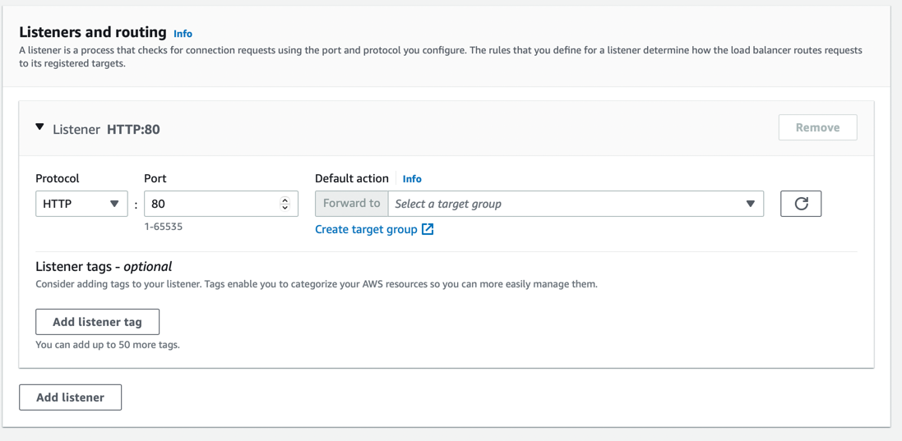
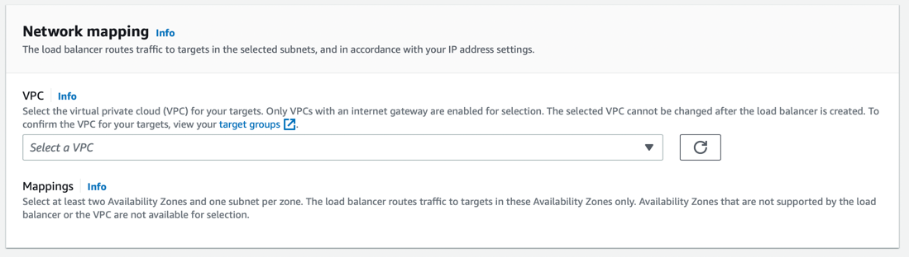
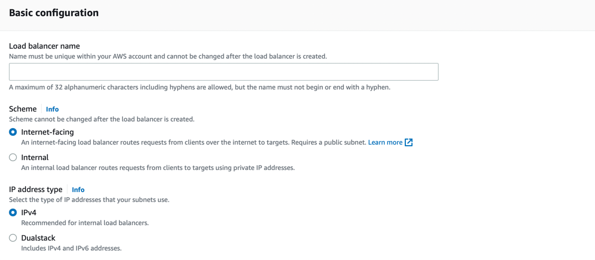

# Amazon ELB - Elastic Load Balancer
- [Amazon ELB - Elastic Load Balancer](https://docs.aws.amazon.com/elasticloadbalancing) automatically distributes your incoming traffic across multiple targets, such as [EC2 instances](../../3_ComputeServices/AmazonEC2), [containers](../../4_ContainerOrchestrationServices/AmazonECS), and IP addresses, in [one or more Availability Zones](../../AWS-Global-Architecture-Region-AZ.md) in the same region.
- [It monitors the health of its registered targets and routes traffic only to the healthy targets](https://aws.amazon.com/builders-library/implementing-health-checks/).
- [ELB vs API Gateway](../AmazonAPIGatewayVsELB.md)
- [Types of ELBs](TypesOfELBs.md)

# Availability Zones and load balancer nodes
- [When you enable an Availability Zone for your load balancer, Elastic Load Balancing creates a load balancer node in the Availability Zone](https://docs.aws.amazon.com/elasticloadbalancing/latest/userguide/how-elastic-load-balancing-works.html). 
- If you register targets in an Availability Zone but do not enable the Availability Zone, these registered targets do not receive traffic. 
- Your load balancer is most effective when you ensure that each enabled Availability Zone has at least one registered target.
- With an [Application Load Balancer](TypesOfELBs.md) however, it is a requirement that you enable at least two or more Availability Zones. (And recommended for [Network Load Balancer](TypesOfELBs.md) also)

# Key Features of ELB

| Feature                                                                                                                              | Remarks                                                                                                                                                                                                                                                                                                                                                 |
|--------------------------------------------------------------------------------------------------------------------------------------|---------------------------------------------------------------------------------------------------------------------------------------------------------------------------------------------------------------------------------------------------------------------------------------------------------------------------------------------------------|
| [Highly available](../../../1_HLDDesignComponents/0_SystemGlossaries/Reliability/HighAvailability.md)                                | Load balancers balances loads across instances in multiple Availability Zones.                                                                                                                                                                                                                                                                          |
| [Automatically Scalable](../../../1_HLDDesignComponents/0_SystemGlossaries/Reliability/HighAvailability.md)                          | ELB automatically scales as traffic increases.                                                                                                                                                                                                                                                                                                          |
| [Health checks](https://docs.aws.amazon.com/elasticloadbalancing/latest/application/target-group-health-checks.html)                 | Automatically checks health of instances and takes them in or out of service.                                                                                                                                                                                                                                                                           |
| [Session stickiness](https://docs.aws.amazon.com/elasticloadbalancing/latest/application/sticky-sessions.html)                       | Routes requests to the same instance.                                                                                                                                                                                                                                                                                                                   |
| [Monitoring/logging](https://docs.aws.amazon.com/elasticloadbalancing/latest/application/load-balancer-monitoring.html)              | Publishes metrics to CloudWatch and can get logs of requests processed.                                                                                                                                                                                                                                                                                 |
| [Cross-zone load balancing](https://docs.aws.amazon.com/elasticloadbalancing/latest/userguide/how-elastic-load-balancing-works.html) | When cross-zone load balancing is enabled, each load balancer node distributes traffic across the registered targets in all enabled Availability Zones. This improves speed and scalability. - When cross-zone load balancing is disabled, each load balancer node distributes traffic only across the registered targets in its Availability Zone. |
| Secure Sockets Layer                                                                                                                 | Supports SSL offload from web and application servers with flexible cipher support                                                                                                                                                                                                                                                                      |

# Key Components of ELB

| Component                          | Description                                                                                                                                                                                                                                                                                                                                                                                                                                                                                                                                                                                                                                                                                                                 |
|------------------------------------|-----------------------------------------------------------------------------------------------------------------------------------------------------------------------------------------------------------------------------------------------------------------------------------------------------------------------------------------------------------------------------------------------------------------------------------------------------------------------------------------------------------------------------------------------------------------------------------------------------------------------------------------------------------------------------------------------------------------------------|
| Listener                           | [A listener](https://docs.aws.amazon.com/elasticloadbalancing/latest/network/load-balancer-listeners.html) checks for connection requests from clients, using the protocol and port that you configure, and forwards requests to a target group.                                                                                                                                                                                                                                                                                                                                                                                                                                                                            |
| Target Group                       | [Each target group](https://docs.aws.amazon.com/elasticloadbalancing/latest/network/load-balancer-target-groups.html) routes requests to one or more registered targets, such as [EC2 instances](../../3_ComputeServices/AmazonEC2), using the TCP protocol ( in case of [Network Load Balancer]()) and the port number that you specify. - You can register a target with multiple target groups. - You can [configure health checks on a per target group basis](https://docs.aws.amazon.com/elasticloadbalancing/latest/application/target-group-health-checks.html). - Health checks are performed on all targets registered to a target group that is specified in a listener rule for your load balancer. |
| Network Mapping - VPC              | The load balancer routes traffic to the targets in the selected subnets, and in accordance with your IP address settings.                                                                                                                                                                                                                                                                                                                                                                                                                                                                                                                                                                                                   |
| Scheme - Internet-Facing, Internal | When you create a load balancer, you must choose whether to make it an internal load balancer or an internet-facing load balancer. - The nodes of an internet-facing load balancer have public IP addresses. - The nodes of an internal load balancer have only private IP addresses. - Both internet-facing and internal load balancers route requests to your targets using private IP addresses. - Therefore, your targets do not need public IP addresses to receive requests from an internal or an internet-facing load balancer.                                                                                                                                                                     |

## Listener Setup

## Network Mapping

## Scheme - Internet-Facing, Internal

# ELB Load Balancer setup in Multi-Regions & Multi-AZs

# How ELB works with AutoScaling?

- [Read here](../../3_ComputeServices/AmazonEC2/AutoScalingGroup/Readme.md)

# References
- [Application Load Balancer vs Network Load Balancer vs Classic Load Balancer | AWS CSAA | Whizlabs](https://www.youtube.com/watch?v=WqJDac1H81I)
- [AWS ELB - Elastic Load Balancer | Why and What is ELB? | What are listeners and target groups?](https://www.youtube.com/watch?v=fMgA3rE0aPY)