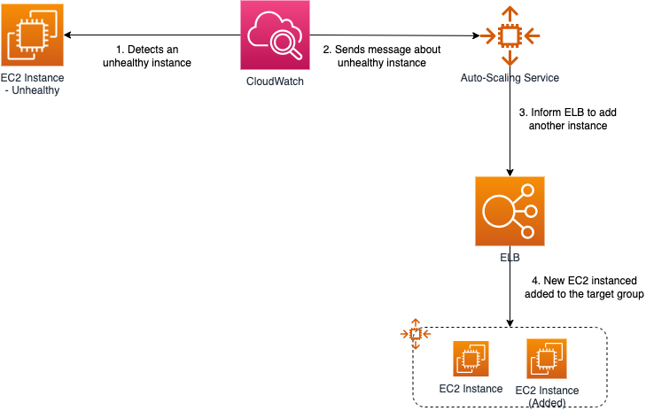

# Amazon ELB - Elastic Load Balancer
- [Amazon ELB - Elastic Load Balancer](https://docs.aws.amazon.com/elasticloadbalancing) automatically distributes your incoming traffic across multiple targets, such as [EC2 instances](../../4_ComputeServices/AmazonEC2), [containers](../../4a_ContainerOrchestrationServices/AmazonECS), and IP addresses, in [one or more Availability Zones](../../AWS-Global-Architecture-Region-AZ.md). 
- [It monitors the health of its registered targets and routes traffic only to the healthy targets](https://aws.amazon.com/builders-library/implementing-health-checks/).
- [ELB vs API Gateway](../AmazonAPIGatewayVsELB.md)

# Availability Zones and load balancer nodes
- [When you enable an Availability Zone for your load balancer, Elastic Load Balancing creates a load balancer node in the Availability Zone](https://docs.aws.amazon.com/elasticloadbalancing/latest/userguide/how-elastic-load-balancing-works.html). 
- If you register targets in an Availability Zone but do not enable the Availability Zone, these registered targets do not receive traffic. 
- Your load balancer is most effective when you ensure that each enabled Availability Zone has at least one registered target.
- With an Application Load Balancer however, it is a requirement that you enable at least two or more Availability Zones. (And recommended for Network Load Balancer also)

# Key Features of ELB

| Feature                                                                                                                              | Remarks                                                                                                                                                                                                                                                                                                                                                   |
|--------------------------------------------------------------------------------------------------------------------------------------|-----------------------------------------------------------------------------------------------------------------------------------------------------------------------------------------------------------------------------------------------------------------------------------------------------------------------------------------------------------|
| [Highly available](../../../1_HLDDesignComponents/0_SystemGlossaries/HighAvailability.md)                                            | Load balancers balances loads across instances in multiple Availability Zones.                                                                                                                                                                                                                                                                            |
| [Health checks](https://docs.aws.amazon.com/elasticloadbalancing/latest/application/target-group-health-checks.html)                 | Automatically checks health of instances and takes them in or out of service.                                                                                                                                                                                                                                                                             |
| [Session stickiness](https://docs.aws.amazon.com/elasticloadbalancing/latest/application/sticky-sessions.html)                       | Routes requests to the same instance.                                                                                                                                                                                                                                                                                                                     |
| [Monitoring/logging](https://docs.aws.amazon.com/elasticloadbalancing/latest/application/load-balancer-monitoring.html)              | Publishes metrics to CloudWatch and can get logs of requests processed.                                                                                                                                                                                                                                                                                   |
| [Cross-zone load balancing](https://docs.aws.amazon.com/elasticloadbalancing/latest/userguide/how-elastic-load-balancing-works.html) | - When cross-zone load balancing is enabled, each load balancer node distributes traffic across the registered targets in all enabled Availability Zones. This improves speed and scalability. - When cross-zone load balancing is disabled, each load balancer node distributes traffic only across the registered targets in its Availability Zone. |
| Secure Sockets Layer                                                                                                                 | Supports SSL offload from web and application servers with flexible cipher support                                                                                                                                                                                                                                                                        |

# Key Components of ELB

## Listener
- [A listener](https://docs.aws.amazon.com/elasticloadbalancing/latest/network/load-balancer-listeners.html) checks for connection requests from clients, using the protocol and port that you configure, and forwards requests to a target group.

## Target Group
- [Each target group](https://docs.aws.amazon.com/elasticloadbalancing/latest/network/load-balancer-target-groups.html) routes requests to one or more registered targets, such as [EC2 instances](../../4_ComputeServices/AmazonEC2), using the TCP protocol ( in case of [Network Load Balancer](#network-load-balancer)) and the port number that you specify.
- You can register a target with multiple target groups.
- You can [configure health checks on a per target group basis](https://docs.aws.amazon.com/elasticloadbalancing/latest/application/target-group-health-checks.html).
- Health checks are performed on all targets registered to a target group that is specified in a listener rule for your load balancer.

## Network Mapping - VPC
- The load balancer routes traffic to the targets in the selected subnets, and in accordance with your IP address settings.

## Scheme - Internet-Facing, Internal
- When you create a load balancer, you must choose whether to make it an internal load balancer or an internet-facing load balancer.
- The nodes of an internet-facing load balancer have public IP addresses.
- The nodes of an internal load balancer have only private IP addresses.
- Both internet-facing and internal load balancers route requests to your targets using private IP addresses. 
- Therefore, your targets do not need public IP addresses to receive requests from an internal or an internet-facing load balancer.

# Types of ELB Load Balancers

You can select the type of [load balancer](../../../1_HLDDesignComponents/0_SystemGlossaries/LoadBalancer.md) that best suits your needs.
- [Network Load Balancer](#network-load-balancer)
- [Application Load Balancer](#application-load-balancer)
- [Gateway Load Balancer](#gateway-load-balancer)

## Difference b/w Network Load Balancer and Application Load Balancer

| Basis                              | Network Load Balancer                                                                                | Application Load Balancer                                                                                 |
|------------------------------------|------------------------------------------------------------------------------------------------------|-----------------------------------------------------------------------------------------------------------|
| Supported Protocols                | TCP, UDP                                                                                             | HTTP, HTTPs                                                                                               |
| Supported Target Group Types       | [Instance](../../4_ComputeServices/AmazonEC2/ReadMe.md), [IP](../../4_ComputeServices/AWSFargate.md) | [Instance](../../4_ComputeServices/AmazonEC2/ReadMe.md), [IP](../../4_ComputeServices/AWSFargate.md), [Lambda](../../4_ComputeServices/AWSLambda/Readme.md)                                                                                      |
| Path-Based / Content-Based Routing | :x: Not-Supported                                                                                    | :white_check_mark: Supported - This would help with less number of load balancers and cost reduction. |
| Rough Throughput                   | Millions of requests per second                                                                      | -                                                                                                         |
| Ideally Use Cases                  | Microservices (if API gateway used), other apps                                                      | Microservices, Container-based apps                                                                       |
| Cross-zone Load Balancing          | Disabled by default                                                                                  | Enabled by default                                                                                        |

## Network Load Balancer
- Choose a [Network Load Balancer](https://docs.aws.amazon.com/elasticloadbalancing/latest/network/introduction.html) when you need ultra-high performance, TLS offloading at scale, centralized certificate deployment, support for UDP, and static IP addresses for your applications.
- Operating at the [connection level (TCD, UDP)](https://www.diffen.com/difference/TCP_vs_UDP), Network Load Balancers are capable of handling [millions of requests per second securely](../../../1_HLDDesignComponents/0_SystemGlossaries/LatencyThroughput.md) while maintaining [ultra-low latencies](../../../1_HLDDesignComponents/0_SystemGlossaries/LatencyThroughput.md).

## Application Load Balancer
- Choose an [Application Load Balancer](https://aws.amazon.com/elasticloadbalancing/application-load-balancer/) when you need a flexible feature set for your applications with [HTTP and HTTPS traffic](https://www.izooto.com/blog/understanding-http-https-protocols). 
- Operating at the request level (HTTP, HTTPs), Application Load Balancers provide advanced routing and visibility features targeted at application architectures, including [microservices](../../../1_HLDDesignComponents/1_MicroServicesSOA) and [containers](../../../1_HLDDesignComponents/0_SystemGlossaries/Scalability/ContainerOrchestrationService.md).
- Application Load Balancer allows for multiple applications (using [Content-based routing - /FOO, /BAR](https://aws.amazon.com/blogs/aws/new-advanced-request-routing-for-aws-application-load-balancers/) etc.) to be hosted behind a single load balancer.

### Key Features of ALB
- [Highly available](../../../1_HLDDesignComponents/0_SystemGlossaries/HighAvailability.md)
- [Health checks](https://aws.amazon.com/builders-library/implementing-health-checks/)
- [Session stickiness](https://docs.aws.amazon.com/elasticloadbalancing/latest/application/sticky-sessions.html)
- [Content-based routing](https://aws.amazon.com/blogs/aws/new-advanced-request-routing-for-aws-application-load-balancers/)
- [WebSockets](https://aws.amazon.com/blogs/compute/using-websockets-and-load-balancers-part-two/)
- [Monitoring/logging](https://docs.aws.amazon.com/elasticloadbalancing/latest/application/load-balancer-monitoring.html)
- Container based apps
- HTTP/2

## Gateway Load Balancer
- Choose a [Gateway Load Balancer](https://docs.aws.amazon.com/elasticloadbalancing/latest/gateway/introduction.html) when you need to deploy and manage a fleet of third-party virtual appliances that support GENEVE. 
- These appliances enable you to improve security, compliance, and policy controls.

# ELB Load Balancer setup in Multi-Regions & Multi-AZs

# How ELB works with AutoScaling?

- [Read here](../../4_ComputeServices/AmazonEC2/AutoScalingGroup/README.md)

# References
- [Application Load Balancer vs Network Load Balancer vs Classic Load Balancer | AWS CSAA | Whizlabs](https://www.youtube.com/watch?v=WqJDac1H81I)
- [AWS ELB - Elastic Load Balancer | Why and What is ELB? | What are listeners and target groups?](https://www.youtube.com/watch?v=fMgA3rE0aPY)