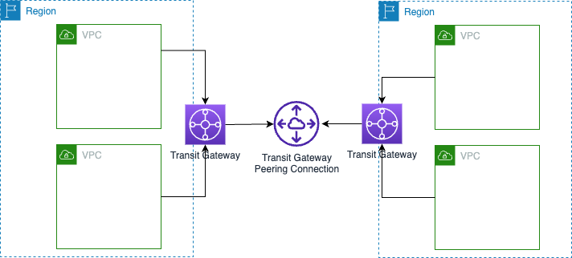

# Transit Gateway
- [A transit gateway](https://docs.aws.amazon.com/vpc/latest/tgw/what-is-transit-gateway.html) is a network transit hub that you can use to interconnect your [virtual private clouds (VPCs)]() and on-premises networks.
- As your cloud infrastructure expands globally, inter-Region peering connects transit gateways together using the AWS Global Infrastructure.
- Your data is automatically encrypted and never travels over the public internet.
- Transit gateway allows one-to-many network connections as opposed to other AWS connectivity types which allow only on-to-one connections.

# Attachment

| Connection from                                                 |
|-----------------------------------------------------------------|
| Amazon VPC                                                      |
| VPN                                                             |
| Direct Connect                                                  |
| Transit Gateway Connect attachments                             |
| Transit Gateway Peering connections                             |

# Key concepts

| Concept     | Description                                                                              |
|-------------|------------------------------------------------------------------------------------------|
| Association | The route table used to route packets coming from an attachment (from Amazon VPC to VPN) |
| Propagation | The route table where the attachment's routes are installed.                             |

# Path Selection Behaviour
- Most specific route (the longest prefix match)
- Static route entries, including static site-2-site VPN routes
- BGP-propagated routes from Direct Connect gateway
- BGP-propagated routes from AWS site-2-site VPN

