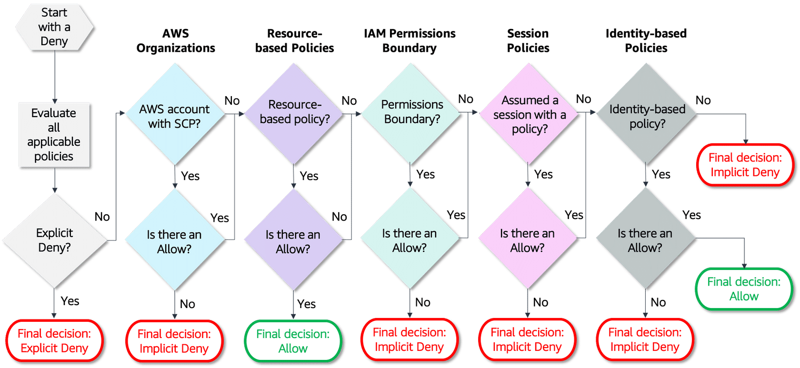

# AWS Identity and Access Management (IAM)
- [AWS Identity and Access Management (IAM)](https://aws.amazon.com/iam/) allows an administrator to provide multiple users and groups with granular access.
- Various user groups and users may require varying levels of access to the various resources that have been developed.
- We may assign roles to users and create roles with defined access levels using IAM.
- It further gives us Federated Access, which allows us to grant applications and users access to resources without having to create IAM Roles.
- Each AWS account can have max 5000 IAM users.

# Terms & Concepts

| Term                                                                                                      | Description                                                                                                                                                                                                                                                                                                                          |
|-----------------------------------------------------------------------------------------------------------|--------------------------------------------------------------------------------------------------------------------------------------------------------------------------------------------------------------------------------------------------------------------------------------------------------------------------------------|
| IAM Policy                                                                                                | [IAM Policy](https://docs.aws.amazon.com/IAM/latest/UserGuide/access_policies.html) helps to define user access (through AWS Console or AWS Cli) for the AWS resources. - [AWS Policy Generator](https://awspolicygen.s3.amazonaws.com/policygen.html)                                                                           |
| IAM Group                                                                                                 | [An IAM user groups](https://docs.aws.amazon.com/IAM/latest/UserGuide/id_groups.html) is a collection of IAM users. - User groups let you specify permissions for multiple users, which can make it easier to manage the permissions for those users.                                                                            |
| IAM Roles                                                                                                 | [An IAM Roles](https://docs.aws.amazon.com/IAM/latest/UserGuide/id_roles.html) is an IAM identity that you can create in your account that has specific permissions.  - An IAM role is similar to an IAM user, in that it is an AWS identity with permission policies that determine what the identity can and cannot do in AWS. |
| [Trust Policy](https://aws.amazon.com/blogs/security/how-to-use-trust-policies-with-iam-roles/)           | The trust policy defines which principals can assume the role, and under which conditions.  - A trust policy is a specific type of resource-based policy for IAM roles.                                                                                                                                                          |

# Types of AWS credentials

| Term                           | Description                                                                                                                                                                           |
|--------------------------------|---------------------------------------------------------------------------------------------------------------------------------------------------------------------------------------|
| Username & Password            | A password policy is a set of rules that define the type of password an IAM user can set.                                                                                             |
| MFA Login                      | Multi-factor authentication (MFA) is an additional layer of security for accessing AWS services.                                                                                      |
| IAM user access key/secret key | These are used to programmatically call to AWS using AWS CLI, AWS SDK or direct HTTP calls using APIs for individual services. - Their expiry is between 15 minutes and 36 hours. |

# IAM request context

| Context                                                                                                  | Description                                                                                                                                                              |
|----------------------------------------------------------------------------------------------------------|--------------------------------------------------------------------------------------------------------------------------------------------------------------------------|
| Principal                                                                                                | User, role, external user, or application that sent the request and the policies associated with that principal. Example - arn:aws:iam::<AWS-account-ID>:user/<username> |
| Effect                                                                                                   | The effect element specifies whether the statement will explicitly allow or deny access.                                                                                 |
| Action                                                                                                   | What the principal is attempting to do. Example - iam:GetUser                                                                                                            |
| Resource                                                                                                 | AWS resource object upon which the actions or operations are performed.                                                                                                  |
| [Condition](https://docs.aws.amazon.com/IAM/latest/UserGuide/reference_policies_elements_condition.html) | The Condition optional element (or Condition block) lets you specify conditions for when a policy is in effect.                                                          |

# Types of Policies

| Type                                                                                                                                          | Description                                                                                                                                                                                                                                                                                                                                                                                                   |
|-----------------------------------------------------------------------------------------------------------------------------------------------|---------------------------------------------------------------------------------------------------------------------------------------------------------------------------------------------------------------------------------------------------------------------------------------------------------------------------------------------------------------------------------------------------------------|
| [Identity-based policies](https://docs.aws.amazon.com/IAM/latest/UserGuide/access_policies.html#policies_id-based)                            | Attach managed and inline policies to IAM identities (users, groups to which users belong, or roles).  - Identity-based policies grant permissions to an identity.                                                                                                                                                                                                                                        |
| [Resource-based policies](https://docs.aws.amazon.com/IAM/latest/UserGuide/access_policies.html#policies_resource-based)                      | Attach inline policies to resources. Resource-based policies grant permissions to the principal that is specified in the policy.  - Principals can be in the same account as the resource or in other accounts. - The most common examples of resource-based policies are [Amazon S3 bucket policies](../../7_StorageServices/3_ObjectStorageTypes/AmazonS3/S3Bucket.md) and IAM role trust policies. |
| [Permissions boundaries for IAM entities](https://docs.aws.amazon.com/IAM/latest/UserGuide/access_policies_boundaries.html)                   | A permissions boundary is an advanced feature for using a managed policy to set the maximum permissions that an identity-based policy can grant to an IAM entity. - The entity can perform only the actions that are allowed by both its identity-based policies and its permissions boundaries.                                                                                                          |
| [AWS Organization Service control policies (SCPs)](https://docs.aws.amazon.com/organizations/latest/userguide/orgs_manage_policies_scps.html) | Service control policies (SCPs) are a type of organization policy that you can use to manage permissions in [your organization](AWSOrganization.md). - Restricts permissions for entities in an AWS account, including AWS account root users.                                                                                                                                                            |
| [Session policies](https://docs.aws.amazon.com/IAM/latest/UserGuide/access_policies.html#policies_session)                                    | Session policies are [inline policies](https://docs.aws.amazon.com/IAM/latest/UserGuide/access_policies_managed-vs-inline.html) that you pass as a parameter when you programmatically create a temporary session for a role or federated user.                                                                                                                                                               |

## Explicit and implicit denies

| Type                                                                                                                                          | Description                                                                                                                                                                                                                                                                                                                                                                                    |
|-----------------------------------------------------------------------------------------------------------------------------------------------|------------------------------------------------------------------------------------------------------------------------------------------------------------------------------------------------------------------------------------------------------------------------------------------------------------------------------------------------------------------------------------------------|
| [Implicit denial](https://docs.aws.amazon.com/IAM/latest/UserGuide/reference_policies_evaluation-logic.html)                 | An [implicit denial](https://docs.aws.amazon.com/IAM/latest/UserGuide/reference_policies_evaluation-logic.html) occurs when there is no applicable Deny statement but also no applicable Allow statement.                                                                                                                            |
| [Explicit deny](https://docs.aws.amazon.com/IAM/latest/UserGuide/reference_policies_evaluation-logic.html)                   | An [explicit deny](https://docs.aws.amazon.com/IAM/latest/UserGuide/reference_policies_evaluation-logic.html) in any of these policies overrides the allow.                                                                                                                                                                          |

# Identity-based policies

| Type                                                                                                                 | Description                                                                                                                                                                                                                                                                                                |
|----------------------------------------------------------------------------------------------------------------------|------------------------------------------------------------------------------------------------------------------------------------------------------------------------------------------------------------------------------------------------------------------------------------------------------------|
| [AWS managed policies](https://docs.aws.amazon.com/IAM/latest/UserGuide/access_policies_managed-vs-inline.html)      | An AWS managed policy is a standalone policy that is created and administered by AWS.  - Standalone policy means that the policy has its own Amazon Resource Name (ARN) that includes the policy name.                                                                                                 |
| [Customer managed policies](https://docs.aws.amazon.com/IAM/latest/UserGuide/access_policies_managed-vs-inline.html) | You can create standalone policies in your own AWS account that you can attach to principal entities (users, groups, and roles).  - Notice that the same policy can be attached to multiple principal entities—for example, the same DynamoDB-books-app policy is attached to two different IAM roles. |
| [Inline policies](https://docs.aws.amazon.com/IAM/latest/UserGuide/access_policies_managed-vs-inline.html)           | An inline policy is a policy created for a single IAM identity (a user, group, or role). Inline policies maintain a strict one-to-one relationship between a policy and an identity.                                                                                                                       |

# AWS Condition keys

| Condition key                                                                                                            | Tag                              | Description                                                                                           |
|--------------------------------------------------------------------------------------------------------------------------|----------------------------------|-------------------------------------------------------------------------------------------------------|
| [iam:AWSService](https://docs.aws.amazon.com/IAM/latest/UserGuide/reference_policies_iam-condition-keys.html)            | -                                | Specifies the AWS service to which this role is attached.                                             |
| iam:OrganizationsPolicyId                                                                                                | -                                | IAM Condition key for IAM entity access to specific service control policy.                           |
| [iam:PermissionsBoundary](https://docs.aws.amazon.com/IAM/latest/UserGuide/reference_policies_iam-condition-keys.html)   | -                                | Checks that the specified policy is attached as a permissions boundary on the IAM principal resource. |
| [iam:PolicyARN](https://docs.aws.amazon.com/IAM/latest/UserGuide/reference_policies_iam-condition-keys.html)             | -                                | Checks the Amazon Resource Name (ARN) of a managed policy in requests that involve a managed policy.  |
| iam:ResourceTag                                                                                                          | -                                | Checks the tag attached to the identity resource.                                                     |
| [iam:PassedToService](https://docs.aws.amazon.com/IAM/latest/UserGuide/reference_policies_iam-condition-keys.html)       | Condition keys for passing roles | Specifies the service principal of the service to which a role can be passed.                         |
| [iam:AssociatedResourceArn](https://docs.aws.amazon.com/IAM/latest/UserGuide/reference_policies_iam-condition-keys.html) | Condition keys for passing roles | Specifies the ARN of the resource to which this role will be associated at the destination service    |

## Permission Boundary
- A [permissions boundary](https://aws.amazon.com/blogs/security/delegate-permission-management-to-developers-using-iam-permissions-boundaries/) is an advanced feature that allows you to limit the maximum permissions that a principal can have.
- As the IAM administrator, you can define one or more permissions boundaries using managed policies and allow your employee to create a principal with this boundary.
- The employee can then attach a permissions policy to this principal. 
- However, the effective permissions of the principal are the intersection of the permissions boundary and permissions policy.

# Tools

| Tool                                                                                                                                        | Description                                                                                                                                                     |
|---------------------------------------------------------------------------------------------------------------------------------------------|-----------------------------------------------------------------------------------------------------------------------------------------------------------------|
| [IAM Policy Simulator](https://docs.aws.amazon.com/IAM/latest/UserGuide/access_policies_testing-policies.html)                              | With the IAM policy simulator, you can test and troubleshoot identity-based policies and IAM permissions boundaries.                                            |
| [IAM Access Analyzer](https://docs.aws.amazon.com/IAM/latest/UserGuide/what-is-access-analyzer.html)                                        | IAM Access Analyzer helps you identify the resources in your organization and accounts, such as Amazon S3 buckets or IAM roles, shared with an external entity. |
| [Viewing last accessed information for IAM](https://docs.aws.amazon.com/IAM/latest/UserGuide/access_policies_access-advisor-view-data.html) | You can view last accessed information for IAM using the AWS Management Console, AWS CLI, or AWS API.                                                           |
| [AWS CloudTrail](../../8_MonitoringServices/AWSCloudTrail.md)                                                                               | CloudTrail captures all AWS service API calls as events, including calls from the console, AWS CLI, and API tools.                                              |

# References
- [AWS IAM Identity Center (Successor to AWS SSO) Overview Demo | Amazon Web Services](https://www.youtube.com/watch?v=4yJp5-jGGNk)
- [AWS IAM Core Concepts You NEED to Know](https://www.youtube.com/watch?v=_ZCTvmaPgao)
- [List of various AWS IAM Permissions](https://aws.permissions.cloud/)