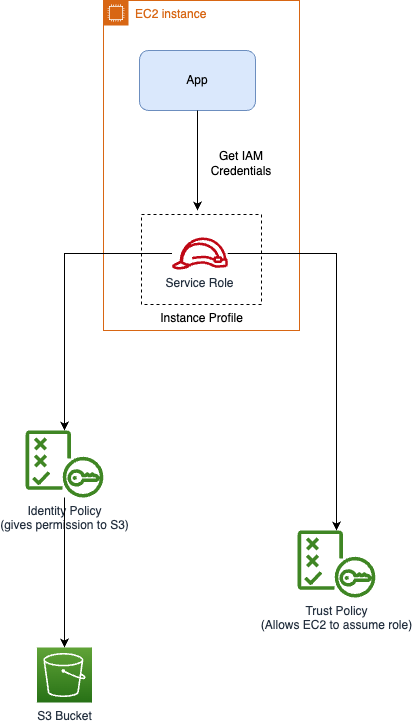
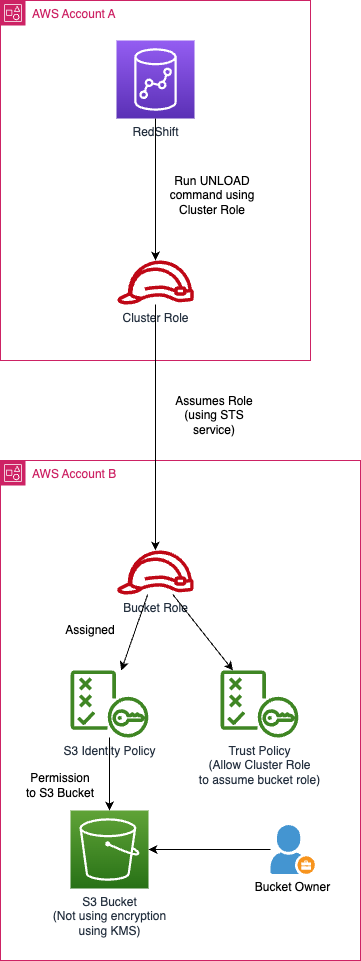

# IAM Roles
- [An IAM Roles](https://docs.aws.amazon.com/IAM/latest/UserGuide/id_roles.html) is an IAM identity that you can create in your account that has specific permissions.  
- An IAM role is similar to an IAM user, in that it is an AWS identity with permission policies that determine what the identity can and cannot do in AWS.

# STS Assume Role - EC2, S3

[Read more](https://docs.aws.amazon.com/IAM/latest/UserGuide/id_roles_use_switch-role-ec2.html)

# Cross-Account access - Redshift & S3

[Read more](https://repost.aws/knowledge-center/s3-access-denied-redshift-unload)