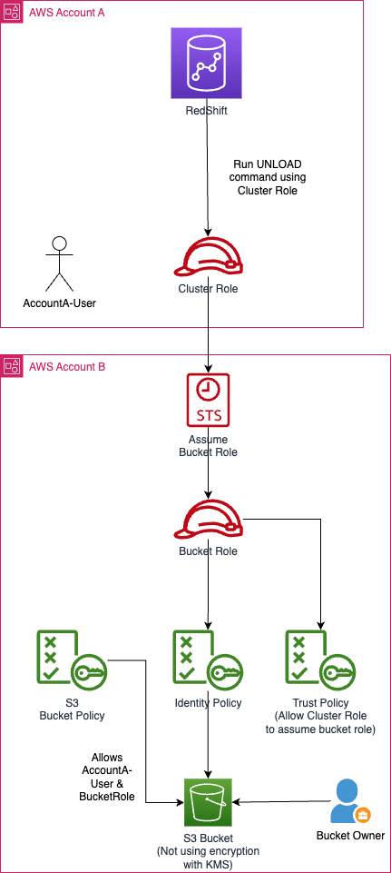

# IAM Roles
- [An IAM Roles](https://docs.aws.amazon.com/IAM/latest/UserGuide/id_roles.html) is an IAM identity that you can create in your account that has specific permissions.  
- An IAM role is similar to an IAM user, in that it is an AWS identity with permission policies that determine what the identity can and cannot do in AWS.

# Features

| Feature                                                                                                  | Remarks                                                                                                                                                                                                                                                                                                                      |
|----------------------------------------------------------------------------------------------------------|------------------------------------------------------------------------------------------------------------------------------------------------------------------------------------------------------------------------------------------------------------------------------------------------------------------------------|
| Temporary Credentials                                                                                    | A role does not have standard long-term credentials such as a password or access keys associated with it.  - Instead, when you assume a role, it provides you with temporary security credentials for your role session.                                                                                                 |
| Delegate Access                                                                                          | You can use roles to delegate access to users, applications, or services that don't normally have access to your AWS resources.  - For example, you might want to grant users in your AWS account access to resources they don't usually have, or grant users in one AWS account access to resources in another account. |
| [Service-linked roles](https://docs.aws.amazon.com/IAM/latest/UserGuide/using-service-linked-roles.html) | A service-linked role is a type of service role that is linked to an AWS service.  - The service can assume the role to perform an action on your behalf.                                                                                                                                                                |

# Delegate Access, STS Assume Role - EC2, S3

[Read more](https://docs.aws.amazon.com/IAM/latest/UserGuide/id_roles_use_switch-role-ec2.html)

# Cross-Account access - Redshift & S3
- IAM roles enable several scenarios to delegate access to your resources, and [cross-account access](https://docs.aws.amazon.com/AmazonS3/latest/userguide/example-walkthroughs-managing-access-example4.html#access-policies-walkthrough-example4-overview) is one of the key scenarios. 
- In this example, the bucket owner, Account A, uses an IAM role to temporarily delegate object access cross-account to users in another AWS account, Account C.

[Read more](https://repost.aws/knowledge-center/s3-access-denied-redshift-unload)