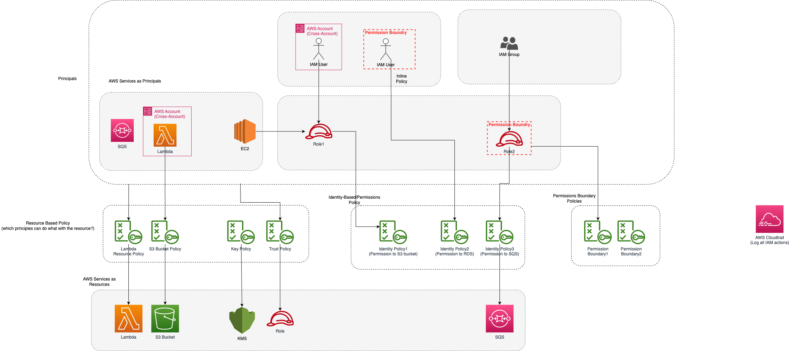

# AWS Identity and Access Management (IAM)
- [AWS Identity and Access Management (IAM)](https://aws.amazon.com/iam/) allows an administrator to provide multiple users and groups with granular access.
- Various user groups and users may require varying levels of access to the various resources that have been developed.
- By default, [all AWS resources are private](https://docs.aws.amazon.com/config/latest/developerguide/s3-bucket-policy.html), so only the AWS account that created the resources can access them.

# Use Cases

| Use Case                                                                                                                       | Description                                                                                                                         |
|--------------------------------------------------------------------------------------------------------------------------------|-------------------------------------------------------------------------------------------------------------------------------------|
| [Follow least privilege principle](https://aws.amazon.com/blogs/security/techniques-for-writing-least-privilege-iam-policies/) | We may create [roles](IAMRoles.md) with defined access levels/permissions/policies using [IAM & assign roles](IAMRoles.md) to users. |
| [Cross-Account access](https://docs.aws.amazon.com/config/latest/developerguide/s3-bucket-policy.html)                         | Using [IAM roles](IAMRoles.md), it is possible to access cross-account resources.                                                   |

# Terms & Concepts

| Term                                                                         | Remarks                                                                                                                                                                                                                                                                                                       |
|------------------------------------------------------------------------------|---------------------------------------------------------------------------------------------------------------------------------------------------------------------------------------------------------------------------------------------------------------------------------------------------------------|
| [IAM User](https://docs.aws.amazon.com/IAM/latest/UserGuide/id_users.html)   | The [IAM user](https://docs.aws.amazon.com/IAM/latest/UserGuide/id_users.html) represents the human user or workload who uses the IAM user to interact with AWS. - Each AWS account can have max 5000 IAM users. - You use the ARN when you need to uniquely identify the IAM user across all of AWS. |
| [IAM Group](https://docs.aws.amazon.com/IAM/latest/UserGuide/id_groups.html) | [An IAM user groups](https://docs.aws.amazon.com/IAM/latest/UserGuide/id_groups.html) is a collection of IAM users. - User groups let you specify permissions for multiple users, which can make it easier to manage the permissions for those users.                                                     |
| [IAM Roles](IAMRoles.md)                                                     | [An IAM Roles](IAMRoles.md) is an IAM identity that you can create in your account that has specific permissions.                                                                                                                                                                                             |
| [IAM Policy](IAMPolicyContext.md)                                            | [IAM Policy](IAMPolicyContext.md) helps to define user access (through AWS Console or AWS Cli) for the AWS resources.                                                                                                                                                                                         |
| [IAM Policy Types](IAMPolicyTypes.md)                                        | -                                                                                                                                                                                                                                                                                                             |
| [IAM DB Authentication](IAMAuth.md)                                          | You can authenticate to [your DB instance](../../../6_DatabaseServices/AmazonRDS/Readme.md) using [AWS Identity and Access Management (IAM) database authentication](https://repost.aws/knowledge-center/users-connect-rds-iam).                                                                              |

# Types of AWS credentials

| AWS Credentials Type           | Description                                                                                                                                                                           |
|--------------------------------|---------------------------------------------------------------------------------------------------------------------------------------------------------------------------------------|
| Username & Password            | A password policy is a set of rules that define the type of password an IAM user can set.                                                                                             |
| MFA Login                      | Multi-factor authentication (MFA) is an additional layer of security for accessing AWS services.                                                                                      |
| IAM user access key/secret key | These are used to programmatically call to AWS using AWS CLI, AWS SDK or direct HTTP calls using APIs for individual services. - Their expiry is between 15 minutes and 36 hours. |

# Tools

| Tool name                                                                                                                                         | Description                                                                                                                                                     |
|---------------------------------------------------------------------------------------------------------------------------------------------------|-----------------------------------------------------------------------------------------------------------------------------------------------------------------|
| [IAM Policy Simulator](https://docs.aws.amazon.com/IAM/latest/UserGuide/access_policies_testing-policies.html)                                    | With the IAM policy simulator, you can test and troubleshoot identity-based policies and IAM permissions boundaries.                                            |
| [AWS Policy Generator](https://awspolicygen.s3.amazonaws.com/policygen.html)                                                                      | -                                                                                                                                                               |
| [IAM Access Analyzer](https://docs.aws.amazon.com/IAM/latest/UserGuide/what-is-access-analyzer.html)                                              | IAM Access Analyzer helps you identify the resources in your organization and accounts, such as Amazon S3 buckets or IAM roles, shared with an external entity. |
| [Viewing last accessed information for IAM](https://docs.aws.amazon.com/IAM/latest/UserGuide/access_policies_access-advisor-view-data.html)       | You can view last accessed information for IAM using the AWS Management Console, AWS CLI, or AWS API.                                                           |
| [AWS CloudTrail](../../../8_MonitoringServices/AWSCloudTrail.md)                                                                                  | CloudTrail captures all AWS service API calls as events, including calls from the console, AWS CLI, and API tools.                                              |
| [Techniques for writing least privilege IAM policies](https://aws.amazon.com/blogs/security/techniques-for-writing-least-privilege-iam-policies/) | -                                                                                                                                                               |

# References
- [AWS IAM Identity Center (Successor to AWS SSO) Overview Demo | Amazon Web Services](https://www.youtube.com/watch?v=4yJp5-jGGNk)
- [AWS IAM Core Concepts You NEED to Know](https://www.youtube.com/watch?v=_ZCTvmaPgao)
- [List of various AWS IAM Permissions](https://aws.permissions.cloud/)