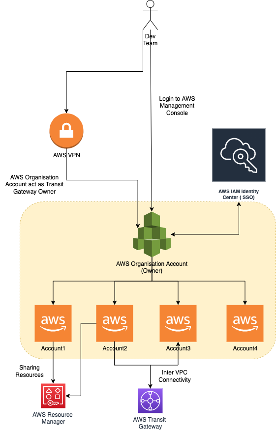

# AWS Organizations
- [AWS Organizations](https://aws.amazon.com/organizations/) lets you create new AWS accounts at no additional charge.
- More easily allocate resources, group accounts, and apply governance policies to accounts or groups.

# Do I need multiple AWS accounts?
- [AWS accounts](https://docs.aws.amazon.com/accounts/latest/reference/welcome-multiple-accounts.html) serve as the fundamental security boundary in AWS. 
- They serve as a resource container that provides a useful level of isolation. 
- The ability to isolate resources and users is a key requirement to establishing a secure, well governed environment.

Different types of accounts can be setup like,
- Production, Staging, Dev etc.
- Infrastructure, Application, Data etc.

Separating your resources into separate AWS accounts helps you to support the following principles in your cloud environment:
- Security control 
- Isolation
- Many teams
- Data isolation
- Business process 
- Billing
- Quota allocation

All of the recommendations and procedures described in this document are in compliance with the [AWS Well-Architected Framework](https://aws.amazon.com/architecture/well-architected/?wa-lens-whitepapers.sort-by=item.additionalFields.sortDate&wa-lens-whitepapers.sort-order=desc&wa-guidance-whitepapers.sort-by=item.additionalFields.sortDate&wa-guidance-whitepapers.sort-order=desc).